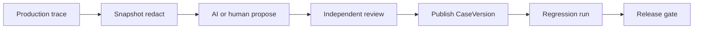

# Production-to-eval loop

Turn real failures into **immutable regression cases** with governance — not silent copy-paste from production.

## Steps

1. **Observe** — Online policy or manual selection identifies a failed/spcode diagnosis trace
2. **Snapshot** — Capture evidence with consent, redaction, sensitivity tags
3. **Propose** — Create candidate CaseVersion + optional rubric/evaluator changes (`derived_from` lineage)
4. **Review** — Human or independent policy approves exact digest
5. **Publish** — Immutable CaseVersion joins `regression` split
6. **Activate** — Suite/gate references updated in authorized action
7. **Gate** — Next agent build must pass expanded suite

## Authorization

| Action | Who |
|--------|-----|
| Propose | Humans, AI agents (with audit) |
| Approve / publish / activate gate | Configured human or policy — **not** self-approval by proposing agent |
| Rollback | Server RBAC with immutable audit |

Approval binds exact content digest; any mutation invalidates it.

## Relationship to Testing

Java record/replay cases in [Testing](/en/testing/) remain separate. Eval cases may **reference** trace IDs as lineage without merging replay mock semantics into eval manifests.

See [Evaluation loop](/en/evaluation/concepts/evaluation-loop).
