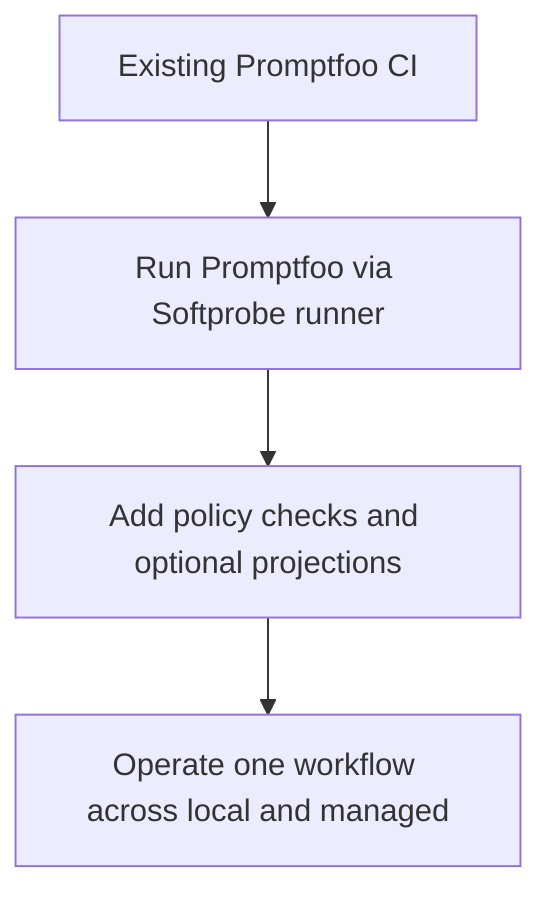

# Promptfoo integration

Promptfoo remains supported, but integration is now **runner-first**.

## Integration flow


This keeps Promptfoo semantics intact while still using Softprobe lifecycle, evidence custody, and gates.

## Step-by-step example

### 1. Package Promptfoo definition as pinned artifact

```bash
sp eval pack --framework promptfoo \
  --config promptfooconfig.yaml --tests tests.yaml \
  --out .softprobe/promptfoo-definition.cas.json
```

### 2. Validate runner descriptor and artifact closure

```bash
sp eval validate \
  --runner promptfoo-runner@2.1.0 \
  --definition .softprobe/promptfoo-definition.cas.json \
  --json
```

### 3. Execute framework runner inside kernel workflow

```bash
sp eval run \
  --runner promptfoo-runner@2.1.0 \
  --definition .softprobe/promptfoo-definition.cas.json \
  --gate support-router-v1 \
  --out-dir .softprobe/runs/latest
```

## What gets persisted

| Artifact | Why |
|----------|-----|
| Definition bundle digest | Reproducibility |
| Runner/runtime digest | Compatibility and audit |
| Native Promptfoo result bundle | Full semantics and diagnostics |
| Outer kernel status/events | Cross-framework lifecycle and gates |

## Optional projection (not required)

You may project common results to measurements for dashboard/search:

```text
native bundle -> optional projection -> measurements
```

Projection is additive and loss-aware. It does not replace native artifacts.

## Migration strategy



Use this path when you want quick adoption without rewriting your entire Promptfoo corpus.

## Common pitfalls

- Treating projection as full semantic parity.
- Assuming Promptfoo pass/fail is the release gate.
- Running runner with ambient network/secrets.

## Related

- [Framework adapters](/en/evaluation/reference/framework-adapters)
- [Native model and framework runners](/en/evaluation/concepts/native-model-and-adapters)
- [Quick start](/en/evaluation/getting-started)
