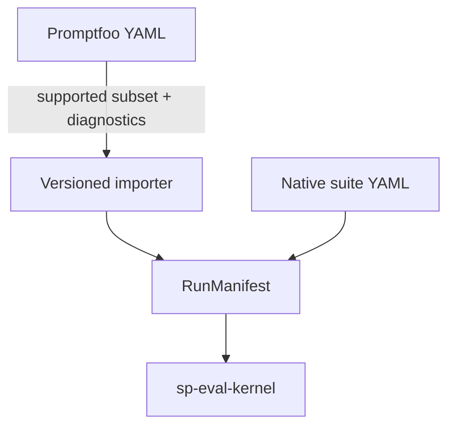
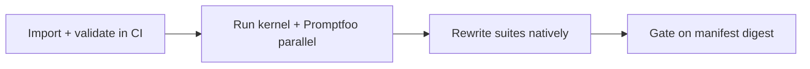

# Promptfoo integration

Promptfoo is a **supported authoring ecosystem** — not the canonical schema for Softprobe eval. Use it while migrating; **author native suites** for long-term CI and environment-backed eval.



## What Softprobe owns

| Softprobe | Promptfoo |
|-----------|-----------|
| RunManifest, run identity, trials | Matrix authoring UX |
| Kernel DAG + **environment** lifecycle | Assert library surface |
| thelake ledger, compare, gates | Local SQLite + `promptfoo view` |
| GatePolicyVersion (release truth) | Cell pass/fail (measurement/diagnostic only) |

## Three integration modes

### 1. Importer (migration)

```bash
sp eval validate --import promptfoo \
  --config promptfooconfig.yaml --tests tests.yaml --json
```

- Maps **supported** cases, vars, deterministic asserts, providers
- Emits `unsupported_assert` / `lossy_mapping` — **never silent pass**
- Records `adapter` + `source_digest` in manifest provenance
- Does **not** encode every future assert type into RunManifest JSON

See [Framework adapters](/en/evaluation/reference/framework-adapters).

**Example diagnostic:**

```json
{
  "code": "unsupported_assert",
  "path": "tests[4].assert[0]",
  "detail": "type javascript — use sandboxed node or rewrite as native evaluator"
}
```

### 2. Sandboxed evaluator node

Invoke Promptfoo for **one grading method** inside the kernel DAG:

- Returns measurements + Promptfoo diagnostics as artifacts
- Cannot expand matrix, schedule trials, retry, or publish gates

Use when no native capability exists yet; migrate to `builtin/*` or plugin evaluators when ready.

### 3. Opaque legacy-run importer

Archive a whole Promptfoo run for comparison. Framework IDs are provenance — not portable CaseRun identity.

## Recommended migration



During parallel running, compare measurements on your **supported subset** — not every Promptfoo feature.

Exit criteria (team-defined, example):

- Critical cases import without `unsupported` blockers
- N consecutive CI runs at fixture parity on shared cases
- Live-provider spot checks adjudicated

Retire duplicate Promptfoo CI when ready; keep the **public adapter** for teams still on YAML.

## Native rewrite example

**Promptfoo input:**

```yaml
assert:
  - type: icontains
    value: billing-support
```

**Native target (what you maintain):**

```yaml
evaluators:
  - id: router.skill_match
    capability: builtin/deterministic/contains@1
    params: { pattern: billing-support, selector: rollout.output }
```

## External pass/fail

Promptfoo pass/fail may be stored as a **measurement** or diagnostic artifact. **GateDecision** always comes from kernel **GatePolicyVersion**.

## Related

- [Native model and adapters](/en/evaluation/concepts/native-model-and-adapters)
- [Quick start](/en/evaluation/getting-started)
- [Author a suite](/en/evaluation/guides/author-a-suite)
