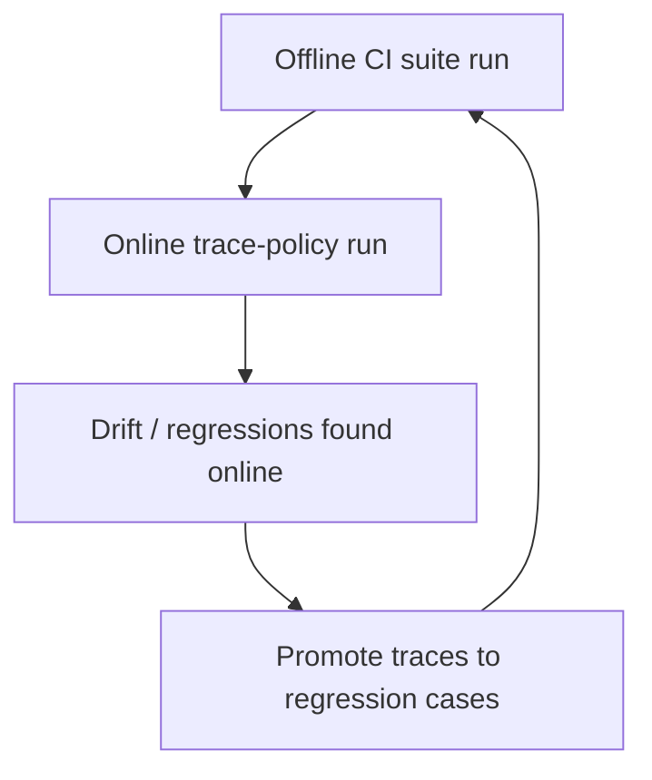

# Promptfoo on production OTEL traces

This guide shows how to run Promptfoo evaluations against **production OTEL traces** through Softprobe's online evaluation workflow.

## Why this guide

Promptfoo tracing is excellent for capturing and visualizing traces during evaluations. Online evaluation adds the missing production workflow:

1. select production traces by policy,
2. snapshot and redact evidence,
3. execute Promptfoo runner on that evidence,
4. compare and gate continuously.

## End-to-end flow


## 1) Prepare Promptfoo suite for trace-based checks

Example `tests.yaml` assertions that benefit from trace context:

```yaml
tests:
  - vars:
      order_id: "123"
    assert:
      - type: trajectory:tool-used
        value: search_orders
      - type: trajectory:tool-sequence
        value:
          steps:
            - search_orders
            - compose_reply
```

Package the suite as a pinned definition artifact:

```bash
sp eval pack --framework promptfoo \
  --config promptfooconfig.yaml \
  --tests tests.yaml \
  --out .softprobe/promptfoo-definition.cas.json
```

## 2) Create online policy for production trace selection

`policies/promptfoo-online-router-v1.yaml`:

```yaml
policy_id: promptfoo-online-router-v1
runner:
  id: promptfoo-runner@2.1.0
  definition_artifact: .softprobe/promptfoo-definition.cas.json

trace_filter:
  service.name: support-router
  deployment.environment: production
  span.kind: server

sampling:
  strategy: stable_hash
  rate: 0.02

watermark:
  wait_for_late_spans_s: 120

budgets:
  max_runs_per_hour: 200
  max_eval_cost_usd_per_day: 50

redaction:
  attributes:
    - authorization
    - api_key
    - promptfoo.request.body

exclusions:
  - eval.execution=true
```

## 3) Apply and run policy

```bash
sp eval policy apply --file policies/promptfoo-online-router-v1.yaml
sp eval policy run --policy promptfoo-online-router-v1 --window "last_1h"
```

## 4) Inspect outputs

```text
Run status: succeeded
Native result artifact: cas://sha256:promptfoo-results-2026-07-21
Projected measurements: 18 (projection_status=lossy)
Gate: support-router-online-v1 = PASS
```

Stored artifacts include:
- native Promptfoo result bundle,
- trace snapshot metadata and lineage,
- outer lifecycle events,
- optional projected measurements.

## 5) Compare online vs offline

```bash
sp eval compare \
  --baseline .softprobe/runs/ci-router/manifest.resolved.json \
  --candidate .softprobe/runs/online-router/manifest.resolved.json
```

Use this to detect production drift that did not appear in CI fixtures.

## Offline vs online in practice



## Common pitfalls

- **No loop guard:** forgetting `exclusions: eval.execution=true` can re-evaluate evaluator traces.
- **No watermark:** late spans can produce inconsistent evidence snapshots.
- **No budgets:** online costs can spike quickly.
- **Assuming projection parity:** full semantics remain in native Promptfoo artifacts.

## Related

- [Online evaluation](/en/evaluation/concepts/online-evaluation)
- [Online vs offline evaluation](/en/evaluation/concepts/online-vs-offline)
- [Production-to-eval loop](/en/evaluation/guides/production-to-eval-loop)
- [Promptfoo integration](/en/evaluation/guides/promptfoo-integration)
