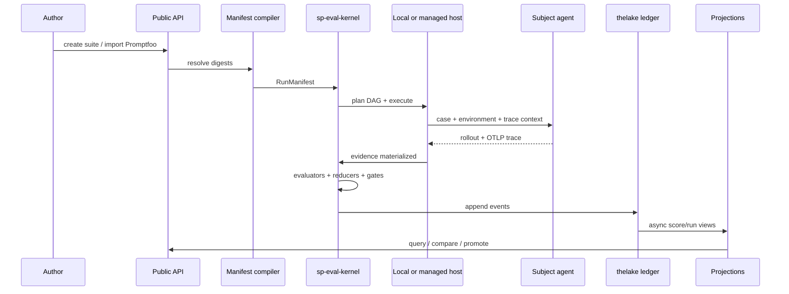
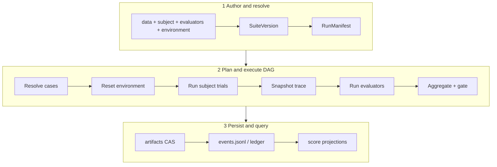
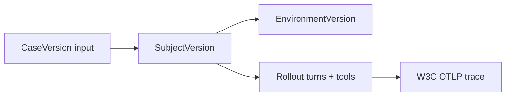
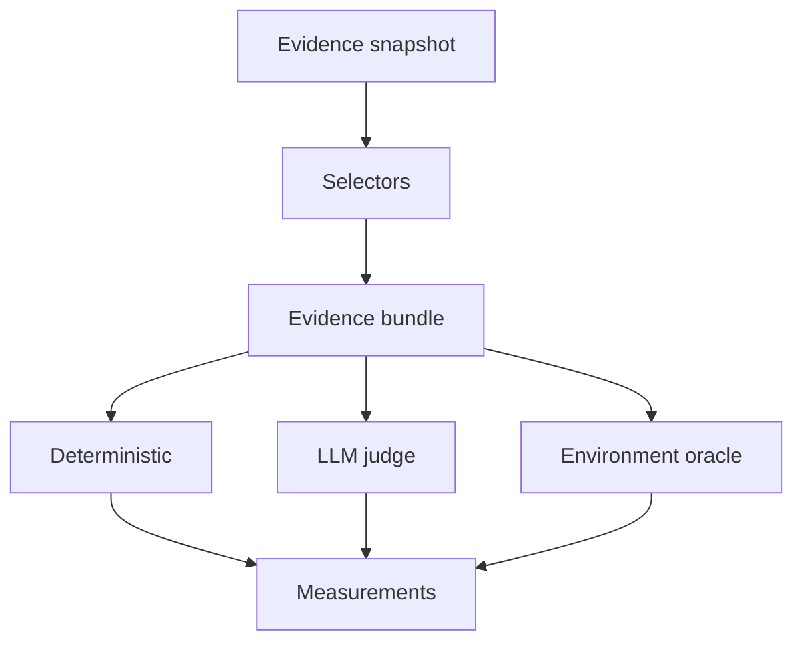
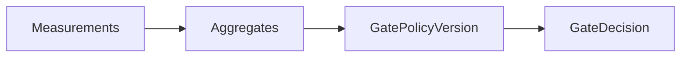
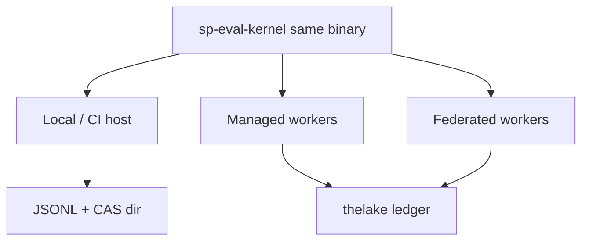
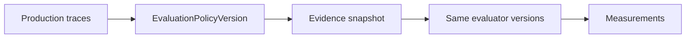

# How agent evaluation works

An evaluation run is a **content-addressed pipeline**: compile a manifest, execute a DAG, append events, project scores, apply gates.

## End-to-end lifecycle



## Pipeline overview



## Phase 1 — Author and resolve

Authors work with mutable names; execution uses immutable versions:

```text
data + subject + evaluators + environment
        ↓
   SuiteVersion (cases, evaluators, trials, gates)
        ↓
   RunManifest (+ initiator, secrets-by-ref, reproducibility class)
```

`sp eval validate` performs this compile step without executing the subject — ideal for CI lint.

## Phase 2 — Plan and execute DAG

The kernel builds a **content-addressed DAG** (not a fixed “prompt then assert” loop):

```mermaid
flowchart LR
  R[Resolve versions]
  G[Generate / choose cases]
  E[Allocate / reset env]
  S[Run subject trials]
  T[Trace snapshot]
  N[Normalize trajectory]
  V[Materialize evidence]
  I[Item evaluators]
  P[Group evaluators]
  A[Aggregates]
  GT[Gates]
  Pub[Publish / export]
  R --> G --> E --> S --> T --> N --> V --> I --> P --> A --> GT --> Pub
```



See [Execution DAG](/en/evaluation/architecture/execution-dag).

## Phase 3 — Subject produces rollout

The **subject** (your model, API wrapper, or full agent process) runs against the **environment**:



- Emits ordered turns, tool calls, observations
- Creates or adopts a **W3C trace** (`traceparent` propagated)
- Records `run_id`, `case_run_id`, `trial_id` on spans

OTLP is the observation boundary — trajectories normalize to a canonical step view shared by all evaluators.

## Phase 4 — Evaluators grade evidence



Each **evaluator** reads selected evidence and returns:

- **Status** — how the attempt ended (`succeeded`, `missing_evidence`, …)
- **Measurements** — zero or more typed facts with evidence refs

Evaluators never mutate source traces or prior measurements.

## Phase 5 — Reducers and gates

**Reducers** combine measurements across trials, cases, or subjects (mean, pass@k, confidence intervals).

**Gates** apply a versioned **GatePolicyVersion** to aggregates and measurements. Gate failure does not delete underlying facts.



## Phase 6 — Persist and project

Managed execution appends to the **thelake eval ledger** (system of record). Large bytes live in object storage; ledger stores digests and metadata (commit-before-reference).

**Projections** (scores table, run views) consume events asynchronously and are rebuildable — they are not the source of truth.

Local runs write the same event stream to JSONL; publish to thelake via validated bundle import.

## Local vs managed — same semantics



| Mode | Host | Storage |
|------|------|---------|
| Local / CI | CLI host adapter | JSONL + CAS artifacts |
| Managed | Queued workers + sandboxes | thelake ledger + object storage |
| Federated | Customer worker | Policy-filtered export only |

One conformance corpus ensures identical legal transitions and measurement IDs across hosts.

## Prompt-only vs environment-backed

| Slice | Subject | Environment | What it proves |
|-------|---------|-------------|----------------|
| **Prompt-only** | Pinned model + prompt | noop | Output policy, routing text, safety strings |
| **Environment-backed** | Full agent process | Fixture + verify | Oracles, tools, task completion |

Same envelope; different subject and environment versions. See [Prompt-only vs environment eval](/en/evaluation/guides/eval-modes).

## Online evaluation

**EvaluationPolicyVersion** selects traces from production by filter + stable sampling, snapshots evidence, and runs the same evaluator semantics as offline runs. Eval-execution traces are excluded by default to prevent recursive loops.



See [Online evaluation](/en/evaluation/concepts/online-evaluation).

## Next steps

- [Architecture overview](/en/evaluation/architecture/)
- [Scores and gates](/en/evaluation/concepts/scores-and-gates)
- [Production-to-eval loop](/en/evaluation/guides/production-to-eval-loop)
