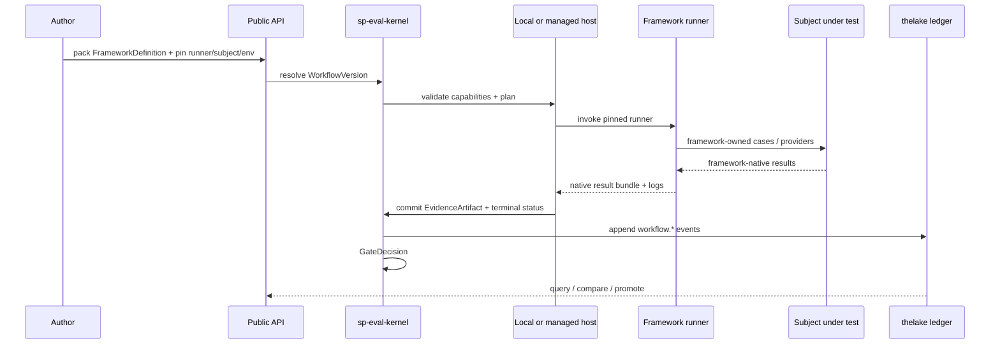
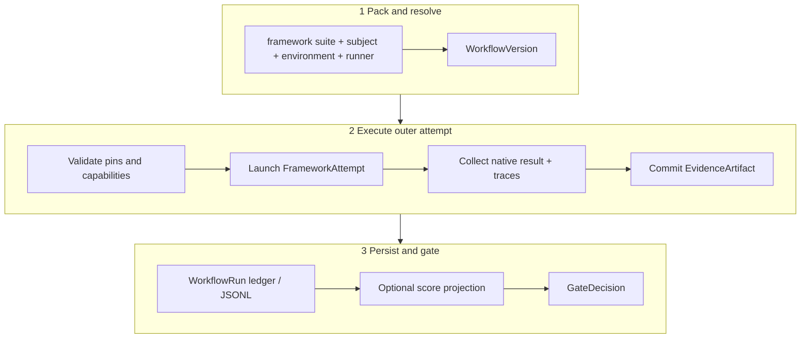
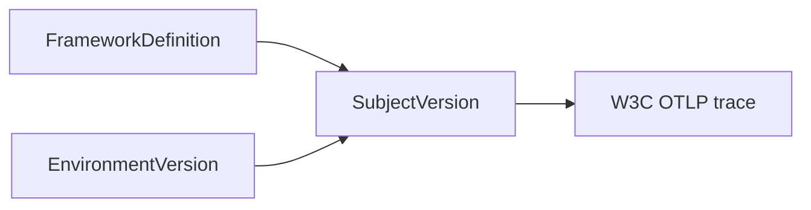
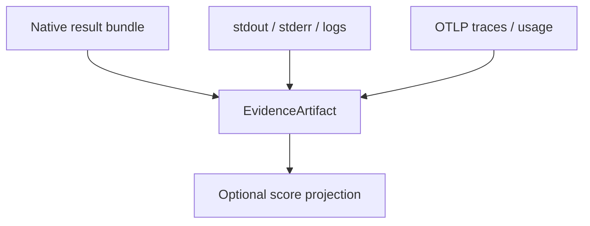
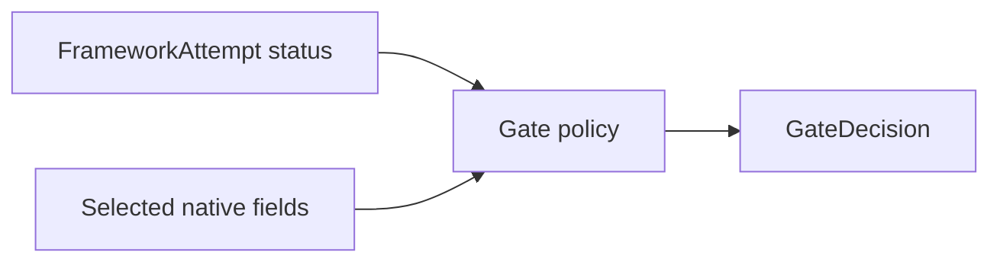
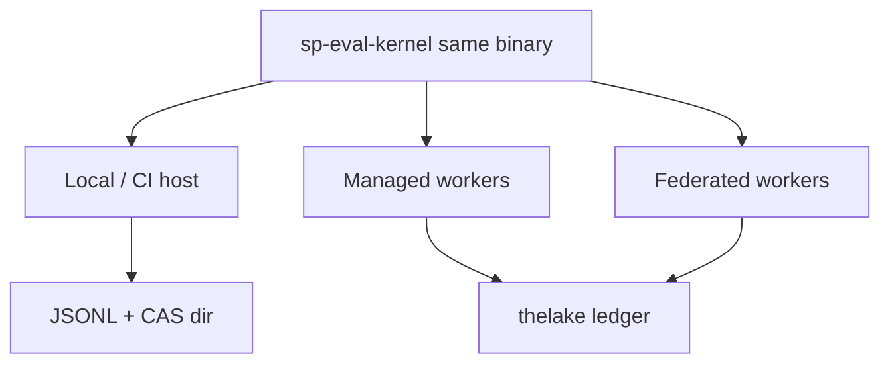
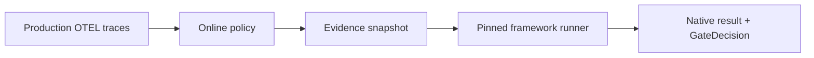

# How agent evaluation works

An evaluation run is a **framework-runner workflow**: resolve a pinned workflow, execute one opaque runner in a controlled environment, commit native evidence, optionally project scores, then apply gates.

## End-to-end lifecycle



## Pipeline overview



## Phase 1 — Pack and resolve

Authors keep **framework-native** files. Softprobe resolves immutable versions:

```text
framework suite + subject + environment + runner
        ↓
   FrameworkDefinition + RunnerVersion + SubjectVersion + EnvironmentVersion
        ↓
   WorkflowVersion (+ gate policy)
```

`sp eval validate` checks closed artifact sets, runner pins, and capability compatibility **without** translating assertions or calling the subject.

## Phase 2 — FrameworkAttempt

The kernel treats the runner as **one opaque execution node**. Softprobe does not expand cases, run assertions, or aggregate framework-internal trials.


Inside the runner, Promptfoo/DeepEval (or another framework) owns matrix expansion, providers, assertions, and its own report formats. Softprobe records digests and outer status only.

See [Execution DAG](/en/evaluation/architecture/execution-dag) for host planning around that opaque node.

## Phase 3 — Subject and observation

The **subject** is whatever the framework exercises (model route, agent process, …) under the **EnvironmentVersion** Softprobe enforces:



Each FrameworkAttempt creates or adopts a W3C trace and records `workflow_run_id`, `framework_attempt_id`, `workflow_version_id`, and `runner_version_id`. Eval-execution traces use a reserved internal environment and are excluded from online rules by default.

## Phase 4 — Evidence and optional projection



- **Native bundle** is authoritative for framework semantics.
- **Projection** may emit lossy measurements for query — never a Softprobe re-score of assertions.
- Malformed or oversized bundles map to typed failures (`invalid_input`, `missing_evidence`, …), never score `0`.

## Phase 5 — Gates

**Gates** apply the policy pinned in WorkflowVersion to outer status, provenance, and optionally selected runner-reported fields. Gate failure does not delete evidence.



## Phase 6 — Persist

Managed execution appends to the **thelake** eval ledger. Large bytes live in object storage; the ledger stores digests (commit-before-reference). Local runs write the same event stream to JSONL and may publish via validated bundle import.

## Local vs managed — same semantics



| Mode | Host | Storage |
|------|------|---------|
| Local / CI | CLI host | JSONL + CAS artifacts |
| Managed | Queued workers + sandboxes | thelake ledger + object storage |
| Federated | Customer worker | Policy-filtered export only |

## Prompt-only vs environment-backed

| Slice | What Softprobe pins | What the framework does |
|-------|---------------------|-------------------------|
| **Prompt-only** | Model/prompt subject + noop/light env | Assertions on text outputs |
| **Environment-backed** | Full agent subject + fixture env | Tool/trajectory/outcome checks in-framework |

Same Softprobe envelope; different SubjectVersion and EnvironmentVersion. See [Prompt-only vs environment eval](/en/evaluation/guides/eval-modes).

## Online evaluation

An online **policy** selects production traces (filter + stable sampling), snapshots evidence, and launches the **same framework runner** workflow — Softprobe does not switch to a parallel Softprobe-owned grader. Eval-execution traces are excluded by default.



See [Online vs offline](/en/evaluation/concepts/online-vs-offline) and [Promptfoo on production OTEL](/en/evaluation/guides/promptfoo-online-otel).

## Next steps

- [Mental model](/en/evaluation/mental-model)
- [Architecture overview](/en/evaluation/architecture/)
- [Scores and gates](/en/evaluation/concepts/scores-and-gates)
- [Production-to-eval loop](/en/evaluation/guides/production-to-eval-loop)
