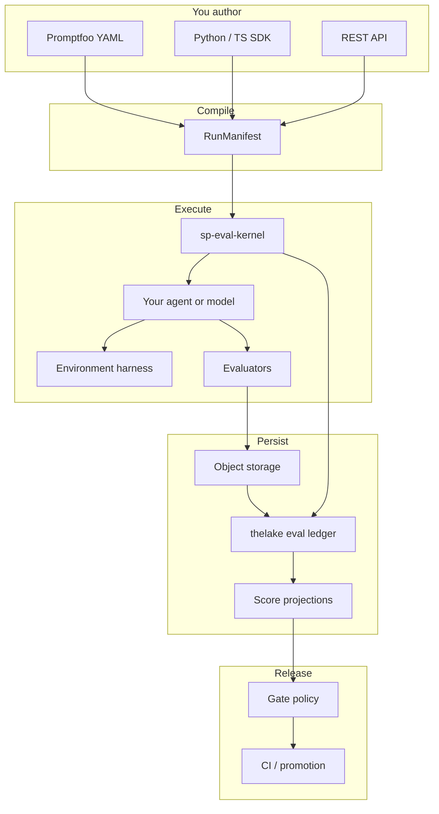
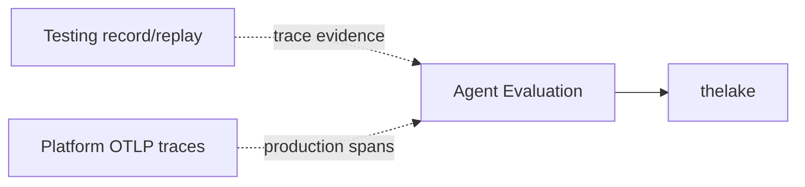

# Softprobe Agent Evaluation

**Pin a recipe. Run the agent. Grade evidence. Gate releases.**

::: tip Ready to start?
New to agent evaluation? Start with the **[mental model](/en/evaluation/mental-model)**, then **[Quick start](/en/evaluation/getting-started)**.
:::

Softprobe Agent Evaluation is an open evaluation control plane for AI agents. You define immutable **suites** (cases, subject, evaluators, environment), run them locally or in CI, store durable results in **thelake**, and gate releases on versioned policies.

It works with — not instead of — tools you already use: **Promptfoo** for YAML authoring, **Langfuse**-style datasets and experiments, **Braintrust**-style `data + task + scores`, and environment harnesses like **Prime Intellect Verifiers**.

## System at a glance



::: info Product areas on this site
| Area | You use it when... |
|------|---------------------|
| **[Testing](/en/testing/)** | You need Java record/replay regression with the JVM agent |
| **[Platform](/en/platform/)** | You need Istio mesh capture, SESSIFY, or the observability dashboard |
| **Agent Evaluation** (this section) | You need to evaluate **your** AI agents: outputs, trajectories, environment outcomes, CI gates, production-to-eval loop |
:::

## What you can do

- **Author suites** with a small API: `data + subject + evaluators + environment`
- **Validate before you spend** — compile native suites or import frameworks with explicit diagnostics
- **Run anywhere** — same manifest on local laptop, GitHub Actions, or managed workers
- **Grade evidence, not vibes** — measurements cite artifacts and traces; missing evidence is a typed outcome, never score zero
- **Gate releases** — scores are facts; pass/fail is a versioned **gate policy** you can change without rewriting history
- **Close the loop** — production failures become governed regression cases

## Public API shape

```text
data + subject + evaluators + environment  →  resolve  →  RunManifest  →  run  →  measurements  →  gate
```

See [Mental model](/en/evaluation/mental-model) and [Data model](/en/evaluation/concepts/data-model).

## Two evaluation modes

| Mode | When | See |
|------|------|-----|
| **Prompt-only** | Model output / routing / rubric on text | [Prompt-only vs environment eval](/en/evaluation/guides/eval-modes) |
| **Environment-backed** | Full agent with tools and oracles | Same guide |

Both modes share the same suite envelope — you change **SubjectVersion** and **EnvironmentVersion**, not the kernel.

## Who should read this section

| Persona | Start here |
|---------|------------|
| Eval author (native YAML, SDK) | [Quick start](/en/evaluation/getting-started) · [Author a suite](/en/evaluation/guides/author-a-suite) |
| Migrating from Promptfoo | [Native model and adapters](/en/evaluation/concepts/native-model-and-adapters) · [Framework adapters](/en/evaluation/reference/framework-adapters) |
| Agent builder (shipping agents) | [Eval modes](/en/evaluation/guides/eval-modes) · [Compare and promote](/en/evaluation/guides/compare-and-promote) |
| Migrating from Langfuse / Braintrust | [Ecosystem mapping](/en/evaluation/concepts/ecosystem-mapping) |
| AI coding agent | [For AI agents](/en/evaluation/agents/overview) |

## How it relates to Testing and Observability



| Product | Relationship |
|---------|----------------|
| **Testing** | Record/replay for Java services — separate problem. Eval may **consume** recorded traces as evidence. |
| **Platform / OTLP** | Eval uses OpenTelemetry as the **observation boundary** — canonical trajectories, not a proprietary trace graph. |
| **thelake** | Append-only eval ledger + score projections; same data plane as LLM observability scores. |

## Quick links

- [Mental model](/en/evaluation/mental-model) — five nouns: suite, run, evidence, measurement, gate
- [How it works](/en/evaluation/how-it-works) — lifecycle diagrams
- [Terminology](/en/evaluation/concepts/terminology) — full glossary
- [Evaluator taxonomy](/en/evaluation/evaluators/) — all supported method families
- [CLI reference](/en/evaluation/reference/cli) — `sp eval validate`, `run`, `compare`, `publish`, `promote`
