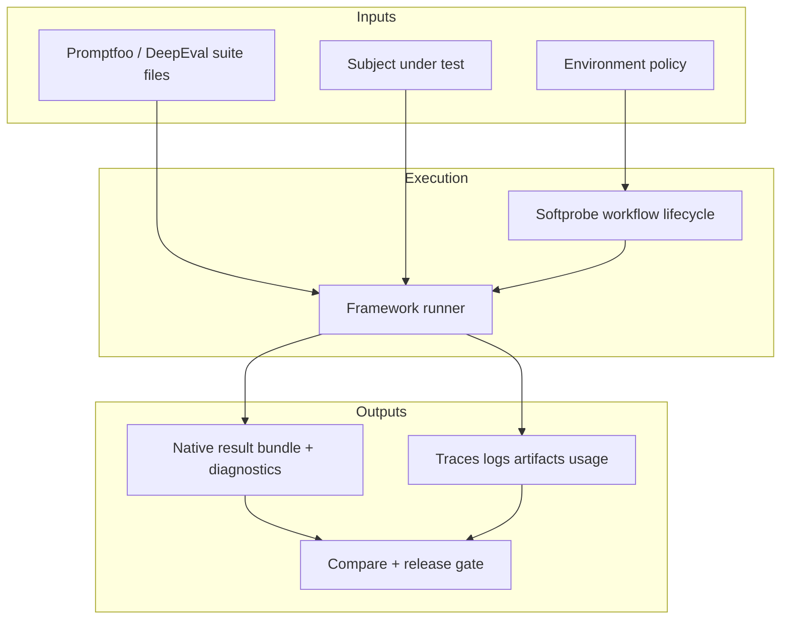

# Softprobe Agent Evaluation

**Run existing eval suites in controlled environments. Capture complete native evidence. Compare and gate with one workflow.**

Softprobe Agent Evaluation is an open workflow/control plane for AI evaluation frameworks.

## System at a glance

## What Softprobe does

- **Packages and pins** framework-native definitions
- **Controls execution environment** (network, mounts, secrets, limits)
- **Captures complete native outputs** (results, logs, traces, cost/usage)
- **Normalizes outer lifecycle** (`requested → validated → running → terminal`)
- **Compares runs and drives gates** across local CI and managed execution

## What Softprobe does not do

- Replace Promptfoo/DeepEval DSLs
- Promise full assertion-type parity in a new schema
- Require users to author a new eval language

## Product areas on this site

| Area | You use it when... |
|------|---------------------|
| **[Testing](/en/testing/)** | Java record/replay regression with JVM agent |
| **[Platform](/en/platform/)** | Istio/SESSIFY observability |
| **Agent Evaluation** | Workflow + environment control + evidence + gates for framework suites |

## Start here

| Persona | Start page |
|---------|------------|
| Framework user (Promptfoo/DeepEval) | [Quick start](/en/evaluation/getting-started) |
| Migration lead | [Promptfoo integration](/en/evaluation/guides/promptfoo-integration) |
| Platform operator | [Architecture](/en/evaluation/architecture/) |
| CI / AI coding agent | [For AI agents](/en/evaluation/agents/overview) |

## Quick links

- [Native model and framework runners](/en/evaluation/concepts/native-model-and-adapters)
- [Framework adapters](/en/evaluation/reference/framework-adapters)
- [Prepare a framework run](/en/evaluation/guides/author-a-suite)
- [How it works](/en/evaluation/how-it-works)
