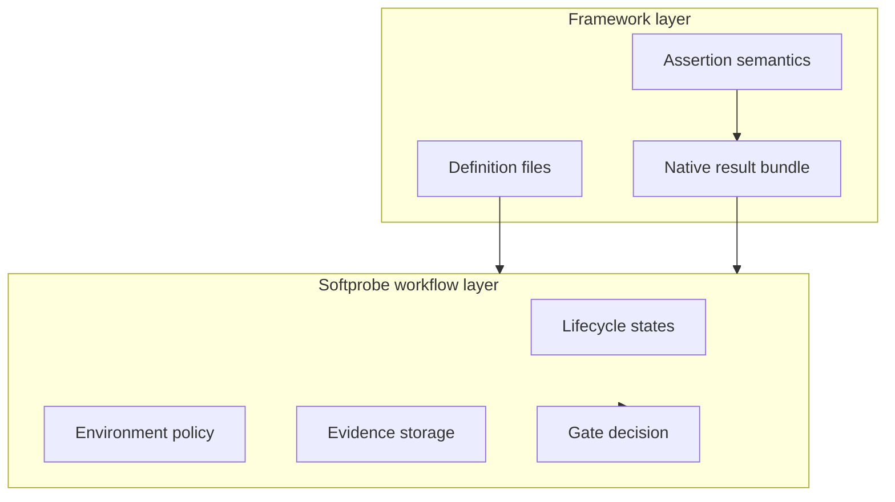

# Mental model

Think in two layers:

1. **Framework layer** (Promptfoo/DeepEval): native definitions + native semantics.
2. **Workflow layer** (Softprobe): controlled run lifecycle, evidence custody, compare, and gates.

## Layered model



## Five nouns (workflow layer)

```text
Run request → Validation → Execution → Evidence bundle → Gate decision
```

## Real example

Billing-router Promptfoo suite runs through `promptfoo-runner@2.1.0` with:
- network disabled,
- read-only workspace,
- allowlisted secret refs,
- result size limit.

Softprobe stores complete native outputs and then applies release gates.

## What is authoritative

| Artifact | Authority |
|----------|-----------|
| Promptfoo result details | Framework-native artifact |
| Run status and governance | Softprobe workflow ledger |
| Release gate result | Softprobe GatePolicyVersion |

## What is optional

Projected measurements are optional and may be lossy. Native result bundles remain the source for full framework semantics.

## Next

- [Native model and framework runners](/en/evaluation/concepts/native-model-and-adapters)
- [Promptfoo integration](/en/evaluation/guides/promptfoo-integration)
