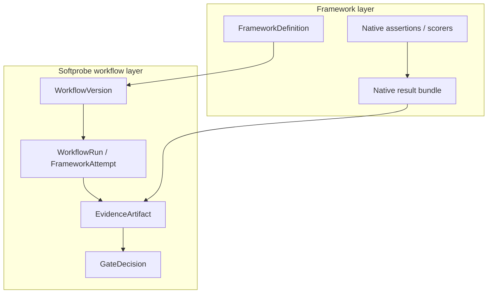

# Mental model

Think in two layers:

1. **Framework layer** (Promptfoo, DeepEval, …): native definitions, assertions, scorers, and result bundles.
2. **Workflow layer** (Softprobe): pinned runner + environment, outer lifecycle, evidence custody, compare, and gates.

Softprobe does **not** invent another eval DSL. The public API is:

```text
framework suite + subject + environment + runner
```

## Layered model



## Five nouns (immutable inputs)

| Noun | Role |
|------|------|
| **FrameworkDefinition** | Closed, content-addressed native suite + dependencies |
| **RunnerVersion** | Pinned framework package / image / command / capabilities |
| **SubjectVersion** | System under test (agent, model route, image, …) |
| **EnvironmentVersion** | Isolation: network, mounts, secrets-by-ref, limits |
| **WorkflowVersion** | Resolved binding of the four above + gate policy |

Runtime records: **WorkflowRun** → **FrameworkAttempt** → **EvidenceArtifact** → **GateDecision**.

## Pipeline (outer lifecycle only)

```text
pack / resolve → validate → run framework runner → commit evidence → gate
```

Softprobe owns the outer attempt. Matrix expansion, retries, and assertion semantics stay inside the framework’s native result bundle.

## Real example

Billing-router Promptfoo suite runs through `promptfoo-runner@2.1.0` with:

- network disabled,
- read-only workspace,
- allowlisted secret refs,
- result size limit.

Softprobe stores the complete native result bundle, projects optional measurements for query, then applies a release gate on outer status and selected runner-reported fields.

## What is authoritative

| Artifact | Authority |
|----------|-----------|
| Assertion details / cell pass-fail | Framework-native result bundle |
| Outer run status and provenance | Softprobe workflow ledger |
| Release gate result | Softprobe **GateDecision** (policy pinned in WorkflowVersion) |
| Queryable `scores` rows | Optional, lossy projection — never replace the native bundle |

## Typed outcomes (not scores)

A **FrameworkAttempt** ends as one of:

`succeeded | invalid_input | missing_evidence | unsupported | timed_out | cancelled | resource_exhausted | runner_error | subject_error`

Errors never become score `0`. `succeeded` with zero projected measurements is valid.

## Next

- [Data model](/en/evaluation/concepts/data-model)
- [Native model and framework runners](/en/evaluation/concepts/native-model-and-adapters)
- [Promptfoo integration](/en/evaluation/guides/promptfoo-integration)
