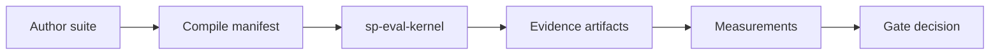

# Mental model

Agent evaluation has five nouns. If you remember these, everything else fits.

```text
Suite (pinned recipe) → Run (execution) → Evidence (what happened) → Measurements (facts) → Gates (release view)
```

## 1. Suite — the pinned recipe

A **suite** is everything needed to evaluate an agent, frozen as content-addressed **versions**:

- **Data** — test cases (inputs, expected references, lineage)
- **Subject** — the agent or model under test (prompts, tools, binary digests)
- **Evaluators** — graders (deterministic checks, LLM judges, outcome verifiers)
- **Environment** — harness (noop for prompt-only eval; fixtures for full agents)

Friendly names like `routing-suite` are mutable pointers. Execution uses **IDs and digests only**.

```text
data + subject + evaluators + environment  →  resolve  →  RunManifest
```

**Promptfoo users:** your `promptfooconfig.yaml` + `tests.yaml` compile into a suite. Promptfoo remains the authoring tool; Softprobe owns orchestration and storage. See [Ecosystem mapping](/en/evaluation/concepts/ecosystem-mapping).

## 2. Run — one execution

A **run** executes one resolved **RunManifest** once. It produces:

- **Case runs** — one case × subject × trial
- **Rollouts** — agent turns, tool calls, observations (with W3C trace context)
- **Events** — append-only ledger (`run.planned` … `run.completed`)

Local runs write JSONL + content-addressed artifacts. Managed runs append to **thelake**.

## 3. Evidence — what graders look at

**Evidence** is material evaluators grade: model output, OTLP trajectory, environment state, retrieved context, logs. Evidence is stored as **content-addressed artifacts** with provenance.

Design rule: **evidence before score**. Every measurement should cite evidence references so you can drill down and replay the conclusion.

**Outcomes beat transcripts:** when an environment oracle exists (tests pass, DB state, task completion), prefer that over judging chat text alone.

## 4. Measurements — durable facts

A **measurement** is a typed score fact:

- name (e.g. `routing.skill_match`, `diagnosis.root_cause_correct`)
- value (boolean, number, string, …)
- target (case run, rollout, span, trace, …)
- evaluator version + evidence refs + optional cost/latency

Measurements project to thelake **scores** for querying. They are **not** pass/fail of a release by themselves.

Errors are **not** measurements: `missing_evidence`, `evaluator_error`, and `timed_out` are typed **status** values — never implicit score zero.

## 5. Gates — versioned release views

A **gate** is a **policy** over measurements and aggregates: e.g. `outcome_correct ≥ 0.9 AND confidentiality = pass`.

- Gate policies are **versioned** — you can tighten thresholds without rewriting historical measurements
- Re-running a gate on old runs uses the new policy; raw facts stay unchanged
- Framework-native pass/fail (Promptfoo cell green/red) may be stored as measurements but is **not** the authoritative release decision

## End-to-end flow



## Two layers of data

| Layer | When | Examples |
|-------|------|----------|
| **Immutable resources** | Pinned before run | CaseVersion, SubjectVersion, EvaluatorVersion, RunManifest |
| **Runtime records** | Produced during run | CaseRun, Rollout, Measurement, Event, GateDecision |

Full entity list: [Data model](/en/evaluation/concepts/data-model).

## What Softprobe owns vs frameworks

| Softprobe owns | Frameworks own |
|----------------|----------------|
| Manifest, run identity, trials, retries | YAML/matrix authoring UX |
| Kernel orchestration, events, gates | Native diagnostics (Promptfoo UI, etc.) |
| thelake ledger, compare, promotion | Method-specific assertion libraries |
| OTLP trajectory normalization | |

Promptfoo, DeepEval, and others integrate as **importers** or **sandboxed evaluator nodes** — never as a second orchestrator inside a kernel run.

## Next steps

- [How it works](/en/evaluation/how-it-works) — lifecycle sequence diagram
- [Quick start](/en/evaluation/getting-started) — validate and run your first suite
- [Ecosystem mapping](/en/evaluation/concepts/ecosystem-mapping) — Promptfoo / Langfuse / Braintrust / Verifiers → Softprobe
