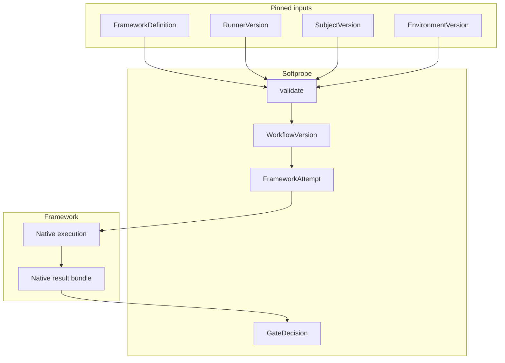

# Framework runners

Framework interoperability is **runner-first**. Softprobe does not promise full DSL translation for Promptfoo, DeepEval, or future tools.

(Older docs may say “framework adapters.” Prefer **framework runner**.)

## Runner model



## What Softprobe runs vs owns

| Softprobe does | Softprobe does not |
|----------------|--------------------|
| Pin definition, runner, subject, environment | Translate assertions into Softprobe JSON |
| Enforce capabilities and isolation | Implement Promptfoo/DeepEval scorers |
| Capture native result + evidence | Expand framework-internal case matrices |
| Outer lifecycle + GateDecision | Own trials/reducers as Softprobe plugins |

## Example: Promptfoo runner pin

```yaml
framework_definition: cas://sha256:42a...
runner:
  id: promptfoo-runner@2.1.0
  runtime_image: ghcr.io/softprobe/promptfoo-runner@sha256:9c3...
subject: support-router@sha256:...
environment:
  network: off
  filesystem: [workspace:ro, artifacts:rw]
  secrets: [OPENAI_API_KEY_REF]
  limits:
    timeout_s: 300
    max_result_mb: 50
gate_policy: support-router-v1
```

## Validation diagnostics

```json
{
  "ok": false,
  "error": {
    "code": "RUNNER_DEFINITION_NOT_CLOSED",
    "message": "Unpinned file reference: prompts/router.txt"
  }
}
```

```json
{
  "ok": false,
  "error": {
    "code": "RUNNER_RESULT_INVALID",
    "message": "result bundle exceeds declared max_result_mb"
  }
}
```

## Optional projection

Framework-native result remains the authoritative artifact:

```json
{
  "native_result_artifact": "cas://sha256:result-bundle",
  "projected_measurements": [
    { "name": "router.skill_match", "value": true }
  ],
  "projection_status": "lossy"
}
```

Unsupported fields stay in native artifacts and are flagged in diagnostics.

## Security and trust

- Runner cannot append Softprobe lifecycle events directly.
- Runner cannot publish authoritative gates.
- All uploads validated before commit.
- Capability grants are explicit and least-privilege.

## Related

- [Native model and framework runners](/en/evaluation/concepts/native-model-and-adapters)
- [Promptfoo integration](/en/evaluation/guides/promptfoo-integration)
- [Trust boundaries](/en/evaluation/architecture/trust-boundaries)
