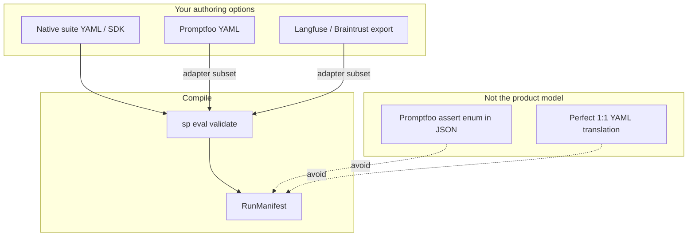

# Framework adapters

Softprobe does **not** mirror every Promptfoo, Langfuse, or Braintrust feature in RunManifest JSON. Frameworks are **optional inputs**; the kernel contract is native suites, environments, evaluators, and workflow.



## Design principles

| Principle | Meaning |
|-----------|---------|
| **Native first** | Author `data + subject + evaluators + environment` directly |
| **Adapters are versioned** | Each import records adapter id + source digest |
| **Explicit failure** | Unsupported features → diagnostics, not silent drop |
| **Capabilities not enums** | Evaluators reference descriptors, not `assert[].type` |
| **Workflow is universal** | validate → run → evidence → gate — same for all sources |

## Three integration modes

### 1. Importer / compiler

`sp eval validate --import <framework>` translates a **supported subset** into RunManifest:

```bash
sp eval validate --import promptfoo \
  --config promptfooconfig.yaml --tests tests.yaml \
  --json
```

**Example response (diagnostics, not silent pass):**

```json
{
  "ok": true,
  "data": {
    "manifest": { "…": "…" },
    "diagnostics": [
      {
        "path": "tests[2].assert[0]",
        "code": "unsupported_assert",
        "detail": "javascript assert runs only as sandboxed node or native rewrite"
      }
    ],
    "lossy_mappings": [
      {
        "path": "defaultTest.options.provider",
        "code": "lossy_mapping",
        "detail": "provider cache policy not portable; kernel uses hermetic cache rules"
      }
    ],
    "provenance": {
      "adapter": "promptfoo-importer@2.1.0",
      "source_digest": "sha256:promptfooconfig…"
    }
  }
}
```

**Typical supported subset (Promptfoo):** cases/vars → CaseVersion; common deterministic asserts → builtin evaluators; providers → SubjectVersion; matrix expansion at kernel plan time.

**Not promised:** every assert type, custom JS, provider-specific cache semantics, `.promptfoo` SQLite as SoR.

### 2. Sandboxed evaluator component

Run Promptfoo (or DeepEval, etc.) as **one DAG node** when a method has no native equivalent yet:

- Node returns measurements + native diagnostics as artifacts
- Node **cannot** schedule trials, retry, expand matrix, or publish gates
- Prefer migrating to native evaluator capabilities when stable

### 3. Opaque legacy-run importer

Import an entire legacy run as provenance for comparison — not as a portable per-case manifest.

## Execution equivalence (workflow, not file format)

| Concept | Softprobe (native) | Promptfoo (adapter input) |
|---------|-------------------|---------------------------|
| Define cases | `cases[]` in suite YAML | `tests` / `vars` |
| Define grader | `evaluators[]` + capability | `assert[]` (partial import) |
| Run | `sp eval run` | `promptfoo eval` (parallel path during migration) |
| Pass/fail for release | **GatePolicyVersion** | External flag → measurement only |
| Storage | thelake ledger + CAS | Native artifacts preserved; not authoritative SoR |

## Migration path


1. Run importer in CI — fail on `unsupported` for cases you care about
2. Run kernel and framework **side-by-side** until parity on your subset
3. Rewrite high-value suites to native YAML (especially environment/outcome eval)
4. Gate releases on **RunManifest** digest + GatePolicyVersion

## Example — same intent, native vs imported

**Native (recommended):**

```yaml
evaluators:
  - id: router.skill_match
    capability: builtin/deterministic/contains@1
    params: { pattern: billing-support, selector: rollout.output }
```

**Promptfoo (adapter input only):**

```yaml
assert:
  - type: icontains
    value: billing-support
```

After import, the manifest references `eval_contains_…@sha256` — not `{ "type": "icontains" }`. The assert type is **provenance**, not the long-term schema.

## Related

- [Native model and adapters](/en/evaluation/concepts/native-model-and-adapters)
- [Promptfoo integration](/en/evaluation/guides/promptfoo-integration)
- [Quick start](/en/evaluation/getting-started)

::: info Legacy page
The old “field-by-field mapping” mental model is intentionally retired. Adapters change with framework versions; the native model and workflow do not.
:::
