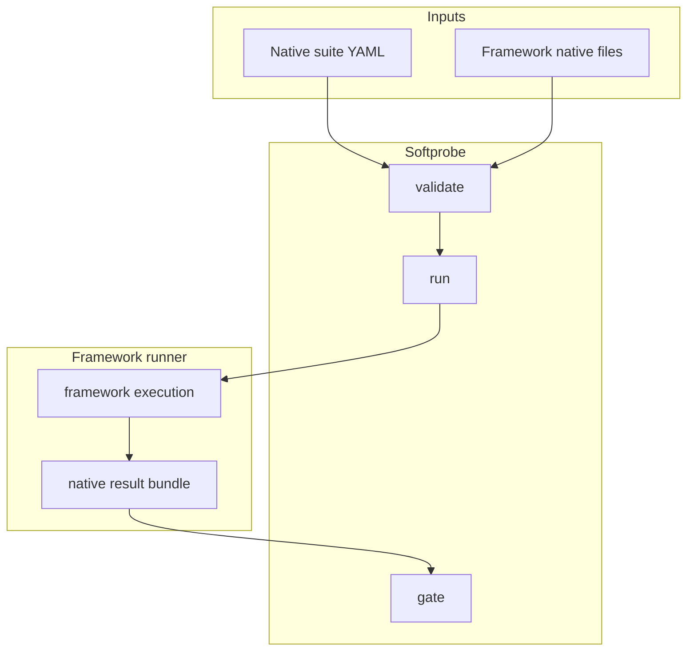

# Framework adapters

Framework interoperability is **runner-first**. Softprobe does not promise full DSL translation for Promptfoo/DeepEval.

## Adapter model



## Modes and when to use them

| Mode | Best for | Guarantees |
|------|----------|------------|
| Opaque framework runner | Keep full Promptfoo/DeepEval semantics | Native definitions/results preserved byte-for-byte |
| Sandboxed kernel component | Small kernel-owned checks | Stable evaluator contract inside kernel DAG |
| Optional projection | Query/report on common subset | Explicitly loss-aware; unsupported fields stay native |

## Example: Promptfoo runner descriptor

```yaml
subject:
  type: framework_runner
  runner:
    id: promptfoo-runner@2.1.0
    runtime_image: ghcr.io/softprobe/promptfoo-runner@sha256:9c3...
  definition_artifact:
    ref: cas://sha256:42a...
  capabilities:
    network: off
    filesystem: [workspace:ro, artifacts:rw]
    secrets: [OPENAI_API_KEY_REF]
  limits:
    timeout_s: 300
    max_result_mb: 50
```

## Example: validation diagnostics

```json
{
  "ok": false,
  "error": {
    "code": "RUNNER_DEFINITION_NOT_CLOSED",
    "message": "Unpinned file reference: prompts/router.txt"
  }
}
```

```json
{
  "ok": false,
  "error": {
    "code": "RUNNER_RESULT_INVALID",
    "message": "result bundle exceeds declared max_result_mb"
  }
}
```

## Optional projection example

Framework-native result remains authoritative artifact:

```json
{
  "native_result_artifact": "cas://sha256:result-bundle",
  "projected_measurements": [
    { "name": "router.skill_match", "value": true }
  ],
  "projection_status": "lossy"
}
```

If projection cannot represent a field, it is retained in native artifacts and flagged in diagnostics.

## Security and trust

- Runner cannot append kernel lifecycle events directly.
- Runner cannot publish authoritative gates.
- All uploads validated before commit.
- Capability grants are explicit and least-privilege.

## Related

- [Native model and framework runners](/en/evaluation/concepts/native-model-and-adapters)
- [Promptfoo integration](/en/evaluation/guides/promptfoo-integration)
- [Trust boundaries](/en/evaluation/architecture/trust-boundaries)
