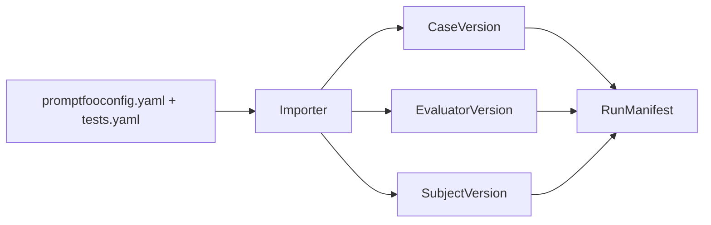

# Promptfoo field mapping

Field-by-field mapping from Promptfoo authoring files to Softprobe **immutable resources**. Use with `sp eval validate --import promptfoo`.



## Config and suite

| Promptfoo | Softprobe |
|-----------|-----------|
| `promptfooconfig.yaml` (full project) | **SuiteVersion** (via importer) |
| `tests.yaml` (shared cases) | **DatasetVersion** + **CaseVersion[]** |
| `description` on test row | CaseVersion metadata + human title |
| Matrix (prompt × provider × test) | **CaseRun** grid from resolved manifest |

## Variables → CaseVersion

| Promptfoo field | Softprobe field |
|-----------------|-----------------|
| `vars.system_prompt` | `CaseVersion.input_refs.prompt_digest` (content-addressed) |
| `vars.user_query` | `CaseVersion.input.user_query` |
| `vars.*` (other) | `CaseVersion.input` / `metadata` with typed mapping |
| `file://` refs | Resolved to digest at validate time |

## Assertions → EvaluatorVersion

| Promptfoo | Softprobe |
|-----------|-----------|
| `assert[].type: icontains` | Builtin deterministic evaluator (`contains`) |
| `assert[].type: not-icontains` | Builtin deterministic evaluator (`not-contains`) |
| `assert[].value` | Evaluator parameter `pattern` |
| `defaultTest.assert` | Suite-level default EvaluatorVersion bindings |
| Unsupported types | Typed diagnostic at validate — never silent pass |

## Providers → SubjectVersion

| Promptfoo | Softprobe |
|-----------|-----------|
| `providers[]` | **SubjectVersion.provider_descriptor** |
| Model id / API config | Pinned in manifest with digest |
| Matrix expansion | Kernel plan time — not nested Promptfoo orchestrator |

## Prompts

| Promptfoo | Softprobe |
|-----------|-----------|
| `prompts[]` | Subject prompt refs or case vars |
| Prompt file content | Digest pinned in **RunManifest** |

## Execution mapping

| Promptfoo | Softprobe |
|-----------|-----------|
| `promptfoo eval` | `sp eval run` |
| `.promptfoo/` SQLite | Native diagnostics as **artifacts**; thelake is system of record |
| `promptfoo view` | API/projections + artifact paths |
| Provider cache | Kernel cache on hermetic nodes only |
| Pass/fail | External measurement; **GateDecision** from GatePolicyVersion |

## Worked example (support router)

```yaml
# tests.yaml excerpt
vars:
  system_prompt: "file://prompts/router.txt"
  user_query: "I was charged twice for my subscription"
assert:
  - type: icontains
    value: "billing-support"
  - type: not-icontains
    value: "internal_db_schema"
```

Compiles to:

- **CaseVersion** with `user_query` + prompt digest
- **EvaluatorVersion** ×2 (skill match, confidentiality)
- **SubjectVersion** with pinned provider
- **EnvironmentVersion** noop

See [Promptfoo integration](/en/evaluation/guides/promptfoo-integration) and [Data model worked example](/en/evaluation/concepts/data-model).
