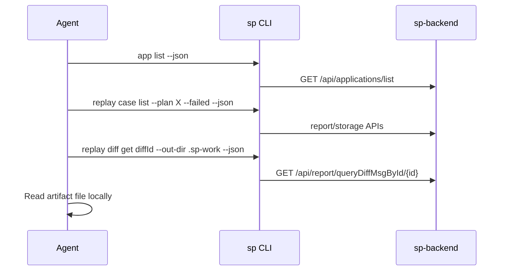

# Choose how to integrate

This section is for people who write scripts, CI jobs, plugins or AI-agent skills against SoftProbe, and for the AI agents themselves (OpenCode / spcode, Claude Code, Codex, Cursor and other hosts that call SoftProbe through shell tools).

## Pick an interface {#pick-an-interface}

| You want to… | Use |
|---|---|
| Trigger a replay after a deployment and gate the pipeline on the result | The HTTP endpoints in [Replay after deployment](/en/testing/webhook-and-ci) and the [Replay trigger Open API](/en/testing/reference/replay-openapi) |
| Query recordings, replay results, diffs and logs, or diagnose a failed replay | The `sp` command line (this section and the [command reference](/en/testing/commands/)) |
| Manage recording, mock and compare policies as files in Git | `sp policy` and the [Policy YAML reference](/en/testing/policy-yaml-guide) |
| Look at reports and diffs by hand | The web console — see [Replay report](/en/testing/replay-report) |

## Feed these docs to your agent {#feed-these-docs-to-your-agent}

The whole documentation set is published in [llmstxt.org](https://llmstxt.org/) format so an agent can read it without scraping HTML:

| URL | Contents |
|-----|----------|
| [`/llms.txt`](/llms.txt) | Curated index of every page with descriptions — a small entry point |
| [`/llms-full.txt`](/llms-full.txt) | The entire docs corpus in one plain-text file |
| `‹any page›.md` | The Markdown source of a single page (append `.md` to its URL) |

Point your agent at `/llms.txt` first; it follows links into the full text or per-page `.md` as needed.

## How the parts fit together {#how-softprobe-works}

| Part | Role |
|------|------|
| **Your Java service** | Started with `-javaagent:/path/to/sp-agent.jar` |
| **SoftProbe Java agent** | Weaves bytecode at runtime and records HTTP, database, cache, RPC and other dependency data without code changes; mocks those calls during replay |
| **SoftProbe backend (sp-backend)** | Stores recordings, policies, replay plans, logs, diff results and agent heartbeats; every documented `sp` command talks to it over HTTP (`:8090` by default) |
| **`sp` CLI** | Registers apps, applies policies, checks agent status, queries recorded data, starts replays and diagnoses failures. Stable JSON output, predictable exit codes, and files for large payloads — see [Output contract](/en/testing/agents/output-contract) |

A replay needs recorded cases from an app that actually ran with the agent, so replay is never the first step on a fresh system.

The agent is attached with a JVM flag. Pin the app ID explicitly; it is how SoftProbe isolates recordings, pulls config and matches replay data (it is separate from `OTEL_SERVICE_NAME`). Use the ID returned by `sp app create`, or any stable non-empty name such as `order-service` — an unknown ID is normally registered automatically the first time the agent loads its config (exceptions: [Concepts and IDs](/en/testing/agents/concepts#application-appid)):

```bash
java \
  -javaagent:/opt/softprobe/sp-agent.jar \
  -Dsp.app.id=a1b2c3d4e5f67890 \
  -Dsp.api.url=http://127.0.0.1:8090 \
  -jar order-service.jar
```

Full attach instructions: [Attach the Java agent](/en/testing/java-agent).

## Calling `sp` from an agent {#calling-sp-from-an-agent}

1. **One process, one job** — each tool call runs a single `sp` command with explicit flags. No shell aliases, no interactive prompts.
2. **Always pass `--json`** for machine parsing, unless you are showing output to a person.
3. **Use artifacts for large payloads** — diff bodies, log downloads and record queries write files under `--out-dir`; stdout carries only paths and summaries.

Wrap `sp` as a shell tool with a fixed argv prefix:

```bash
sp --json --profile "${SP_PROFILE:-default}" <subcommand> ...
```

Environment variables to set in the host config:

| Variable | Purpose |
|----------|---------|
| `SP_API_URL` | Backend base URL (e.g. `http://127.0.0.1:8090`) |
| `SP_TOKEN` | JWT from `sp auth login` or a CI secret |
| `SP_PROFILE` | Named profile in `${XDG_CONFIG_HOME}/softprobe/config.jsonc` or `sp.jsonc` |
| `SP_CONFIG` | Extra config file loaded after `sp.jsonc` and before `--config` |

`sp` also reads `${XDG_CONFIG_HOME:-~/.config}/softprobe/config.jsonc` for shared settings and `${XDG_CONFIG_HOME:-~/.config}/softprobe/sp.jsonc` for CLI-specific overrides. In short-lived CI containers, prefer `SP_API_URL` and `SP_TOKEN`.

How to read exit codes and errors: [Output contract](/en/testing/agents/output-contract#exit-codes).

## Command order for a new app {#lifecycle-command-order}

1. `sp doctor --json`
2. `sp app create <name> --json` → save `data.appId`
3. `sp policy recording apply -f … --json`
4. Download `sp-agent.jar` (see [Attach the Java agent](/en/testing/java-agent#download)), then `sp agent command --app <id> --agent-jar ./sp-agent.jar --json`
5. Start the app with `data.startCommand`; send traffic
6. `sp record case list --app <id> --since -1h --json`
7. `sp policy mock apply` / `sp policy compare apply`
8. `sp replay run --app <id> --env <service-base-url> --json`
9. `sp replay status <planId> --json` or `sp diagnose replay <planId> --json`

## Typical flows {#typical-flows}

### Diagnose a failed replay {#diagnose-a-failed-replay}



Step by step: [Diagnose a failed replay](/en/testing/examples/agent-diagnose-replay).

### Change a policy and re-run {#change-a-policy-and-re-run}

1. `sp policy recording validate -f policy.yaml --json` — check `data.valid`; the command exits `0` even when the policy is invalid
2. `sp policy recording apply -f policy.yaml --json`
3. `sp replay run --app … --env <service-base-url> --json`
4. `sp replay status <planId> --watch --json`

## What not to call {#what-not-to-call}

- Agent write APIs (`POST /api/storage/record/save`, batch saves) — for the instrumentation only
- OTLP ingestion (`/v1/traces`) — use collectors

Commands that delete or change shared state — `sp policy <type> delete`, `sp replay noise exclude` and real-time replay queue control — refuse to run without `--confirm`. Let a person decide before an agent passes it.

## Migrating from the spcode plugin's `sp_api` tool {#migrating-from-the-spcode-plugins-sp_api-tool}

The `sp_api` tool in the spcode / OpenCode plugin used named endpoints (`diff_detail`, `query_replay_case`, …). The `sp` CLI exposes the same operations as stable subcommands, so skills behave the same outside spcode:

| Old | New |
|-----|-----|
| `sp_api endpoint=list_applications` | `sp app list --json` |
| `sp_api endpoint=diff_detail diffId=…` | `sp replay diff get … --out-dir … --json` |
| `sp_api endpoint=find_traces_by_attr …` | `sp trace find … --json` |

## Examples {#examples}

- [Diagnose a failed replay](/en/testing/examples/agent-diagnose-replay) — from a failed plan, or from a business ID such as an order number, to diffs and correlated logs
- [Manage policies in Git](/en/testing/examples/gitops-policies) — export, review, validate in CI and apply
- [Replay after deployment](/en/testing/webhook-and-ci) — a complete pipeline script

## Reference {#reference}

- [Command reference](/en/testing/commands/)
- [Output contract](/en/testing/agents/output-contract) — envelope, exit codes, JSON shapes, versioning
- [Concepts and IDs](/en/testing/agents/concepts)
- [Replay trigger Open API](/en/testing/reference/replay-openapi)
- [CLI to backend API mapping](/en/testing/reference/api-mapping)
- [Log query fields](/en/testing/commands/log-query-fields)
- [Replay send log markers](/en/testing/reference/replay-send-log-markers)
