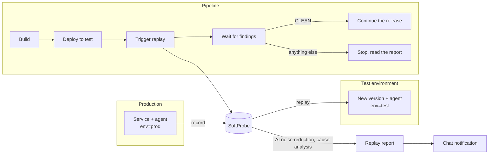

# Best practice: regression testing on every release (the full CI/CD flow)

This page walks through recording, replay, AI analysis, a CI/CD gate and chat notifications — the full path from onboarding a service to "every release is regression-tested automatically" — followed by a real example. Each step links to the page with the details.

The result: once a new version is deployed to the test environment, the pipeline replays requests recorded in production against it. If something is wrong, the pipeline stops and the group chat is told which endpoint and which field changed; with AI set up, it also analyzes whether a code change caused the difference and where. If nothing is wrong, the release continues.

## The whole flow {#overview}



## One-time setup {#setup}

### 1. Record in production {#record-prod}

Add the agent to the JVM startup arguments of your production (or pre-production) instances and give them an environment tag:

```bash
-javaagent:/opt/softprobe/sp-agent.jar -Dsp.app.id=order-service \
-Dsp.api.url=http://sp-backend.internal:8090 -Dsp.tags.env=prod
```

By default each machine records at most one request per endpoint per minute, which is usually enough. To record more, add a sampling rule under **Config → Recording**: set **Active environments** to `env=prod` and raise the sample rate.

The same rule can also be written as YAML and kept in Git; to apply it, see [Manage policies in Git](/en/testing/examples/gitops-policies). `ratePerHundredSeconds` is the console's **Sample rate (per minute)** — the field name is historical:

```yaml
apiVersion: softprobe.ai/v1
kind: RecordingPolicy
metadata:
  name: order-service-prod-sampling
  priority: 20
selector:
  appIds: [order-service]
  envTags:
    env: [prod]
spec:
  sampling:
    ratePerHundredSeconds: 10
```

How much is enough: a few dozen requests for each main endpoint, covering the common parameter combinations. You don't need everything. If the service uses local caches, set **Coverage packages** in the recording settings. Register business methods that return something different on every call (encryption, your own serial-number generator and the like) as [dynamic classes](/en/testing/policies#dynamic-classes) so the replay can reproduce them; system time and random numbers are handled by built-in instrumentation and need no dynamic-class configuration. See [Attach the Java agent](/en/testing/java-agent) and [Recording and replay settings](/en/testing/policies).

### 2. The test environment {#test-env}

Attach the agent to the test instances too, with the **same application ID** and the tag `env=test`:

```bash
-javaagent:/opt/softprobe/sp-agent.jar -Dsp.app.id=order-service \
-Dsp.api.url=http://sp-backend.internal:8090 -Dsp.tags.env=test
```

The test environment doesn't record, so replayed requests aren't recorded all over again. Add a sampling rule with **Active environments** set to `env=test` and a sample rate of 0. As YAML:

```yaml
apiVersion: softprobe.ai/v1
kind: RecordingPolicy
metadata:
  name: order-service-test-no-recording
  priority: 20
selector:
  appIds: [order-service]
  envTags:
    env: [test]
spec:
  sampling:
    ratePerHundredSeconds: 0
```

On the network side, instances in both production and test must reach the SoftProbe backend (the agent reports data, pulls its configuration, and fetches recorded results during replay), the backend must reach the service port in the test environment, and the CI machine must reach the backend. See [Before you deploy — network rules](/en/testing/installation/preparation#network).

### 3. Register the main endpoints {#main-operations}

Without registered main endpoints, a replay that finished normally with nothing to fix or review still ends up `LOW_COVERAGE` if it covered fewer than 10 endpoints or fewer than 30 requests. Once main endpoints are registered, the check becomes whether every endpoint on the list was replayed. If the service has only a few endpoints, or you replay only a few key ones, register them first:

```bash
curl -X POST http://sp-backend.internal:8090/api/config/schedule/modify/UPDATE \
  -H 'Content-Type: application/json' \
  -d '{"appId": "order-service", "mainOperations": ["/order/price", "/catalog/item", "/user/profile"]}'
```

See [Replay after deployment — main endpoints](/en/testing/webhook-and-ci#main-operations).

### 4. Set up AI and the code repository (recommended) {#ai}

With a model service set up and a code repository bound to the application, under the default flow settings pipeline-triggered replays first go through automatic AI noise reduction, which recognizes fields that change on every run (timestamps, random IDs and the like) as noise and ignores them. If cases still fail, their cause is then analyzed automatically. The results go into the report and the chat notification; when a difference is traced to a code change, the analysis points to the file and line. Some cases may remain without an established cause. See [Set up AI diagnosis and code repositories](/en/testing/installation/ai-diagnosis).

- The AI reads the code on the bound branch and doesn't check that it matches the version actually running in the test environment. Bind the branch that gets deployed to test, such as the release branch. The report notes which branch and commit the analysis read.
- Whether automatic noise reduction and analysis run depends on the switches and daily limits in the report's [flow settings](/en/testing/replay-report#flow-settings). By default at most 10 analyses run automatically per day; raise it there if you release often.

Without AI you can still record, replay and judge by diff rules; you just don't get automatic noise reduction or cause analysis.

### 5. Establish a clean replay baseline {#baseline}

Deploy **the same version that runs in production** to the test environment, trigger a replay with the script from [Wire it into the pipeline](#pipeline) below using the pipeline's parameters, open the report link it prints, and deal with the differences in the report:

- Fields that change on every run, such as timestamps, serial numbers and random IDs: add [diff rules](/en/testing/compare-rules-web-ui), or use **Ignore permanently** on the noise the AI found, under **Ignored noise** in the report.
- Differences caused by configuration that differs between test and production: adjust the test environment first; only for calls that genuinely can't match, consider registering them as dynamic classes.

Trigger again after each round, until the script prints `CLEAN`. A clean baseline keeps the same noise from blocking later releases again and again.

### 6. Notification channel {#notify}

In the **Notifications** tab of settings, add a Feishu or DingTalk bot, pick this application under **Applications**, then click **Send test** and check that the message arrives. To hear only about problems, turn on **Only on failure**.

When the findings are `NEEDS_ACTION` or `REVIEW_ONLY` and this replay will be analyzed automatically, the notification waits for the analysis result, for up to 20 minutes; after that it's sent anyway, with the analysis progress. To feed results into your own system, choose the Webhook type; it also receives the AI analysis text as a separate event. See [Replay notifications](/en/testing/notifications).

### 7. Keep the rules in Git (optional) {#gitops}

Sampling, mock and diff rules can all be written as YAML and reviewed and released together with the code. See [Manage policies in Git](/en/testing/examples/gitops-policies).

## Wire it into the pipeline {#pipeline}

First check the conditions in [Before you start](/en/testing/webhook-and-ci#before-you-start): these endpoints are available on self-hosted deployments only; an All-in-One deployment needs `SP_REPLAY_OPENAPI=true` and a restart; and the machine running the script needs bash, curl and jq.

Then, after "deployed to the test environment and health check passed" and before "release to the next environment", add a step that runs [the complete script](/en/testing/webhook-and-ci#script) with these environment variables:

| Variable | Value in this example | Meaning |
|------|---------|------|
| `SP_BACKEND` | `http://sp-backend.internal:8090` | SoftProbe backend address |
| `SP_APP_ID` | `order-service` | Application ID |
| `SP_TARGET` | `http://order-service.test:8080` | Address of the new version in the test environment |
| `SP_CASE_TAGS` | `{"env":"prod"}` | Replay only requests recorded in production |
| `SP_CASE_SOURCE_HOURS` | `24` | Replay recordings from this many recent hours; a positive integer |
| `SP_REVISION`, `SP_BRANCH` | Commit, branch | Shown in the report and the chat notification |
| `SP_PIPELINE_RUN_ID`, `SP_PIPELINE_RUN_URL` | Pipeline run number and link | Lets people click from the notification back to the pipeline run |
| `SP_TIMEOUT_SECONDS` | `1800` (default) | How many seconds to wait at most; a timeout exits with code `2` |

Exit codes:

| Exit code | Findings | Pipeline |
|---|---|---|
| `0` | `CLEAN` | Continue the release |
| `1` | `NEEDS_ACTION`, `REVIEW_ONLY` | Stop: there are problems to fix or review |
| `2` | `LOW_COVERAGE`, `NO_CASES`, `INTERRUPTED`, `ENVIRONMENT_FAILURE`, or the call failed or timed out | Stop: this release wasn't verified |

For Jenkins, GitLab CI and GitHub Actions, see [Wire it into your pipeline](/en/testing/webhook-and-ci#wire-it-into-your-pipeline). Once it's wired up, run it once with an unchanged version and once with a deliberately broken one, to confirm the exit code really stops the release. If your team lets releases through after review, set up a manual approval step in the pipeline in advance.

::: tip How long the pipeline waits
The script gets its answer once the replay has finished and AI noise reduction is done; it doesn't wait for the AI cause analysis. The analysis continues in the background, then goes into the report and triggers the chat notification. In [the example below](#example), the first run had differences — from trigger to script exit took about 2 minutes, and the notification arrived about 10 minutes after the script exited. The second run passed completely, yet the step took about 8 minutes: 1 min 36 s of replay, and the rest was AI noise reduction wrapping up, not cause analysis. Leave room for both the replay and AI noise reduction in `SP_TIMEOUT_SECONDS`.
:::

## After the findings are in {#triage}

| Findings | What it usually means | What to do |
|------|-----------|---------|
| `CLEAN` | Enough requests were replayed and no problems were found | Continue the release |
| `NEEDS_ACTION` | An endpoint returned errors, a field value changed, a field went missing, or downstream calls dropped | Open the report and look at all the problems to fix first; once the AI analysis is done, go through **Differences caused by code changes**, **Cause not established** and **Invalid**. If the change is intended, mark it passed in the report, then let the release through by hand following your team's process; if not, fix it and release again |
| `REVIEW_ONLY` | Differences someone should review, such as new fields, extra downstream calls, changed downstream request parameters, or a 401 or timeout on a few endpoints | Review each by its cause, then decide whether to let it through |
| `LOW_COVERAGE` | Too few endpoints or requests were replayed, or main endpoints weren't replayed | Record more, or register or fill in the main endpoints |
| `NO_CASES` | Nothing to replay | Check that production is recording, and that `SP_CASE_TAGS` and `SP_CASE_SOURCE_HOURS` match |
| `ENVIRONMENT_FAILURE`, `INTERRUPTED` | Many endpoints failed the same way, or the replay didn't finish | Read the failure reason in the report, and check that the service is up and its address and network are reachable. When many endpoints all return 500, the application itself may be failing. Rerun the pipeline once it's fixed |

How to read the report: [Replay report](/en/testing/replay-report). To go through differences one by one: [Review differences](/en/testing/review-diffs-in-the-web-ui).

::: info After an intended change ships
Once the change is in production, production gradually records requests from the new version. While requests from the old version are still within the `SP_CASE_SOURCE_HOURS` time range, later releases report the same difference and the pipeline stops again. **Mark passed** applies only to that one replay, so it has to be checked each time; the report and the notification say how many runs in a row the difference has appeared, which makes a recurring difference easy to recognize. `SP_CASE_SOURCE_HOURS` is at least 1 hour. Once all old-version instances in production are gone and the new version's recordings cover the main endpoints, you can shorten the time range.
:::

## A real run {#example}

Here is a full record of one run, following this page on a demo environment:

- The service under test is a pricing service with application ID `sp-diag-e2e-app` and 3 endpoints, all registered as main endpoints; diff rules already exclude `quoteId` and `quotedAt`, which change on every call.
- The production and test instances run on one machine on two ports; production traffic is simulated by a script.
- AI is set up and a code repository is bound; the notification channel is a Webhook.
- The pipeline step runs [the complete script](/en/testing/webhook-and-ci#script) as is, with `SP_CASE_SOURCE_HOURS` set to `1`.

### Before the release: production is recording {#example-record}

The production instance runs with the `env=prod` tag, with a sampling rule added as in [step 1](#record-prod). Demo traffic is light, so the sample rate was set to 30 per minute. The release replays the requests recorded in the hour before it: 237 of them.

### First release: the rounding changed {#example-first}

A developer committed `0026097` ("调整会员价计算", adjust the member price calculation), which changed the member price from rounding half up to rounding down:

```diff
-    return listPrice.multiply(MEMBER_DISCOUNT).setScale(0, RoundingMode.HALF_UP);
+    return listPrice.multiply(MEMBER_DISCOUNT).setScale(0, RoundingMode.FLOOR);
```

After the new version was deployed to the test environment, the pipeline ran the replay step and printed the following. This run used the Chinese version of the script, whose messages read "Replay triggered", "Replay findings" and "Report" in the English version; the console address in the report link is replaced:

```text
已触发回放，planId=6abc8d38e5eb34767296cc10
回放结论：NEEDS_ACTION
报告：https://<console-address>/sp/workbench/sp-diag-e2e-app/runs/6abc8d38e5eb34767296cc10
```

The exit code was `1` and the pipeline stopped. From trigger to script exit took 2 min 06 s: 1 min 39 s of replay, then about 20 s waiting for AI noise reduction, and the rest was the script's polling interval.

The report: of 237 cases, 158 passed and 79 didn't. `/order/price` replayed 81 cases, and in 79 of them `payable` was 1 lower than recorded. The AI attributed all 79 to a code change, pointed at `PricingService.java:12` and commit `0026097`, and explained why: taking a list price of 1990, 15% off is 1691.5, which rounds half up to 1692 and down to 1691. In this run the AI wrote its analysis in Chinese.


The **10 replays in a row** label next to the difference's title reflects earlier replays of the same version in the demo environment.

### The notification {#example-notify}

About 10 minutes after the script exited, the AI analysis finished and the notification channel received the findings of this replay and the AI analysis. The AI analysis, translated:

> **AI cause analysis**: 79 cases failed; the cause was established for all 79.
>
> **Differences caused by code changes** (developers need to confirm they are intended)
>
> - Member price now rounds down; payable is 1 yuan less · 79 cases · PricingService.payable · src/main/java/diag/e2e/PricingService.java:12. What to do: confirm whether this change in rounding is intended. If it is, mark these cases passed; if not, fix the code and replay again.

With a Feishu or DingTalk bot as the channel, the group gets a card titled "sp-diag-e2e-app 发版回放：1 处差异由代码改动引起" ("sp-diag-e2e-app release replay: 1 difference caused by code changes"). For what the card contains, see [What's in a notification](/en/testing/notifications#card).

### Fix and release again {#example-fix}

The change wasn't intended, so the developer put the rounding back to half up and released again. The pipeline printed:

```text
已触发回放，planId=6abc8e97e5eb34767296cfcf
回放结论：CLEAN
报告：https://<console-address>/sp/workbench/sp-diag-e2e-app/runs/6abc8e97e5eb34767296cfcf
```

The exit code was `0` and the release continued. All 237 cases passed and the replay took 1 min 36 s; the step took about 8 minutes in total, including the wait for AI noise reduction to finish (see [How long the pipeline waits](#pipeline)).

Both runs are listed under **Replay plans → Run records**; the 128 and 129 in the plan names are the pipeline run numbers:


Had the change been intended, the next step would have been to click **Mark passed (79)** in the report, then approve the release manually in the pipeline.

## Day-to-day upkeep {#maintenance}

- **Pin the core scenarios**: pin core transaction flows and requests that once caused trouble so they're not affected by recording retention. See [Pinned cases](/en/testing/pinned-cases).
- **Replay pinned cases on a schedule**: under **Replay plans → Scheduled tasks**, regularly replay the pinned cases against the test environment to confirm the core scenarios still work on the current version. Downstream dependencies are answered from the recording by default, so this won't catch changes in the downstream APIs themselves; scheduled replays also don't send chat notifications or run cause analysis automatically — check the results in Run records. See [Scheduled replay](/en/testing/replay-and-diff#scheduled).
- **Watch the noise**: when "cause not established" or ignored differences grow noticeably in the report, first look at what actually changed and whether the AI read the code for the right version; add a diff rule only once you've confirmed it's a field with no business impact, such as a timestamp or random ID.
- **Agent upgrades**: run the same agent version in production and test, and verify a new version in test before upgrading production.
