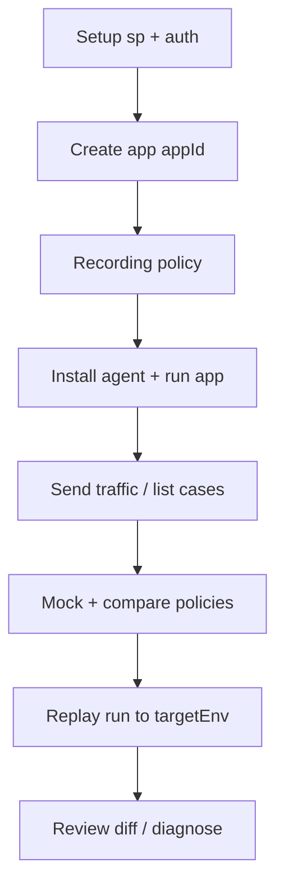

# Getting started with Softprobe Testing

This page is the **product lifecycle** for Java record-and-replay. Hands-on commands live in the [CLI quickstart](/en/cli/guide/quickstart); read this first for *what* happens at each step and *why* replay cannot be step one.

::: tip Try the demo first (5 minutes)
New to Softprobe? Run the [Travel OTA demo quickstart](/en/testing/demo-quickstart): download the lightweight JAR, attach the Java agent, and capture your first recording in minutes.
:::

## Prerequisites

- Java service you can start with `-javaagent`
- **sp-boot** running (local Docker/E2E: port **8090**; cloud: your tenant API URL)
- `sp` CLI installed, or dashboard access for the same backend
- Network path from agent host to sp-boot

## Lifecycle



| Step | Action | Detail |
|------|--------|--------|
| 1 | Setup | `sp setup doctor`, configure `SP_API_URL`, user token, and on SaaS `sp tenant key ensure` — [CLI quickstart §1](/en/cli/guide/quickstart#_1-setup) |
| 2 | Register app | `sp app create <appName>` → save `appId` — [concepts](/en/cli/guide/concepts#application-appid) |
| 3 | Recording policy | Before traffic: `sp policy recording apply` — [Recording policy](/en/testing/policies#recording-policy) |
| 4 | Agent | `sp agent download` + start JVM with `-Dsp.app.id` — [Java agent](/en/testing/java-agent) |
| 5 | Record | Generate traffic and verify cases — [How to record](/en/testing/recording) |
| 6 | Extraction (optional) | If you search by business ids (`orderId`), apply extraction rules before heavy traffic |
| 7 | Mock + compare policy | Before replay — [Mock and compare policies](/en/testing/policies#mock-policy) |
| 8 | Replay | `sp replay run --env <test-base-url>` — [replay and diff](/en/testing/replay-and-diff) |
| 9 | Investigate | `sp replay diff`, `sp diagnose replay`, `sp trace find` |

::: tip
**Replay is never the first step** on a greenfield app. Until step 5 produces cases, `sp replay run` has nothing meaningful to execute.
:::

## Record vs replay environments

| Environment | Agent recording | Role |
|-------------|-----------------|------|
| Production / staging | On (per policy) | Capture real traffic |
| Test / CI | Replay host: recording off or minimal | Receive replay HTTP; mock dependencies |

Use `-Dsp.tags.env=<label>` when you need to filter cases by source environment.

## Minimal command cheat sheet

```bash
export SP_API_URL=http://127.0.0.1:8090
sp app create order-service --json
sp policy recording apply -f recording.yaml --json
sp agent download --json
# start JVM with sp agent command output
sp record case list --app <appId> --json
sp policy mock apply -f mock.yaml --json
sp policy compare apply -f compare.yaml --json
sp replay run --app <appId> --env http://127.0.0.1:8080 --json
```

Replace `8080` with the port where **your application** listens — not sp-boot’s 8090.

## What to read next

| Goal | Link |
|------|------|
| How to produce cases | [How to record](/en/testing/recording) |
| Understand capture and mock mechanics | [How it works](/en/testing/how-it-works) |
| JVM flags and production safety | [Java agent](/en/testing/java-agent) |
| Framework coverage | [Supported frameworks](/en/testing/supported-frameworks) |
| Automate in CI or agents | [CLI overview](/en/cli/guide/overview) |
| Istio / frontend observability | [Platform quick start](/en/platform/getting-started/quick-start) |

## Related

- [Softprobe Testing overview](/en/testing/)
- [CLI quickstart](/en/cli/guide/quickstart)
