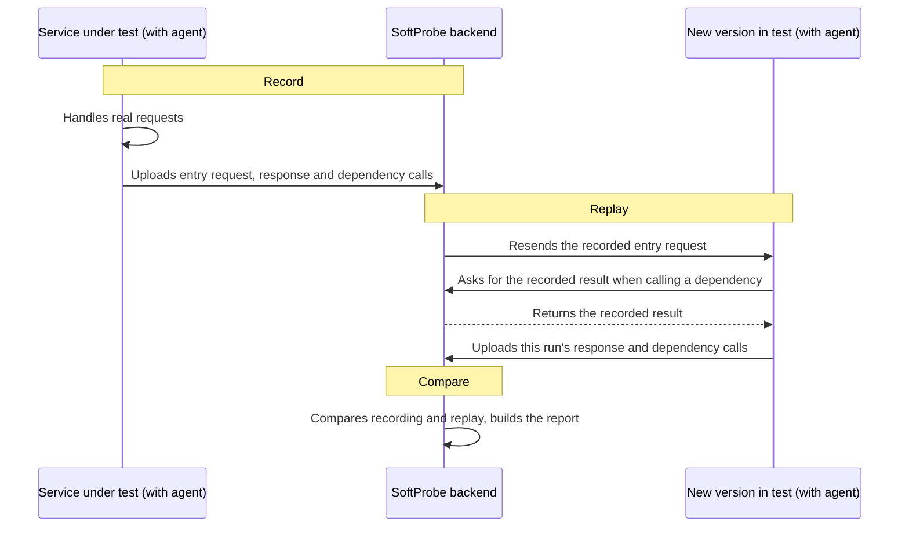

# How record and replay works

SoftProbe records one complete **request handling**: an entry request and every dependency the code called while handling it. During replay the same business code runs again; when it calls a dependency, the recorded result answers, depending on your settings.

## End to end {#end-to-end}



## Recording {#recording-phase}

The agent records two kinds of calls in the service:

| Kind | Examples | What is recorded |
|------|----------|------------------|
| **Entry** | HTTP endpoints (Servlet), Dubbo services, message consumers | The request received and the response returned |
| **Dependency** | Databases, Redis, HTTP clients, Dubbo calls, local caches, system time | Each call's parameters and result |

One entry request with all the dependency calls it triggered is a **case**. Recording is sampled — by default about one per minute, per instance, per endpoint. The agent uploads in a background thread, so business requests don't wait for the network.

Cases only come from recording; they can't be written by hand. Browsing recordings: [Recordings](/en/testing/recording). Changing what's recorded: [Recording settings](/en/testing/policies#recording).

## Replay {#replay-phase}

A replay (replay plan) picks a set of cases and sends their entry requests to the **target environment**: the address of a running service in a test environment, such as `http://order-service.test:8080`. The target also runs the agent, with the same application ID.

1. The backend sends the recorded entry requests to the target.
2. The target runs its real business code: controllers and business logic all execute.
3. When the code calls a dependency, the agent follows **Config → Replay**: answer with the recorded result (mock), or really make the call. By default everything is mocked.
4. This run's response and dependency calls are recorded.

Mocking only works for dependency types the agent supports. Dependencies set to make real calls, dependencies the agent doesn't support, and replay plans that force every dependency to make real calls all reach real external systems. That's why the target should be a test environment.

## Comparison {#comparison}

After a replay, each case's recorded and replayed results are compared item by item:

- **Entry response**: whether what's returned to the caller is the same.
- **Dependency calls**: whether the parameters match, and whether calls are missing or extra.

Common differences:

- **Value differs**: a field has a different value in recording and replay.
- **Missing call**: a dependency called during recording isn't called during replay.
- **Extra call**: replay calls a dependency the recording doesn't have.

Fields that change every time, such as timestamps and random IDs, are ignored with [diff rules](/en/testing/compare-rules-web-ui). The results add up to the [replay report](/en/testing/replay-report); with AI diagnosis set up, the report also says whether a difference was caused by a code change.

## An example {#example}

This method parses an IP address:

```java
public Integer parseIp(String ip) {
    int result = 0;
    if (checkFormat(ip)) {
        String[] ipArray = ip.split("\\.");
        for (int i = 0; i < ipArray.length; i++) {
            result = result << 8;
            result += Integer.parseInt(ipArray[i]);
        }
    }
    return result;
}
```

If `checkFormat` depends on external configuration or the environment, register it as a [dynamic class](/en/testing/policies#dynamic-classes): during recording the agent keeps its arguments and return value; during replay it returns the recorded value, so `parseIp` behaves as it did when recorded even if the test environment is configured differently. Local caches, encryption and the system clock are handled the same way, without code changes.

## Related {#related}

- [Attach the Java agent](/en/testing/java-agent)
- [Recording and replay settings](/en/testing/policies)
- [Run and schedule replays](/en/testing/replay-and-diff)
- [Concepts and IDs](/en/testing/agents/concepts)
