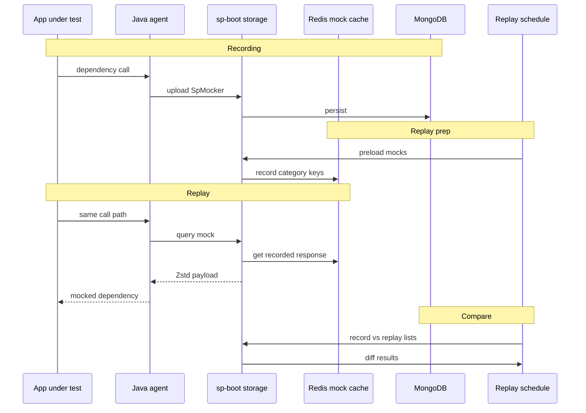

# How record-and-replay works

Softprobe Testing captures a **transaction**: one inbound request plus every dependency the code touched on that path. On replay, the same code path runs again; external calls are satisfied from stored data instead of live systems.

## End-to-end sequence



## Recording phase {#recording-phase}

When recording is enabled, the agent intercepts:

| Kind | Examples | What is stored |
|------|----------|----------------|
| **Entry** | `Servlet`, `DubboProvider`, `NettyProvider` | Inbound API request and response |
| **Dependency** | `HttpClient`, `Database`, `Redis`, `DubboConsumer`, `DynamicClass`, … | Outbound request and response per call |

Each interaction is a **mocker** row keyed by `appId`, trace/case identifiers, category, and operation name.

**How to produce cases:** [1. Record traffic](/en/testing/recording) · **Recording scope config:** [Recording policy](/en/testing/policies#recording-policy)

::: tip
Cases are created only from **instrumented traffic**. There is no supported workflow to hand-author cases in the CLI; send real or synthetic traffic through the app while the agent is recording.
:::

## Replay phase

A **replay plan** selects recorded cases and drives entry HTTP traffic to **`targetEnv`** — the base URL of the service under test (for example `http://order-service.test:8080`). This is **not** the same as `SP_API_URL`, which points at sp-boot.

During replay:

1. The schedule service sends the recorded entry request to `targetEnv`.
2. The app under test must run with the agent attached (recording frequency can be set to zero on the replay machine).
3. On each dependency call, the agent asks storage for the **recorded response** matching that call.
4. Storage serves from Redis when preloaded; otherwise it loads from MongoDB.

**Entry vs dependency behavior:**

- **Entry** (`entryPoint` categories): storage records the replay request; the live app still executes your controller/handler.
- **Dependency**: storage returns the recorded mock body so the app does not hit the real database or external API.

## Compare phase

After replay, the compare engine pairs recorded and replay mockers. Failures mean a mismatch on the main response or a dependency (missing call, wrong value, extra call).

Typical diff patterns:

- **Value diff** — same dependency was called but response body differs
- **Missing call** — replay did not invoke a dependency that was recorded
- **Extra call** — replay invoked something not present in the recording

Use [compare policy](/en/testing/policies) and [replay and diff](/en/testing/replay-and-diff) to ignore noisy fields (timestamps, tokens, IPs).

## Pedagogical example

Consider a method that parses an IP string and calls a validator:

```java
public Integer parseIp(String ip) {
    int result = 0;
    if (checkFormat(ip)) {
        String[] ipArray = ip.split("\\.");
        for (int i = 0; i < ipArray.length; i++) {
            result = result << 8;
            result += Integer.parseInt(ipArray[i]);
        }
    }
    return result;
}
```

**Recording** — the agent saves arguments and return values when `needRecord()` is true.

**Replay** — the agent short-circuits with stored results so `checkFormat` and parsing behave as they did during capture, even if the test environment differs.

Dynamic classes (local cache, encryption helpers, system time) use the same model; configure them via recording policy and mock policy rather than changing application code.

## Storage layout (conceptual)

| Store | Role |
|-------|------|
| **MongoDB** | Durable recordings, replay plans, compare results |
| **Redis** | Hot mock cache during replay (`record:{category}:{recordId}:…`) |

Operators running self-hosted sp-boot use a single **`sp-backend`** process on port **8090** for API, storage, and schedule.

## Related

- [Java agent](/en/testing/java-agent)
- [Policies](/en/testing/policies)
- [Replay and diff](/en/testing/replay-and-diff)
- [CLI concepts](/en/testing/agents/concepts)
