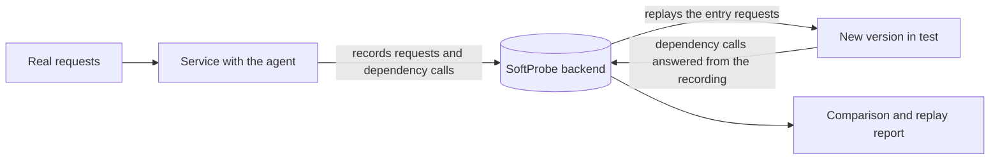

# Replay Testing

Record real requests in production or test, replay them against a new version in a test environment, and compare the results automatically to find what your change broke. No hand-written test cases, no changes to your business code.

For **Java** services: add the SoftProbe Java agent to the service's start command and recording begins.

## What it solves {#why}

- **Hand-written tests miss real traffic.** The parameter combinations and edge cases that show up in production are hard to build by hand. Recorded requests are the test cases.
- **Regression checks are manual.** After a change you no longer diff responses one endpoint at a time: a replay compares everything and points to the endpoint and field that changed.
- **Test environments lack dependencies.** During replay, calls to databases, caches and downstream services can be answered with what was recorded, so the test environment doesn't need all of them.

## How it works {#how-it-works}

1. **Record**: while the service handles real requests, the agent records the entry request and response, plus every call it makes to databases, caches and downstream endpoints, with their results. Recording is sampled, not exhaustive.
2. **Replay**: the recorded entry requests are sent to the new version in a test environment. It runs the real business code; when it calls a dependency, the agent answers with the recorded result.
3. **Compare**: the recorded and replayed responses and dependency calls are compared, and a [replay report](/en/testing/replay-report) explains which differences come from the code change.

::: warning Replay doesn't always stay away from real dependencies
Only calls the agent supports, and that are set to mock under **Config → Replay**, are answered from the recording. That page can send some dependencies to the real service, and a replay plan can choose to force every dependency to make real calls. Point replays at a test environment, never at production.
:::

More detail: [How it works](/en/testing/how-it-works).

## What's in it {#components}

| Part | Role |
|------|------|
| **SoftProbe Java agent** | A jar that starts with your service; records, and answers dependency calls during replay |
| **SoftProbe backend** | Stores recordings, runs replays and comparisons, builds reports |
| **Console** | Browse recordings, start replays, read reports, configure rules, and ask AI why a replay failed |
| **`sp` command line** (optional) | For scripts, CI jobs and AI agents |

## Where to start {#where-to-start}

| You are | Start here |
|---------|-----------|
| A tester or developer using SoftProbe for regression | [Your first record and replay](/en/testing/getting-started), then the "Everyday use" section |
| An operator or platform admin deploying it | [Choose a deployment](/en/testing/installation/deployment), [Attach the Java agent](/en/testing/java-agent) |
| Maintaining a pipeline that should replay after each deploy | [Replay after deployment](/en/testing/webhook-and-ci) |
| Writing scripts or plugins, or wiring up an AI agent | [Choose how to integrate](/en/testing/agents/overview) |

Supported Java versions and frameworks: [Supported frameworks](/en/testing/supported-frameworks).

::: info Business Observability
The "Business Observability" section of this site covers mesh traffic capture with Istio/Envoy on SoftProbe Cloud only. It is separate from Java-agent record and replay.
:::
