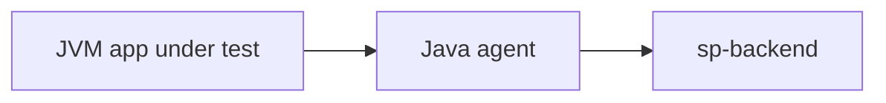

# Softprobe Testing

**Record real traffic. Replay with automatic mocks. Compare without writing test cases.**

::: tip Ready to start?
🚀 If you are new to Softprobe, go straight to our **[Getting Started](/en/testing/getting-started)** guide! Try it out using a pre-built JAR in 5 minutes, and then onboard your own application.
:::

Softprobe Testing is record-and-replay regression for **Java** services. Attach the Softprobe Java agent as a `-javaagent`, capture inbound API traffic and outbound dependency calls in the background, then replay recorded cases in a test environment while dependencies are mocked from stored data and results are compared automatically.

::: info Product areas on this site
| Area | You use it when... |
|------|---------------------|
| **[Platform](/en/platform/)** | You need Istio/Envoy mesh capture, SESSIFY session context, or the observability dashboard |
| **Testing** (this section) | You need Java record/replay, the JVM agent, policies, replay semantics, installation, commands, and automation |
:::

## Why record-and-replay

Traditional integration tests require maintaining environments, seed data, and hand-written cases. Softprobe Testing instead:

- **No application code changes** — bytecode instrumentation via `sp-agent.jar`
- **High coverage from real traffic** — production or staging requests become replay cases
- **Isolated replay** — databases, HTTP clients, Redis, RPC, caches, and more are mocked from recordings so you do not need live downstreams in the test environment
- **Safe WRITE paths** — recorded dependency behavior is replayed without dirtying shared databases during regression
- **Lower noise** — compare rules, time mocking, and ignore nodes handle timestamps, random IDs, and environment-specific fields

## How the pieces fit together

| Component | Role |
|-----------|------|
| **Your Java service** | The application under test, started with `-javaagent:…/sp-agent.jar` |
| **Softprobe Java agent** | Records and replays at runtime; mocks dependencies during replay |
| **Softprobe backend** (`:8090`) | Deployed via Helm. Stores cases (MongoDB), serves policies, runs replay plans, computes diffs |
| **`sp` command** (optional) | Registers apps, applies policies, starts replay, inspects failures — see [Commands](/en/testing/commands/) |
| **Dashboard / workbench** (optional) | Visual diff and trace review |

## Record → replay → compare (short)

1. **Record** — Agent captures entry traffic (e.g. HTTP `Servlet`) and dependency calls (`HttpClient`, `Database`, `Redis`, …) while the app handles real requests.
2. **Store** — Backend persists each interaction; replay hot path uses Redis-backed mock cache.
3. **Replay** — Schedule service sends recorded entry requests to your **test instance** (`targetEnv` URL). The agent returns recorded dependency responses instead of calling real downstreams.
4. **Compare** — Engine diffs recorded vs replay traffic; policies define what to ignore or how strictly to match.

Details: [Record traffic](/en/testing/recording) · [How it works](/en/testing/how-it-works) · [Replay and diff](/en/testing/replay-and-diff)

## Platform agent ≠ Java agent

The [Platform](/en/platform/advanced-guides/agent-architecture) **SP-Istio agent** runs in Envoy sidecars and captures mesh HTTP traffic. **Softprobe Testing** uses the **JVM agent** attached with `-javaagent`. They solve different problems; both can feed the same backend for correlation in SaaS deployments.

## Who should read this section

- **Java developers** adopting record/replay for the first time
- **QA / release engineers** running regression without full downstream stacks
- **Platform engineers** wiring `sp-backend` and agent startup in K8s or VM images
- **Automation authors** — start here for concepts, then [Commands](/en/testing/commands/) for `sp` automation

## Quick links

- [Getting Started](/en/testing/getting-started) — Try the 5-minute [Travel OTA](https://github.com/softprobe/demo-ota) demo and onboard your application.
- [Install Softprobe](/en/testing/installation/) — Install, set up, launch coding, diagnose, and upgrade with `sp`.
- [Record traffic](/en/testing/recording) — Core workflow step 1: build the case corpus.
- [Pin cases & test sets](/en/testing/pinned-cases) — Keep selected recordings beyond retention and replay them as a reusable set.
- [Java agent](/en/testing/java-agent) — Attach, JVM flags, and production safety.
- [Policies overview](/en/testing/policies) — YAML by lifecycle phase.
- [Replay and diff](/en/testing/replay-and-diff) — Core workflow step 2: regression run.
- [Webhook and CI/CD](/en/testing/webhook-and-ci) — Post-deploy replay and pipeline gates.
- [Supported frameworks](/en/testing/supported-frameworks)
