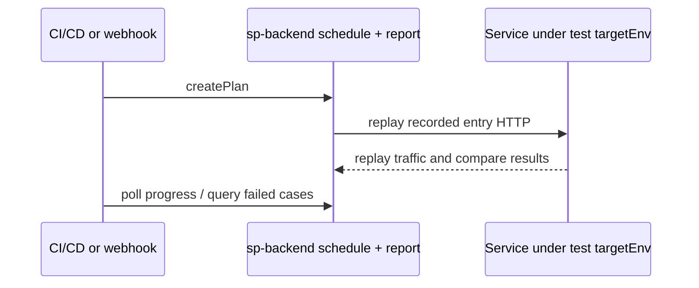

# Webhook-triggered replay and CI/CD integration

Run record-and-replay regression automatically after a deploy or merge against a **test** instance, then gate the pipeline on compare results. This page covers two trigger styles, how to collect results, and GitHub Actions / Jenkins patterns.

::: tip Record first, then automate replay
Webhooks and CI do not create cases for you. Walk the core workflow first — [Record](/en/testing/recording) and [Replay](/en/testing/replay-and-diff) (`appId`, policies, reachable `targetEnv`) — then hand it to automation.
:::

## Should you use the `sp` CLI or REST APIs?

| Scenario | Recommendation |
|----------|----------------|
| Full pipelines (GitHub Actions, Jenkins, GitLab CI) | **`sp` CLI** (`--json`, stable exit codes, built-in polling) |
| Deploy hooks (Argo CD, K8s Job, shell) that only need “deploy OK → start replay” | **GET webhook** (one-line `curl`) |
| Custom orchestration with your own HTTP client and request bodies | **REST** (`POST /api/createPlan` + report APIs) |

**Rule of thumb:** When the pipeline must **create a plan → wait → list failures → pass/fail**, use **`sp replay run --watch`** and **`sp replay case list --failed`** per the [output contract](/en/testing/agents/output-contract). Use GET webhook to **trigger only**; fetch results in a later step with `sp` or authenticated report APIs.

See [replay command](/en/testing/commands/replay) and [authentication](/en/testing/agents/authentication).

## Recommended CI suite: manual `Pinned` cases

For a repeatable post-deploy regression run, pin the cases you want in the Workbench and run the built-in `Pinned` suite:

```text
Pin cases in Workbench → Jenkins runs suite Pinned → SoftProbe reports the run
```

`Pinned` contains manual pinned cases for the selected application only. It excludes `AutoPinned` cases and does not use a recording time range. `--from` and `--to` are ignored for this suite, so an older pinned case remains eligible. The default command without `--suite` remains the Rolling, time-window-based selection.

The v1 `Pinned` CLI flow uses the on-premise backend URL from `SP_API_URL` and does not require a SoftProbe user JWT. Install `sp` once on the Jenkins agent from the official source; the pipeline only supplies the backend URL and run inputs. If your corporate ingress requires credentials, keep those credentials in Jenkins and do not put them in command arguments or archived output.

## Architecture (brief)



- **`SP_API_URL`**: sp-backend (storage, schedule, report) — **not** the service under test.
- **`targetEnv`**: base URL of the test instance (e.g. `http://order-service.test:8080`). Do not confuse with `SP_API_URL` — [CLI concepts: targetEnv](/en/testing/agents/concepts#replay-target-url-targetenv).

## Option 1: Webhook (GET) trigger

The schedule service exposes **GET** `/api/createPlan` for deploy webhooks, alerts, or simple `curl` calls. The server sets `operator` to `Webhook` and, by default, selects cases from the last **24 hours** for the app (narrow with time query params).

### Example request

```bash
curl -sS -G "${SP_API_URL}/api/createPlan" \
  -H "access-token: ${SP_TOKEN}" \
  --data-urlencode "appId=YOUR_APP_ID" \
  --data-urlencode "targetEnv=http://your-service.test:8080" \
  --data-urlencode "planName=post-deploy-smoke" \
  --data-urlencode "caseCountLimit=50" \
  --data-urlencode "enableMock=true"
```

### Query parameters

| Parameter | Required | Description |
|-----------|----------|-------------|
| `appId` | yes | Registered application id |
| `targetEnv` | yes | Test instance base URL (`http://` or `https://`) |
| `caseSourceFrom` | no | Case window start (Unix **milliseconds**); default ~24h ago |
| `caseSourceTo` | no | Case window end (ms); default now |
| `caseCountLimit` | no | Max cases to replay |
| `planName` | no | Display name for the plan |
| `operationIds` | no | Repeatable; restrict to operation ids |
| `enableMock` | no | `true` / `false` |
| `caseTags` | no | JSON string for tag filters |

### Response

On success, `result` is `1` and `data` contains **`replayPlanId`** (use as `planId` when polling):

```json
{
  "result": 1,
  "desc": "success",
  "data": {
    "replayPlanId": "plan-abc123"
  }
}
```

::: warning
GET webhook **only creates** a plan; it does not wait for completion. Poll progress or query the report in a follow-up CI step.
:::

::: info POST vs GET
`POST /api/createPlan` (used by `sp replay run`) accepts the full `BuildReplayPlanRequest` (time window, `operationCaseInfoList`, pressure settings, etc.). For complex case selection, use POST or the CLI instead of stretching GET params.
:::

## Option 2: CLI / REST create (recommended for CI)

Same as [Replay and diff](/en/testing/replay-and-diff):

```bash
export SP_API_URL=https://your-tenant.softprobe.ai

sp replay run \
  --app YOUR_APP_ID \
  --env http://your-service.test:8080 \
  --suite Pinned \
  --name "ci-${GITHUB_SHA:-build}" \
  --watch \
  --json
```

Use the default Rolling selection with `--from`/`--to` when you intentionally want a time-bounded corpus. The `Pinned` command above ignores those flags.

`--watch` polls `GET /api/progress?planId=…` until finished. The CLI may still exit **0** when compare failures exist — pipelines must check failed cases (below).

REST equivalent:

```http
POST /api/createPlan
Content-Type: application/json
access-token: <JWT>

{
  "appId": "YOUR_APP_ID",
  "targetEnv": "http://your-service.test:8080",
  "caseSourceFrom": 1717000000000,
  "caseSourceTo": 1717086400000,
  "enableMock": true,
  "planName": "ci-build-42"
}
```

## Getting results

### 1. Poll progress

```bash
sp replay status plan-abc123 --watch --json
```

REST: `GET /api/progress?planId=plan-abc123` on the same `SP_API_URL`. When `percent` reaches 100, scheduling is done.

### 2. Pass / fail gate

After progress finishes:

```bash
sp replay case list --plan plan-abc123 --failed --limit 1 --json
```

Fail the job if `data.items` is non-empty. For diff artifacts:

```bash
sp replay diff get <diffId> --out-dir .sp-work --json
sp diagnose replay plan-abc123 --failed-only --out-dir .sp-work --json
```

See [Example: diagnose replay failure](/en/testing/examples/agent-diagnose-replay).

### 3. Dashboard (humans)

Open the same `planId` in the workbench or dashboard for diff trees; automation should rely on CLI/`--json`.

## GitHub Actions example

Run after the **test** deployment with the agent attached. Configure `SP_API_URL` for the on-premise backend; the `Pinned` CLI flow does not require a SoftProbe JWT.

```yaml
name: Softprobe replay gate

on:
  workflow_dispatch:
  push:
    branches: [main]

jobs:
  replay-regression:
    runs-on: ubuntu-latest
    env:
      SP_API_URL: ${{ secrets.SP_API_URL }}
      SP_APP_ID: ${{ vars.SP_APP_ID }}
      SP_TARGET_URL: http://my-service.test:8080
    steps:
      - name: Install sp
        run: |
          curl -fsSL -o sp "${SP_DOWNLOAD_URL:-https://install.softprobe.ai/artifacts/sp/latest}/sp-linux-amd64"
          chmod +x sp && sudo mv sp /usr/local/bin/

      - name: Preflight
        run: |
          sp health --json
          sp record case list --app "$SP_APP_ID" --since -24h --json

      - name: Run replay and wait
        id: replay
        run: |
          sp replay run \
            --app "$SP_APP_ID" \
            --env "$SP_TARGET_URL" \
            --suite Pinned \
            --name "gha-${GITHUB_SHA}" \
            --watch \
            --json | tee replay.ndjson
          PLAN_ID=$(grep '"command":"replay run"' replay.ndjson | tail -1 | jq -r '.data.planId // .data.replayPlanId')
          echo "plan_id=$PLAN_ID" >> "$GITHUB_OUTPUT"

      - name: Fail if any case failed
        run: |
          COUNT=$(sp replay case list --plan "${{ steps.replay.outputs.plan_id }}" --failed --json \
            | jq '[.data.items[]?] | length')
          if [ "$COUNT" -gt 0 ]; then
            echo "Replay had $COUNT failed case(s)"
            exit 1
          fi
```

Optional fire-and-forget webhook after deploy:

```yaml
      - name: Trigger replay webhook
        run: |
          curl -fsS -G "$SP_API_URL/api/createPlan" \
            -H "access-token: $SP_TOKEN" \
            --data-urlencode "appId=$SP_APP_ID" \
            --data-urlencode "targetEnv=$SP_TARGET_URL" \
            --data-urlencode "planName=deploy-${{ github.run_id }}"
```

Policy validation on PRs: [CI policy gate example](/en/testing/examples/ci-policy-gate).

## Jenkins example

Install `sp` once on the Jenkins agent from the official SoftProbe source. The pipeline below runs only manual pinned cases and does not perform an interactive login:

```groovy
pipeline {
  agent any
  environment {
    SP_API_URL = 'https://softprobe.internal.example'
    SP_APP_ID  = 'YOUR_APP_ID'
    SP_TARGET_URL = 'http://my-service.test:8080'
  }
  stages {
    stage('Replay') {
      steps {
        sh '''
          sp replay run \
            --app "$SP_APP_ID" \
            --env "$SP_TARGET_URL" \
            --suite Pinned \
            --name "jenkins-${BUILD_NUMBER}" \
            --watch \
            --json > replay.ndjson
          PLAN_ID=$(grep '"command":"replay run"' replay.ndjson | tail -1 | jq -r '.data.planId // .data.replayPlanId')
          FAILED=$(sp replay case list --plan "$PLAN_ID" --failed --json | jq '[.data.items[]?] | length')
          test "$FAILED" -eq 0
        '''
      }
    }
  }
}
```

Use `curl -G …/api/createPlan` in a post-deploy step; wait and gate in a later stage with `sp replay status <planId> --watch`.

## Security and operations

- Store **`SP_TOKEN` in CI secrets** only — [authentication](/en/testing/agents/authentication).
- If webhook URLs are reachable from the internet, restrict access and always send **`access-token`**.
- Replay sends **real HTTP** to `targetEnv`; point webhooks at test/staging instances — [Replay and diff](/en/testing/replay-and-diff).
- Lower or disable recording on replay hosts during runs.

## Related

- [Replay and diff](/en/testing/replay-and-diff)
- [Getting started](/en/testing/getting-started)
- [CLI: replay](/en/testing/commands/replay)
- [API mapping](/en/testing/reference/api-mapping)
- [CLI quickstart](/en/testing/getting-started)
