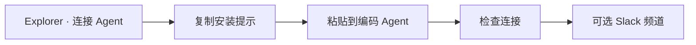

# 快速开始

在 Explorer 中将 Agent 接入 Softprobe Agent QA，验证首个 Session，然后按需绑定 Slack。在「连接 Agent」流程中选择 **OpenCode** 或 **LangChain**。

## 流程

## 1. 打开「连接 Agent」

在 Softprobe Explorer 打开 **Agents**，点击 **+ Connect agent**。命名 Agent、选择环境，并选择框架（**OpenCode** 或 **LangChain**）。Softprobe 会为该 Agent 签发捕获用 API key（`spk_…`）。

## 2. 粘贴安装提示

从弹窗复制短安装提示，粘贴到你的编码 Agent：

| 框架 | 粘贴位置 | 作用 |
|------|----------|------|
| **OpenCode** | OpenCode 对话 | 合并 `@softprobe/opencode-plugin`、写入凭证、跑一轮真实对话 |
| **LangChain** | Cursor / Codex / Claude Code | 安装 Softprobe 包、设置环境变量、挂上 `CallbackHandler` |

完整说明见：[OpenCode 安装](/zh/agent-qa/opencode)、[LangChain 安装](/zh/agent-qa/langchain)。

## 3. 验证捕获

完成一轮真实 Agent 对话后（LangChain 建议包含**工具**调用），在 Explorer 点击 **Check connection**。验证成功后再继续配置 Slack。

打开 **Sessions** 浏览捕获。使用时间范围控件（默认最近 7 天、滚动）与 Agent 筛选；二者都会更新地址栏，便于分享视图。

若要从 Cursor、Claude Code、Codex 或 OpenCode 诊断某个 Session，见 [用编码 Agent 排查](/zh/agent-qa/coding-agent-skills)。

## 4. 最后再配 Slack（可选）

为 Findings 选择 Slack 频道，或 **Skip for now**。工作区 OAuth 仍在 **Integrations**；本步骤只是把频道挂到该 Agent。

## 下一步

- [OpenCode 安装参考](/zh/agent-qa/opencode)
- [LangChain 安装参考](/zh/agent-qa/langchain)
- [概念](/zh/agent-qa/concepts)
