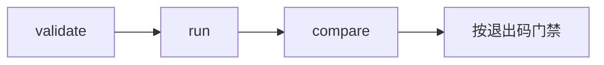

# 面向 AI Agent — 概览

Agent Evaluation 文档说明编码 Agent 与 CI 脚本如何通过带稳定 `--json` 输出的 **`sp eval`**，对 Agent 基准进行 **编写、运行、对比与门禁**。

## 何时用 Evaluation vs Testing

| 用途 | 产品 |
|------|------|
| Java 服务的录制/回放回归 | [Testing](/zh/testing/) |
| 评估**你的** LLM Agent（路由、工具、结果） | **Agent Evaluation** |
| Istio/session 业务可观测性 | [Platform](/zh/platform/) |

## Agent 工作流



1. **Validate** — 在消耗模型额度前执行 `sp eval validate --import promptfoo`
2. **Run** — `sp eval run --manifest … --json --out-dir …`
3. **Compare** — 在 PR 上运行 `sp eval compare --baseline … --candidate …`
4. **Gate** — 根据退出码与 JSON 信封中的 `gate` 字段分支

## 关键契约

- [输出契约](/zh/evaluation/agents/output-contract) — JSON 信封与制品
- [CLI 参考](/zh/evaluation/reference/cli)
- [Result status](/zh/evaluation/reference/result-status) — 切勿把错误当成 score 0
- [Framework runners](/zh/evaluation/reference/framework-adapters)

## Eval 深度

| 模式 | 指南 |
|------|------|
| 仅 Prompt（输出检查） | [Eval 模式](/zh/evaluation/guides/eval-modes) |
| 基于环境（oracle） | 同上 |

## 心智模型（一句话）

```text
Suite (pinned recipe) → Run → Evidence → Measurements → Gates
```

完整说明：[心智模型](/zh/evaluation/mental-model)。

## llms.txt

本站提供 `/llms.txt` 与各页 `.md` 端点，供 Agent 消费（与 Testing 文档相同）。
