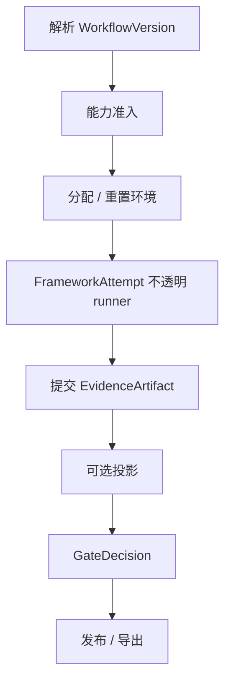
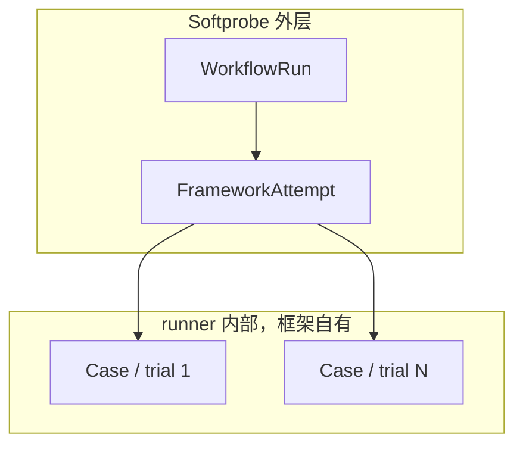
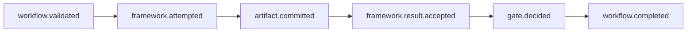

# 执行 DAG

Softprobe 围绕一个不透明的 **框架 runner** 节点规划 **内容寻址的外层 DAG** — 而不是 Softprobe 自有的「cases → Softprobe evaluators → Softprobe reducers」循环。

## 外层 DAG

```text
resolve WorkflowVersion → admit capabilities → allocate environment
 → FrameworkAttempt (opaque runner) → commit EvidenceArtifact
 → optional score projection → GateDecision → publish/export
```



在 runner 内部，框架可以展开 cases、跑 trials、调用 judges，并写出自己的报告。Softprobe **不会**把这些建模为 Softprobe DAG 节点。

## 并行



Softprobe 可并发运行多个 WorkflowRun（在预算允许时）。框架内部并行仍留在 runner 进程内。

## 节点身份

外层节点在可行时内容寻址：WorkflowVersion digest、runner digest、environment digest，以及声明的 seed/fingerprint。

框架 runner **默认不可缓存**，除非未来 runner 契约证明存在无损的更细粒度投影。

## 缓存策略

| 节点类型 | 默认缓存 |
|----------|----------|
| 纯 hermetic Softprobe 控制检查 | 可缓存 |
| 不透明框架 runner | 不可缓存（默认） |
| 在线 / 人工 / 有副作用 | 不可缓存 |

## 各阶段事件

外层阶段发出类型化事件。规范名称见 [事件](/zh/evaluation/reference/events)：


