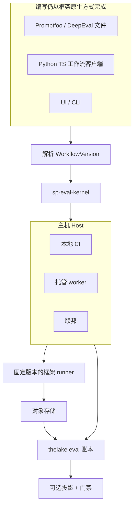

# 架构总览

Softprobe Agent Evaluation 采用 **设计方案 3：可移植评估内核** — 一套 Rust `sp-eval-kernel`、一套 **工作流（workflow）** 模型，多种运行时（本地、CI、托管、联邦）。各框架保留自己的 DSL；Softprobe 提供环境、生命周期、证据、thelake 存储、对比与门禁。

## 组件

| 组件 | 职责 |
|------|------|
| **公开 API** | `framework suite + subject + environment + runner` — 打包、校验、运行、查询、对比、晋升 |
| **工作流解析** | 名称 → digest：FrameworkDefinition、RunnerVersion、SubjectVersion、EnvironmentVersion、门禁策略 |
| **sp-eval-kernel** | 校验、规划外层 attempt、状态机、ID、重试、事件 — 单一 Rust 二进制 |
| **Hosts** | 拉起进程、传输字节、时钟、密钥 — 不含编排语义 |
| **框架 runner** | Promptfoo/DeepEval/… 的不透明执行节点 |
| **thelake 账本** | 仅追加的权威记录（SoR）：WorkflowRun、FrameworkAttempt、EvidenceArtifact digest、GateDecision |
| **对象存储** | 内容寻址的产物字节（按租户隔离） |
| **投影** | 可选的分数 / 运行视图 — 异步、可重建、允许有损 |

## 内核独占职责

- WorkflowVersion 校验与能力协商
- 外层 FrameworkAttempt 身份、重试、取消、幂等
- 合法状态迁移与类型化终态结果
- 证据「先提交再引用」与事件 schema
- 基于外层状态 + 选定 runner 上报字段的 GateDecision

Hosts 与 runners 不得合成 Softprobe 生命周期事件或权威门禁。

## Softprobe **不**负责什么

- Case / assertion / scorer / reducer DSL
- Softprobe 原生套件编写作为产品表面
- 1:1 导入器去镜像每个框架的全部特性

## 相关页面

- [内核与主机](/zh/evaluation/architecture/kernel-and-hosts)
- [执行 DAG](/zh/evaluation/architecture/execution-dag)
- [扩展模型](/zh/evaluation/architecture/plugin-model)
- [存储与 thelake](/zh/evaluation/architecture/storage-and-thelake)
- [信任边界](/zh/evaluation/architecture/trust-boundaries)
