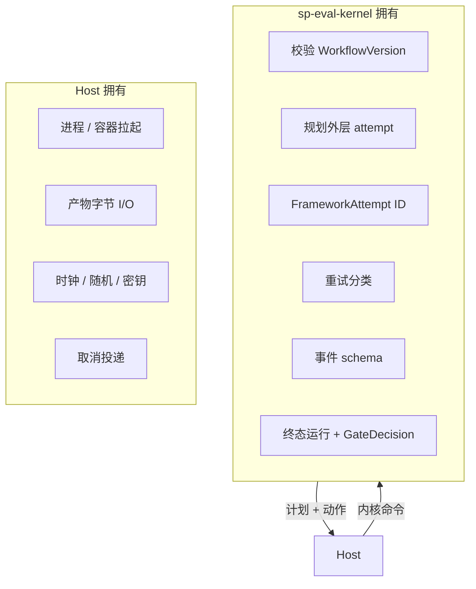
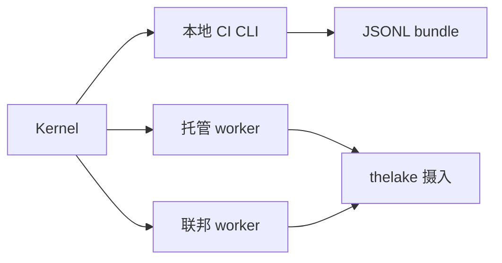

# 内核与主机

一套 **sp-eval-kernel** 拥有 **工作流** 语义（解析、外层 FrameworkAttempt、证据提交、门禁）。框架在 runner 内拥有 assertion/scorer 语义。**Hosts** 提供执行原语 — 它们从不合成 Softprobe 编排决策。

## 职责划分

## sp-eval-kernel

一个静态链接的 **Rust** 二进制实现校验、外层 DAG 规划、幂等 FrameworkAttempt 执行、状态迁移与事件发射。

| 传输 | 用途 |
|------|------|
| stdin/stdout 分帧 Protobuf | 一次性本地/CI |
| Unix socket 或 gRPC | 长驻托管/联邦守护进程 |

同一 crate、同一语义 — 由共享符合性语料验证。

## Hosts

| Host | 拥有 | 不拥有 |
|------|------|--------|
| **本地/CI CLI** | 进程拉起、本地 CAS 产物目录、收集框架 JUnit/Markdown | Workflow ID、门禁逻辑 |
| **托管 worker** | 队列、沙箱、配额、租户、对象存储上传 | 重试是否合法（询问内核） |
| **联邦 worker** | 私有数据驻留、硬件放置 | 无签名摄入时的权威状态 |

Hosts 将每次租约结果通过内核命令回传；它们不会从公开客户端追加原始事件。

## SDK 分层

| 层 | 受众 |
|----|------|
| 公开 Python/TS SDK | 易用的工作流客户端、REST 客户端 |
| 内部 host 客户端 | 分帧 Protobuf 状态机命令（仅受信） |

公开 SDK 从不导出内核事件追加或状态迁移 API。

## 分发

`sp-eval-kernel` 随 Softprobe CLI 发布：固定协议兼容性、校验和/签名、平台矩阵（linux/darwin，amd64/arm64）。当 WorkflowVersion 需要不支持的能力时拒绝升级/降级。

## 相关

- [信任边界](/zh/evaluation/architecture/trust-boundaries)
- [执行 DAG](/zh/evaluation/architecture/execution-dag)
