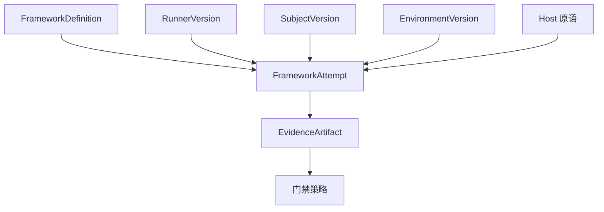

# 扩展模型

Softprobe 通过 **版本化的 runners、environments 与 host 能力** 扩展 — 而不是 Softprobe 自有的 evaluator/scorer 插件市场。

（旧文档标题为「Plugin model」。）

## 你扩展什么

| 扩展点 | Softprobe 角色 |
|--------|----------------|
| **框架 runner** | 固定 package/image/command；捕获原生结果 schema |
| **EnvironmentVersion** | 隔离拓扑与 runner 可用的 verify hooks |
| **SubjectVersion** | 框架所演练的对象 |
| **Host** | 进程拉起、CAS、密钥、时钟 — 不含编排 |
| **门禁策略** | 基于状态 + 选定字段的外层发布视图 |

## 能力描述符（runners 与 environments）

描述符声明 runner 或 environment **需要**什么，以便调度在花钱之前拒绝不兼容的 WorkflowVersion：

- 协议 / 实现版本
- 运行时：`oci`、`process`、…
- 所需挂载、网络、密钥、GPU、预算
- 声明的结果包 schema / 大小限制
- 确定性 / 可复现类别
- 数据驻留约束

未知的 **required** 能力 → 在 validate/plan 时 `unsupported`。Softprobe **不会**用描述符去发明 Softprobe scorers。

## 框架 runners（不是导入器）

1. **Pack** — 闭合并哈希原生文件（不做 assertion 翻译）。
2. **Run** — 一次不透明 FrameworkAttempt。
3. **可选投影** — 有损子集，供 `scores` 查询。

## 控制面检查（不是 evaluators）

产物完整性、密钥脱敏、能力准入与发布门禁是 **工作流策略**。它们不是 Softprobe eval DSL，也不替代 Promptfoo/DeepEval 方法。

## 扩展规则

要支持新的评估方法，应交付或固定一个 **已经拥有该方法的框架 runner** — 而不是新增 Softprobe Measurement 种类或 Softprobe reducers。

参见 [能力描述符](/zh/evaluation/reference/capability-descriptors)。
