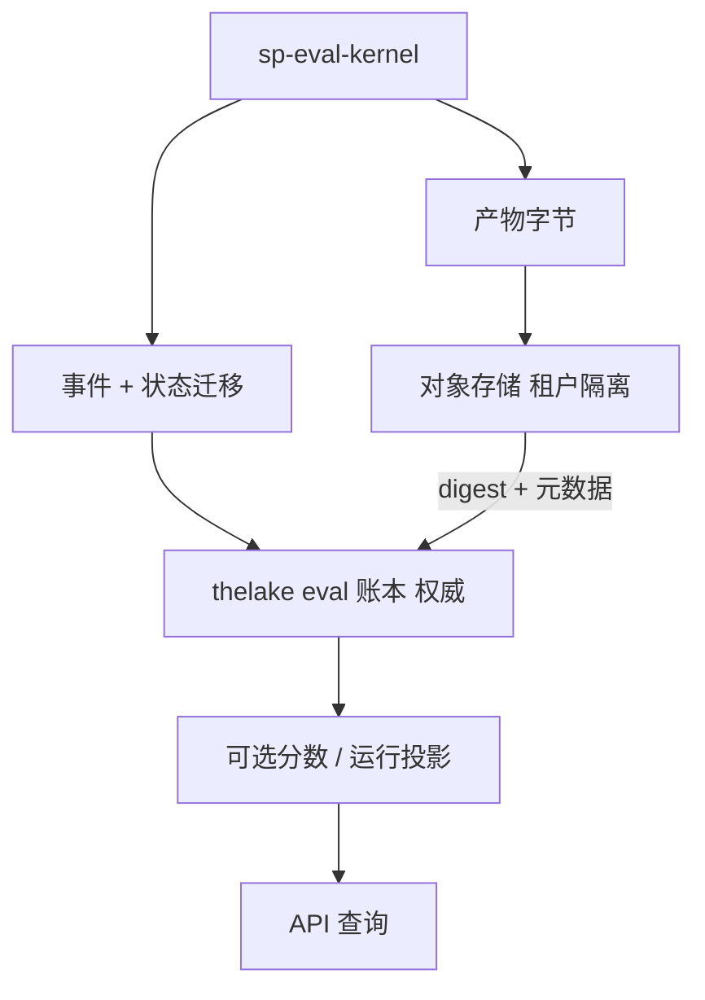
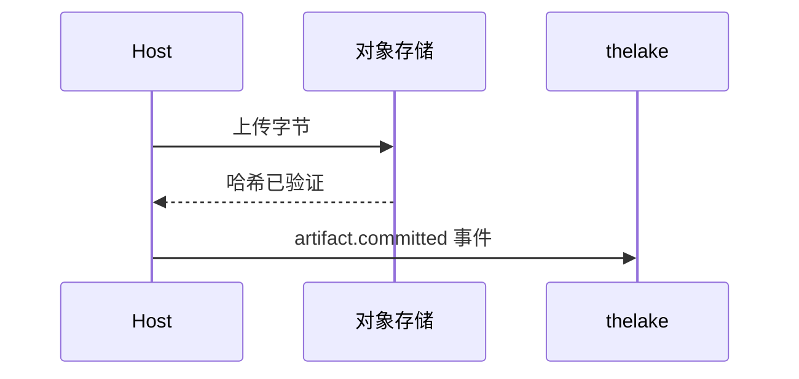

# 存储与 thelake

托管 Agent Evaluation 以 **thelake 作为 Softprobe 工作流域数据的唯一权威记录（SoR）**。框架原生结果细节保留在内容寻址的 **EvidenceArtifact** 字节中。

## 数据流

## 账本（权威）

仅追加表存储：

- WorkflowVersion 快照
- 事件与状态迁移
- FrameworkAttempt 记录与类型化失败
- 产物元数据与内容哈希
- GateDecision 记录
- 可选的投影测量（不是 Softprobe evaluator 契约）

工作 **队列** 是可丢弃的协调状态 — 可从非终态账本记录重建。

## 对象存储

大块不可变字节放在租户隔离的对象存储中（原生结果包、日志、traces）。thelake 存储 digest、大小、媒体类型、加密/ACL 元数据、驻留、保留类别与已提交位置。

先提交再引用：账本从不指向未验证的字节。

## 投影

分数与运行视图可从账本 + 产物 **重建**。它们可能滞后，且相对原生包可能有损。从事件重建；不要把投影当作 SoR。

## 相关

- [数据模型](/zh/evaluation/concepts/data-model)
- [事件](/zh/evaluation/reference/events)
- [分数与门禁](/zh/evaluation/concepts/scores-and-gates)
