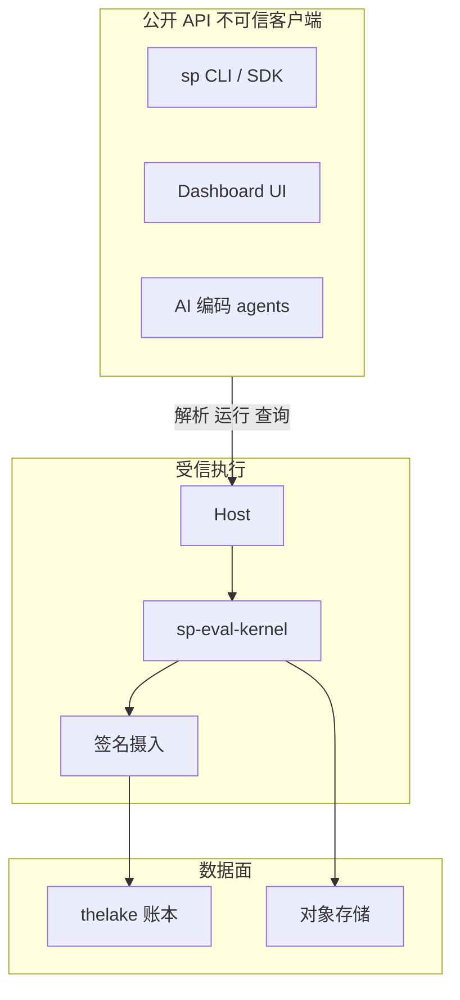
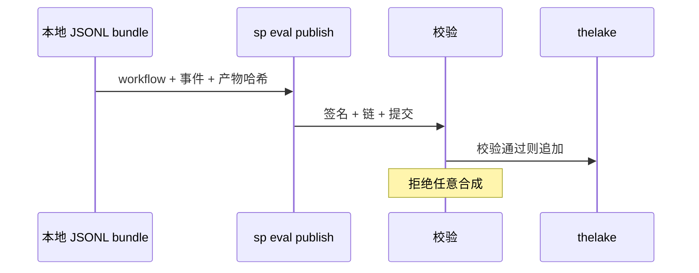

# 信任边界

Agent Evaluation 将 **公开客户端**（你的 CI、SDK、agents）与 **受信内核主机** 分离；只有后者能产生权威 Softprobe 生命周期事件与 GateDecision。

## 信任区域

## 公开 API（不可信客户端）

人类、SDK、CLI、UI 与 AI agents 可以：

- 打包 / 解析 FrameworkDefinition + WorkflowVersion
- 请求/取消 WorkflowRun
- 查询/对比结果与产物
- 提议框架定义或策略变更（受策略约束）

它们 **不能**：

- 追加原始内核事件
- 直接调用 Softprobe 状态迁移
- 合成 FrameworkAttempt、GateDecision 或投影测量

受信 hosts 在 FrameworkAttempt 之后发出生命周期事件（见 [事件](/zh/evaluation/reference/events)）。遗留的 `POST /api/v2/scores` 路径仍用于非 eval 遥测与受治理的人工标注摄入 — 不能用来伪造 Softprobe 自动分数。参见 [REST API](/zh/evaluation/reference/api)。

## 受信 host 摄入（内部）

仅接受内核产出的信封，并绑定已认证的租户、host、WorkflowVersion 与 WorkflowRun 身份。校验签名、序号、幂等、产物提交与协议兼容性。

非法或跳过的迁移会被 **拒绝** — 不会被修复或重新解释。

## 本地 bundle 发布

发布本地 JSONL bundle 是受校验的导入：WorkflowVersion 身份、事件链、签名、产物哈希 — 不是任意事件合成。

## 凭证区域

| 区域 | 持有 |
|------|------|
| Subject | Agent 运行时凭证 |
| 框架 runner | runner 声明的模型/提供商密钥 |
| 控制面 | 租户、摄入、调度 |

沙箱获得短时、最小权限句柄 — 不是共享的原始密钥。

## 框架信任

固定版本的 **框架 runners**（Promptfoo、DeepEval、…）以显式的文件系统、网络与密钥能力运行，并有符合性/安全测试。它们不能追加 Softprobe 生命周期事件或发布权威门禁。

远程 runners 使用绑定租户的签名请求、nonce/幂等键、过期时间与响应签名校验。

## AI 治理

提议、评审、批准、发布、门禁激活与撤销是不同的授权动作，并有不可变审计记录。自批准与重放批准会在服务端被拒绝。
