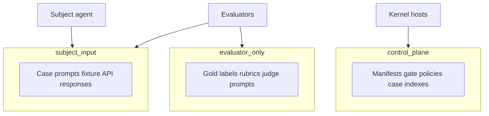

# 产物可见性

每个产物都有 **可见性类别**，控制哪些组件可以读取它。Gold 答案与控制面数据绝不会进入主体命名空间。

## 类别

| 类别 | 谁可读 | 示例 |
|-------|-----------|----------|
| **subject_input** | 主体 + 评估器（运行后） | 用例提示、对 Agent 可见的 fixture API 响应 |
| **evaluator_only** | 仅评估器 | Gold 标签、评分标准、禁止声明列表、judge 提示 |
| **control_plane** | 仅内核 / 可信主机 | Manifest、门禁策略、兄弟用例索引 |

## 基于环境的评估

在沙箱 fixture 中运行 Agent 时：

- 期望结果与 gold 证据留在 `evaluator_only`
- 主体只能看到已脱敏的 fixture 状态
- 主体若试图读取 gold 数据、兄弟用例或结果路径 → 类型化策略失败 + 安全测试

## 审计

评估器声明可读类别；内核按最小权限授权，并按 attempt 审计允许 / 拒绝的访问。

## 先提交再引用

大字节先上传到对象存储；账本事件仅在哈希校验通过后引用 digest。没有任何事件会引用尚未就绪的 blob。

见 [存储与 thelake](/zh/evaluation/architecture/storage-and-thelake)。
