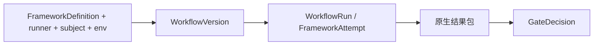
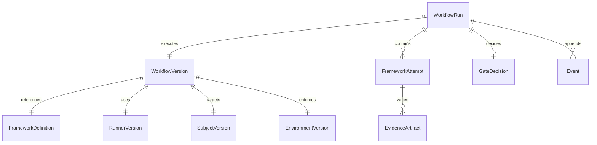

# 数据模型

Agent Evaluation 将 **框架原生产物** 与 **Softprobe 工作流记录** 分开。Softprobe 不建模用例、断言、scorer 或 reducer — 这些仍留在框架定义与结果包内。

## 核心流

```text
FrameworkDefinition + SubjectVersion + EnvironmentVersion + RunnerVersion
→ WorkflowVersion
→ framework runner (FrameworkAttempt)
→ native result bundle + EvidenceArtifact
→ Softprobe lifecycle + compare + GateDecision
```



## 层 A — 不可变资源（执行前）

| 实体 | 说明 | 示例 |
|------|------|------|
| **FrameworkDefinition** | 封闭、内容寻址的原生套件 + 依赖 | Promptfoo config / tests / prompts 包摘要 |
| **RunnerVersion** | 框架名、包 / lockfile / 镜像摘要、命令、结果包 schema、能力 | `promptfoo-runner@2.1.0` + 镜像 sha |
| **SubjectVersion** | 被测代码、镜像、模型配置、prompt、工具或部署 | `support-agent@sha256:…` |
| **EnvironmentVersion** | 沙箱拓扑、挂载、密钥引用、网络策略、限额、时间策略 | 网络关闭、工作区只读 |
| **WorkflowVersion** | 已解析 FrameworkDefinition + RunnerVersion + SubjectVersion + EnvironmentVersion + 门禁策略 | CI 钉死的工作流摘要 |

## 层 B — 运行时记录（执行中 / 后）

| 实体 | 说明 |
|------|------|
| **WorkflowRun** | 一次 WorkflowVersion 的一次执行（外层生命周期） |
| **FrameworkAttempt** | 一次 runner 调用；框架内部重试留在原生包中 |
| **EvidenceArtifact** | 原生定义、原生结果包、日志、trace、用量、环境证据 |
| **GateDecision** | 对外层状态、来源，以及可选 runner 上报字段的版本化工作流策略 |
| **Event** | 只追加的外层生命周期事件 — 见 [事件](/zh/evaluation/reference/events)（`workflow.validated`、`framework.attempted`、`artifact.committed`、`framework.result.accepted`、`gate.decided`、`workflow.completed`） |

可选 **分数投影**：框架上报的测量可落入 thelake `scores` 供查询。原生聚合细节留在结果包中；门禁决策仅在账本中，除非门禁另行发出已配置的布尔测量。

## ER 图



## 工作示例（Promptfoo runner）

**输入**

```yaml
runner: promptfoo-runner@2.1.0
framework_definition: cas://sha256:promptfoo-def-bundle
subject: support-router-prod
environment:
  network: off
  secrets: [OPENAI_API_KEY_REF]
  limits: { timeout_s: 300, max_result_mb: 50 }
gate_policy: support-router-v1
```

**执行后**

```text
WorkflowRun.status = succeeded
FrameworkAttempt.status = succeeded
EvidenceArtifact.native_result = cas://sha256:promptfoo-results
score_projection = optional / may be lossy
GateDecision = pass
```

**生命周期事件**（见 [事件](/zh/evaluation/reference/events)）

```text
workflow.validated → framework.attempted → artifact.committed
  → framework.result.accepted → gate.decided → workflow.completed
```

## 分数目标 v2（仅投影）

投影测量挂到一个规范目标：

`span | trace | session | workflow_run | framework_attempt`

遗留 `span_id` / `trace_id` / `session_id` 仍用于 v1 API。见 [分数目标](/zh/evaluation/reference/score-targets)。

## 相关

- [心智模型](/zh/evaluation/mental-model)
- [框架 runner](/zh/evaluation/reference/framework-adapters)
- [Promptfoo 集成](/zh/evaluation/guides/promptfoo-integration)
- [分数与门禁](/zh/evaluation/concepts/scores-and-gates)
