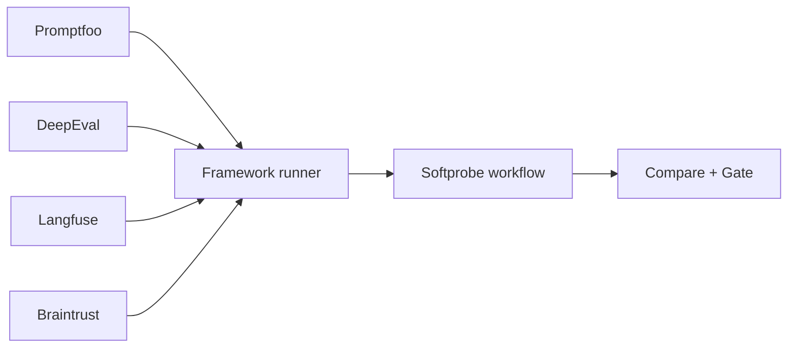

# 生态映射

Softprobe 将各框架作为 runner 集成，而不是替换其 schema。

## 一览映射

## Promptfoo

| Promptfoo 概念 | Softprobe 概念 |
|-------------------|-------------------|
| `promptfooconfig.yaml` + `tests.yaml` | 定义产物包 |
| `promptfoo eval` | 工作流内的框架 runner 执行 |
| `.promptfoo` 结果 | 原生结果产物 + 诊断信息 |
| cell 通过 / 失败 | 可选投影测量（非权威） |

## DeepEval

| DeepEval 概念 | Softprobe 概念 |
|------------------|-------------------|
| 测试用例定义 | 定义产物包 |
| 指标执行 | Runner 自有语义 |
| 指标输出 | 原生结果产物 + 可选投影 |

## Braintrust / Langfuse

Softprobe 可以摄入 / 导出数据集与 trace，但发布门禁与生命周期仍留在 Softprobe 工作流中。

## 刻意差异

Softprobe **不会**试图把每个框架 DSL 完整对等翻译成一套新的通用 schema。
