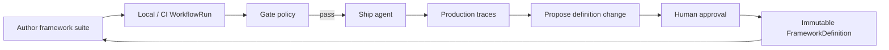

# 评估闭环

Agent Evaluation 支持持续质量飞轮 — 类似 Braintrust 的 playground → experiment → CI → production 模式 — 并叠加 Softprobe 治理与可移植的 **WorkflowVersion** digest。Softprobe 不取代 Promptfoo / DeepEval 的编写体验。



## 1. 本地迭代

作者在 Promptfoo YAML、DeepEval、SDK 或 UI 中原型化。`sp eval validate` 在产生模型费用前检查封闭的 FrameworkDefinition 钉定与 runner 能力 — 不翻译断言。

## 2. CI 中门禁

在 GitHub Actions（或等价系统）中钉死 WorkflowVersion digest。`sp eval run` + 门禁策略会在 Softprobe 配置要强制的、框架上报的回归上阻止合并。

## 3. 对比版本

`sp eval compare` 在选定的投影字段和 / 或 runner 上报摘要上，对比候选与基线 WorkflowRun。

## 4. 生产中打分（在线）

**在线策略** 采样生产 trace、快照证据，并异步启动 **同一框架 runner** — 不增加请求延迟。

## 5. 反馈到框架包

有价值的失败会通过受治理的工作流成为 **候选 FrameworkDefinition** 变更：

```text
production evidence → propose → review → approve → publish FrameworkDefinition → pin in WorkflowVersion
```

AI Agent 可以 **提议**；它们不能自行 **批准**，也不能在自己的提议上激活门禁。

见 [生产到评估闭环](/zh/evaluation/guides/production-to-eval-loop)。

## Softprobe vs Braintrust 闭环

| 阶段 | Braintrust | Softprobe |
|-------|------------|-----------|
| 编写 | Playground / SDK | Promptfoo / DeepEval / …（框架原生） |
| 离线评估 | Experiment | **WorkflowRun**（本地 / 托管同一内核） |
| CI | 流水线中的 `eval` | `sp eval run` + 原生报告 |
| 在线 | 在线打分规则 | 在线策略 + 框架 runner |
| 生产 → 数据集 | 从日志加入数据集 | 受治理提议 + digest 绑定的 FrameworkDefinition |

可移植的 **WorkflowVersion** digest 与 **thelake** 账本使该闭环跨环境可审计。
