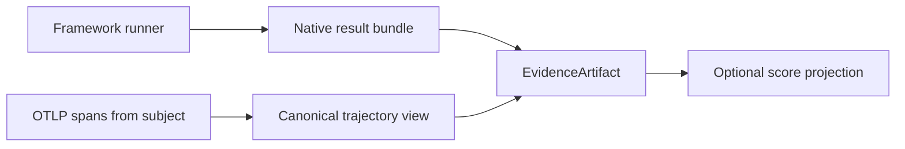
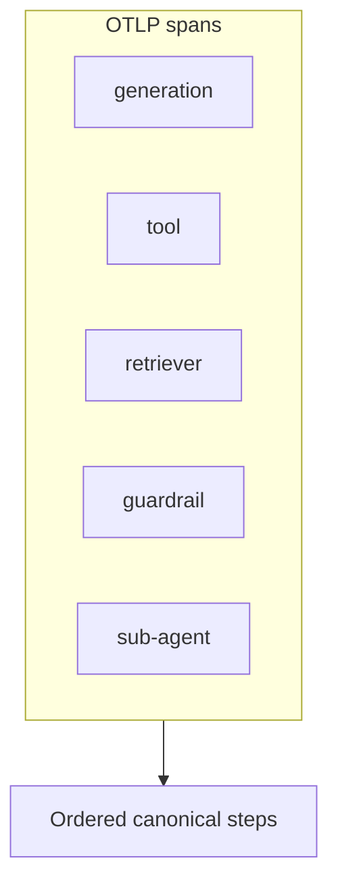
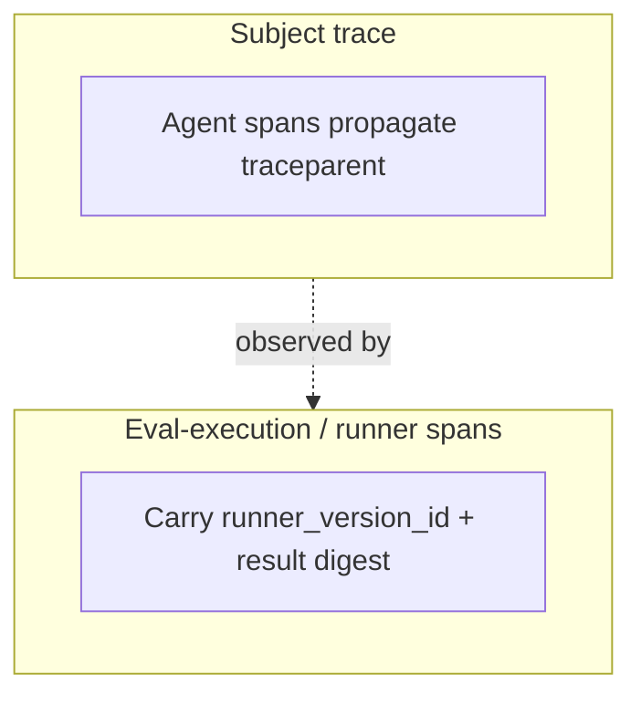

# 证据与轨迹

框架对 **证据** 打分。Softprobe 的职责是 **捕获并关联** 这些证据（原生结果包、日志、OTLP）— 而不是在轨迹上再实现一套 Softprobe scorer。

**OTLP 是观察边界**：Softprobe 将 OpenTelemetry（以及已知框架属性）规范化为规范轨迹视图，用于下钻与可选投影。

## 证据流水线

## 证据类型

| 类型 | 示例 |
|------|----------|
| 框架原生结果 | Promptfoo / DeepEval 报告、断言细节 |
| 模型输出 | 助手文本、结构化 JSON |
| 轨迹 | 工具调用、顺序、span 属性 |
| 参考 | 期望答案、评分标准、gold 标签（框架拥有） |
| 上下文 | 检索文档、fixture API 响应 |
| 环境状态 | DB 快照、文件树、harness 校验输出 |
| 媒体 | 截图、音频 |

所有 Softprobe 存储的材料都是带内容 digest 与来源的 **EvidenceArtifact**。Softprobe 不要求把 Softprobe「证据选择器」作为 Softprobe 评估器 ABI。

## 先有证据再有分数

投影测量应引用证据，使评审者能回答：*评分器看到了什么？*

若所需证据缺失，FrameworkAttempt 状态为 **`missing_evidence`** — 绝不是隐式零分。

## 规范轨迹

一个共享的 **trajectory** 库把 OTLP span 转为有序步骤，用于关联与 UI：

- generation、tool、retriever、guardrail、sub-agent span
- 规范化的工具名与参数（按受支持的 semconv 配置文件）
- 约定不完整或未知时的诊断信息

框架可独立消费 OTEL（例如 Promptfoo tracing）。Softprobe 不会强制 Softprobe scorer 重新解析 OTLP。

## 结果优于逐字稿

当 **环境校验器**（harness / 框架 oracle）能检查终态时，优先于仅轨迹或仅输出的评判 — 仍 **在框架套件内部**。Softprobe EnvironmentVersion 提供隔离与挂载；Softprobe 不拥有 Softprobe 结果-oracle scorer。

## Runner span vs 主体 span

- **主体 span** — 被测 Agent（来自 FrameworkAttempt 的 `traceparent`）
- **Runner / 评估执行 span** — Softprobe + 框架 runner（`runner_version_id`、原生结果 digest）

在线策略默认排除评估执行 trace，以防止递归评估环路。

见 [关联与 Trace](/zh/evaluation/concepts/correlation-and-traces)。

## 相关

- [轨迹与工具](/zh/evaluation/evaluators/trajectory-and-tools)
- [环境结果](/zh/evaluation/evaluators/environment-outcome)
- [框架 runner](/zh/evaluation/reference/framework-adapters)
