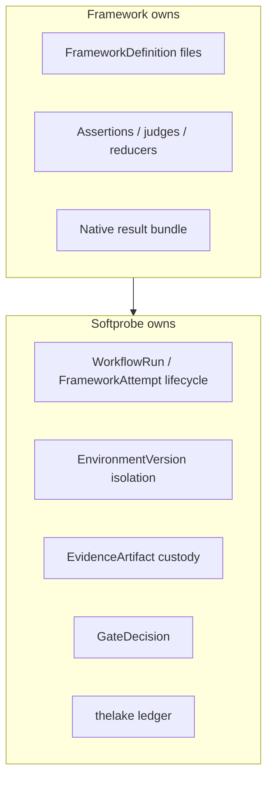
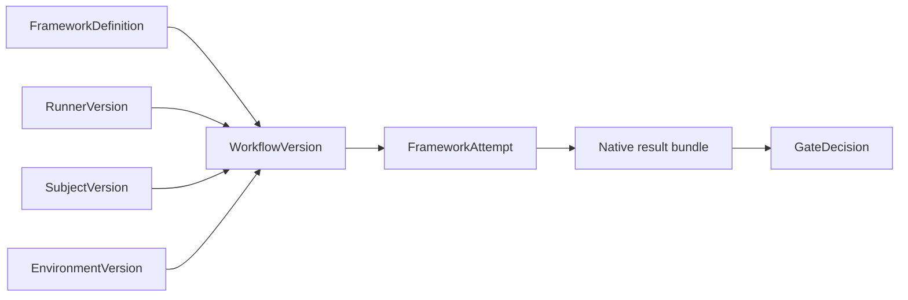
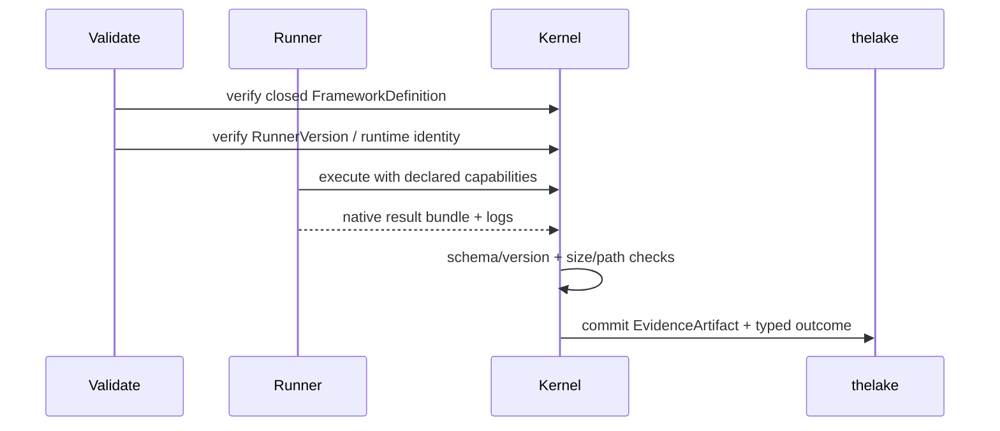

# 原生模型与框架 Runner

Softprobe Agent Evaluation **与框架无关**，且以 **runner 为先**：框架保留各自的 DSL 与语义；Softprobe 拥有工作流、环境、证据保管、对比与发布门禁。

Softprobe **不**提供原生评估编写语言、Softprobe 自有 scorer，或把每个 Promptfoo / DeepEval 特性 1:1 重写进 Softprobe JSON 的导入器。

## 所有权边界



## 默认集成：不透明的框架 runner

将 Promptfoo / DeepEval（或其他工具）作为钉死的执行节点运行 — 不翻译断言。



**具体示例**

```yaml
framework_definition: cas://sha256:promptfoo-config-bundle
runner:
  id: promptfoo-runner@2.1.0
  runtime_image: ghcr.io/softprobe/promptfoo-runner@sha256:abc...
subject: support-router@sha256:...
environment:
  network: off
  filesystem: [workspace:ro, artifacts:rw]
  secrets: [OPENAI_API_KEY_REF]
gate_policy: support-router-v1
```

Softprobe 记录定义 digest、runner / 运行时 digest、原生结果包、外层类型化终态，以及可选的投影测量。

## 可选的有损投影

将原生结果的 **受支持子集** 映射为一等分数行。不受支持的字段留在原生产物中，且绝不会仅因 Softprobe 未建模而阻塞执行。

产品打分 **没有** 单独的 Softprobe「内核评估器模式」。控制面检查（产物完整性、脱敏、能力准入、发布门禁）是工作流策略 — 不是评估 DSL。

## 为何 runner 优先优于完整翻译

| 做法 | 问题 |
|----------|---------|
| 完整 DSL 翻译 | 需持续追赶框架特性 |
| Softprobe 原生套件编写 | 重造成熟生态 |
| Runner 优先 | 稳定的工作流 / 环境契约 + 保留原生语义 |

## 公开产品 API

```text
framework suite + subject + environment + runner
        → WorkflowVersion
        → WorkflowRun / FrameworkAttempt
        → evidence + GateDecision
```

## 前 / 后接受规则



- 运行前：所有文件引用已解析并哈希；runner / 运行时已钉死。
- 运行后：畸形 / 过大的包被拒绝；无路径穿越。
- 无环境隐式网络 / 密钥；仅声明的能力。

## 相关

- [框架 runner](/zh/evaluation/reference/framework-adapters)
- [Promptfoo 集成](/zh/evaluation/guides/promptfoo-integration)
- [心智模型](/zh/evaluation/mental-model)
- [快速开始](/zh/evaluation/getting-started)
