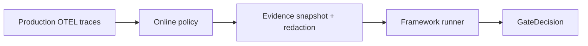

# 在线评估

**在线评估** 把与离线运行相同的 **框架 runner** 工作流应用到生产 trace — 异步执行，带采样与 watermark。Softprobe 不会切换到并行的 Softprobe 自有评分器。

## 离线 vs 在线

| 模式 | 证据来源 | 典型触发 | 主要目标 |
|------|------------------|-----------------|-------------------|
| 离线 | 整理好的 FrameworkDefinition / fixture | CI 与 PR 检查 | 防止发布回归 |
| 在线 | 策略选出的生产 trace | 定时 / 持续 | 检测线上漂移与事故模式 |

见 [在线 vs 离线评估](/zh/evaluation/concepts/online-vs-offline)。

## 在线策略

在线策略选择：

- 钉死的 FrameworkDefinition / RunnerVersion / WorkflowVersion
- Trace / span 过滤（环境、标签、元数据）
- **稳定采样** — hash(target_id + policy_version)，保证可复现的纳入
- **完成 / watermark** 策略，处理迟到 span
- 最大速率、成本、并发、优先级
- 排除内部评估执行 trace 的标签
- Runner 启动前的证据快照规则

调度器发出普通的 WorkflowRun 事件 — 在线、批处理与回填共享内核规划与重试语义。

## 与 Braintrust 在线打分对比

| Braintrust | Softprobe |
|------------|-----------|
| 每项目自动化规则 | 在线策略 + 框架 runner |
| Span vs trace 范围 | 证据快照选择器 |
| 采样率 | 稳定确定性采样 + 预算 |
| 异步打分 | 托管 worker 队列；不影响请求延迟 |

## 回填

历史 trace 快照在钉死的策略 / WorkflowVersion 下重跑，以便在模型或提示变更时做前后对比。

## 治理

仅当敏感度 / 驻留地 **能力** 匹配时，生产内容才会到达 runner。快照 + 脱敏发生在 FrameworkAttempt 之前。

见 [在生产 OTEL Trace 上跑 Promptfoo](/zh/evaluation/guides/promptfoo-online-otel) 与 [生产到评估闭环](/zh/evaluation/guides/production-to-eval-loop)。
