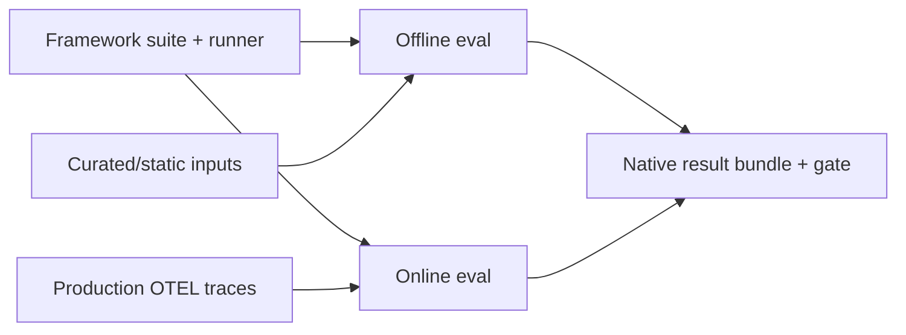
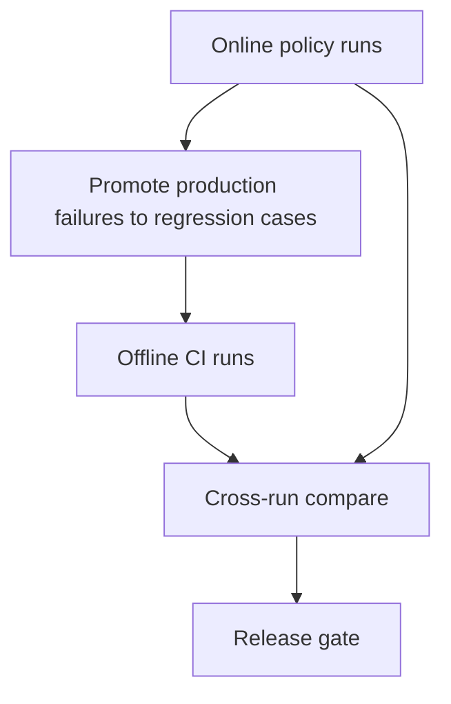

# 在线 vs 离线评估

两种模式使用同一工作流引擎与门禁模型。差别在于 **证据来自何处**。

## 一览



| 维度 | 离线评估 | 在线评估 |
|-----------|--------------------|-------------------|
| 证据来源 | 整理好的用例 / 回放 fixture / 静态输入 | 策略选出的生产 trace |
| 运行时机 | 开发、CI、发布前 | 部署后持续或定时 |
| 目标 | 发布前抓住回归 | 在真实流量中检测漂移 / 失败 |
| 成本控制 | 由套件规模固定 | 策略驱动的采样与预算 |
| 治理 | 标准 CI 权限 | 更强的数据处理（脱敏、驻留地、审批） |

## 离线示例（CI）

```bash
sp eval run \
  --runner promptfoo-runner@2.1.0 \
  --definition .softprobe/promptfoo-definition.cas.json \
  --gate support-router-v1 \
  --out-dir .softprobe/runs/ci
```

## 在线示例（生产 Trace）

```bash
sp eval policy apply --file policies/support-router-online-v1.yaml
sp eval policy run --policy support-router-online-v1 --window "last_1h"
```

策略选择 trace、快照证据，然后执行同一 runner。

## 策略示例

```yaml
policy_id: support-router-online-v1
trace_filter:
  service.name: support-router
  environment: production
sampling:
  strategy: stable_hash
  rate: 0.05
watermark:
  wait_for_late_spans_s: 120
budgets:
  max_runs_per_hour: 500
  max_eval_cost_usd_per_day: 100
exclusions:
  - eval.execution=true
```

## 为何在线不只是「在生产上跑 Promptfoo」

Promptfoo tracing 有助于离线评估与本地内省。在线评估增加平台保证：

- runner 执行前受控的快照与脱敏，
- 可复现的稳定采样，
- 排除评估生成的 trace（环路防护），
- 租户与驻留地强制，
- 与受治理策略绑定的发布门禁。

## 组合运行模型



用离线做快速护栏，用在线做真实流量中的现实校验。

## 相关

- [在线评估](/zh/evaluation/concepts/online-evaluation)
- [在生产 OTEL Trace 上跑 Promptfoo](/zh/evaluation/guides/promptfoo-online-otel)
- [生产到评估闭环](/zh/evaluation/guides/production-to-eval-loop)
