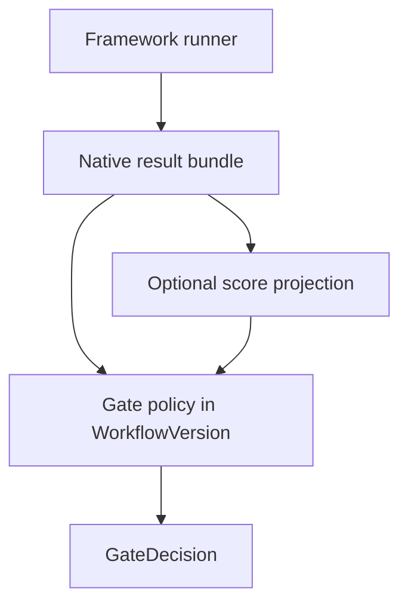

# 分数与门禁

**原生结果权威；分数是可选投影；门禁是工作流视图。** Softprobe 不会重新实现框架断言来产生分数。

## 框架上报的事实

框架 runner 发出 **原生结果包**。Softprobe 可选地将选定的框架上报测量 **投影** 到 thelake `scores` 供查询：

- 名称（例如 `router.skill_match`）
- 值（boolean、number、string、…）
- 目标（见 [分数目标](/zh/evaluation/reference/score-targets)）
- runner / 工作流身份 + 证据引用
- 可选成本、延迟、token 用量

投影 **刻意有损**。不受支持的字段留在原生包中，绝不会仅因 Softprobe 未建模而阻塞执行。

## 什么不是分数

| 结果 | 含义 |
|---------|---------|
| `missing_evidence` | 所需产物缺失 — **不是** 分数 0 |
| `runner_error` | Runner 崩溃或失败 — **不是** 低质量 |
| `unsupported` | 本主机无此能力 |
| `subject_error` | 主体在框架完成前失败 |

见 [结果状态](/zh/evaluation/reference/result-status)。

## 门禁（视图）

**门禁策略**（钉进 **WorkflowVersion**）应用于：

1. 外层生命周期 / FrameworkAttempt 状态，
2. 声明的来源（定义 digest、runner digest、…），
3. 可选地 **显式选定** 的 runner 上报或投影字段。

```yaml
# Conceptual gate policy routing-v2
rules:
  - field: framework_attempt.status
    op: eq
    value: succeeded
  - field: native.summary.pass_rate   # selected runner-reported field
    op: gte
    threshold: 0.95
```

**GateDecision** 记录该策略版本的通过 / 失败 + 原因。

用更新的门禁策略重新评估旧 WorkflowRun 会重算决策；底层原生产物与投影测量保持不变。

## 框架通过 / 失败标志

Promptfoo cell 通过 / 失败（及类似物）留在 **原生结果包** 中。Softprobe 可投影它们以便查询。它们 **不会** 自动成为 Softprobe 发布门禁 — 门禁策略必须显式选定它们。

## 分数目标 v2

投影测量挂到一个规范目标：

`span | trace | session | workflow_run | framework_attempt`

为兼容 v1 API，旧的 span / trace / session 列仍会填充。

## 图示



## 相关

- [心智模型](/zh/evaluation/mental-model)
- [数据模型](/zh/evaluation/concepts/data-model)
- [结果状态](/zh/evaluation/reference/result-status)
