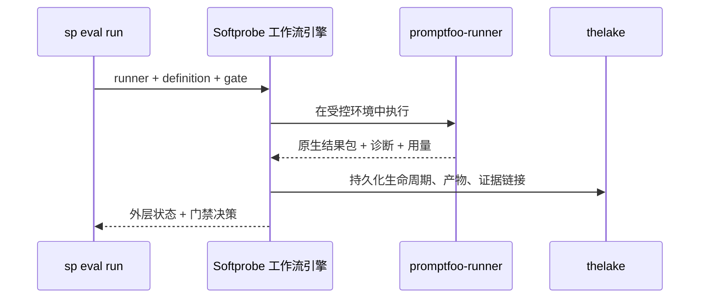

# 快速开始

用现有框架套件跑通第一次评估（此处以 Promptfoo 为例）。Softprobe 聚焦 **工作流 + 环境控制 + 证据 + 门禁**。

## 工作流一图


## 步骤 1 — 打包钉死的定义包

```bash
sp eval pack --framework promptfoo \
  --config promptfooconfig.yaml \
  --tests tests.yaml \
  --out .softprobe/promptfoo-definition.cas.json
```

Promptfoo 用例示例（计费路由）：

```yaml
- description: Route billing questions to billing-support
  vars:
    system_prompt: "file://prompts/router.txt"
    user_query: "I was charged twice for my subscription"
  assert:
    - type: icontains
      value: "billing-support"
    - type: not-icontains
      value: "internal_db_schema"
```

## 步骤 2 — 校验 runner 配置（不调用评估 provider）

```bash
sp eval validate \
  --runner promptfoo-runner@2.1.0 \
  --definition .softprobe/promptfoo-definition.cas.json \
  --json
```

校验内容：
- 定义产物的封闭性与摘要
- runner / 运行时兼容性
- 能力策略（网络、文件系统、密钥）
- 声明的限额（超时、结果大小）

## 步骤 3 — 经工作流引擎运行套件

```bash
sp eval run \
  --runner promptfoo-runner@2.1.0 \
  --definition .softprobe/promptfoo-definition.cas.json \
  --gate support-router-v1 \
  --out-dir .softprobe/runs/$(date +%Y%m%d-%H%M%S)
```



## 步骤 4 — 查看结果

```text
Run status: succeeded
Native result artifact: cas://sha256:promptfoo-results...
Projection status: lossy
Gate (support-router-v1): PASS
```

`--out-dir` 中的产物：

| 产物 | 用途 |
|------|------|
| `events.jsonl` | 外层生命周期账本（`requested → validated → running → terminal`） |
| `artifacts/` | 定义包、原生框架结果包、日志 |
| `manifest.resolved.json` | 规范运行快照 |
| `report.md` | 人类可读摘要 |

## 步骤 5 — 在 CI 中对比与门禁

```bash
sp eval compare --baseline "$LAST_GREEN" --candidate "$RUN_DIR/manifest.resolved.json"
```

参见 [对比与晋升](/zh/evaluation/guides/compare-and-promote)。

## 环境支撑路径

需要严格执行控制时（无环境网络、固定挂载、白名单密钥）：

```yaml
runner_policy:
  network: off
  filesystem:
    workspace: ro
    artifacts: rw
  secrets:
    - OPENAI_API_KEY_REF
  limits:
    timeout_s: 300
    max_result_mb: 50
```

## 下一步

- [Promptfoo 集成](/zh/evaluation/guides/promptfoo-integration)
- [框架 runner](/zh/evaluation/reference/framework-adapters)
- [原生模型与框架 runner](/zh/evaluation/concepts/native-model-and-adapters)
