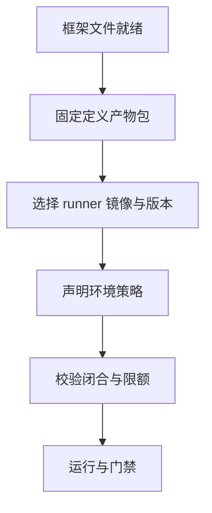

# 准备一次框架运行

本指南替代原先的「编写套件」。你继续使用框架自己的套件 DSL（Promptfoo、DeepEval 等），并把它准备成可复现的工作流执行。

## 准备清单



## 1) 保持框架原生定义

Promptfoo 文件示例：

- `promptfooconfig.yaml`
- `tests.yaml`
- `prompts/router.txt`

不要把它们改写成新的 Softprobe DSL。

## 2) 打包定义 bundle

```bash
sp eval pack --framework promptfoo \
  --config promptfooconfig.yaml \
  --tests tests.yaml \
  --out .softprobe/promptfoo-definition.cas.json
```

bundle 应按 digest 包含所有已解析文件。

## 3) 声明 runner + 环境策略

```yaml
workflow:
  framework_definition: .softprobe/promptfoo-definition.cas.json
  runner:
    id: promptfoo-runner@2.1.0
    runtime_image: ghcr.io/softprobe/promptfoo-runner@sha256:9c3...
  subject: support-router@sha256:...
  environment:
    network: off
    filesystem:
      workspace: ro
      artifacts: rw
    secrets:
      - OPENAI_API_KEY_REF
    limits:
      timeout_s: 300
      max_result_mb: 50
  gate_policy: support-router-v1
```

## 4) 运行前校验

```bash
sp eval validate \
  --runner promptfoo-runner@2.1.0 \
  --definition .softprobe/promptfoo-definition.cas.json \
  --json
```

常见校验失败：
- 未固定的文件引用
- 不允许的网络能力
- 缺失密钥引用
- 声明的结果预算过大

## 5) 执行并收集结果

```bash
sp eval run \
  --runner promptfoo-runner@2.1.0 \
  --definition .softprobe/promptfoo-definition.cas.json \
  --gate support-router-v1 \
  --out-dir .softprobe/runs/latest
```

## 结果结构

| 输出 | 含义 |
|------|------|
| 原生框架结果包 | 完整框架语义与诊断 |
| 外层运行生命周期事件 | 跨框架工作流状态 |
| 可选投影测量 | 查询便利，明确有损 |
| 门禁决策 | 发布策略输出 |

## 治理规则示例

```yaml
gate: support-router-v1
rules:
  - run_status == succeeded
  - native_result_present == true
  - projected.router_skill_match == true
```

## 相关

- [快速开始](/zh/evaluation/getting-started)
- [Promptfoo 集成](/zh/evaluation/guides/promptfoo-integration)
- [框架 runners](/zh/evaluation/reference/framework-adapters)
