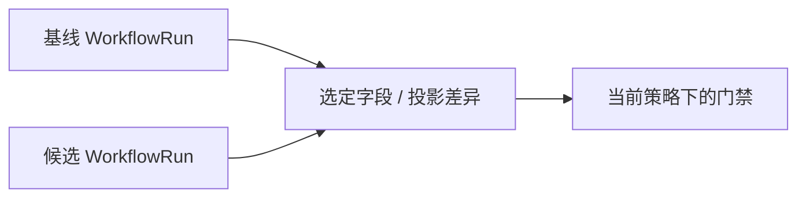

# 对比与晋升

## 对比运行

```bash
sp eval compare \
  --baseline .softprobe/runs/main-green/workflow.resolved.json \
  --candidate .softprobe/runs/pr-123/workflow.resolved.json \
  --json
```



返回选定投影测量和/或 runner 上报摘要字段的差异，以及当前策略下的 GateDecision。随机性 **框架** 套件可能在原生包中包含不确定性；Softprobe 呈现已投影的内容。

## 对比 subjects

用 **同一 WorkflowVersion**（同一 FrameworkDefinition + RunnerVersion + EnvironmentVersion + 门禁策略）对两个 **SubjectVersion** digest 运行（例如 agent 构建 A vs B）。

## 晋升

`sp eval promote` 记录一次授权决策：将某工作流/门禁组合用于发布跟踪 — 并带有到 WorkflowVersion 与门禁策略 digest 的审计血缘。

晋升不同于单次运行的门禁通过；在受治理工作流中可能需要人工批准。

## 发布门禁示例（仅 prompt 的路由）

```yaml
gate: support-router-v1
rules:
  - field: framework_attempt.status
    op: eq
    value: succeeded
  - field: native.summary.failedCount
    op: eq
    value: 0
```

有环境支撑的套件通常还会选择额外的 runner 上报结果字段 — 参见 [评估模式](/zh/evaluation/guides/eval-modes) 与 [环境结果](/zh/evaluation/evaluators/environment-outcome)。
