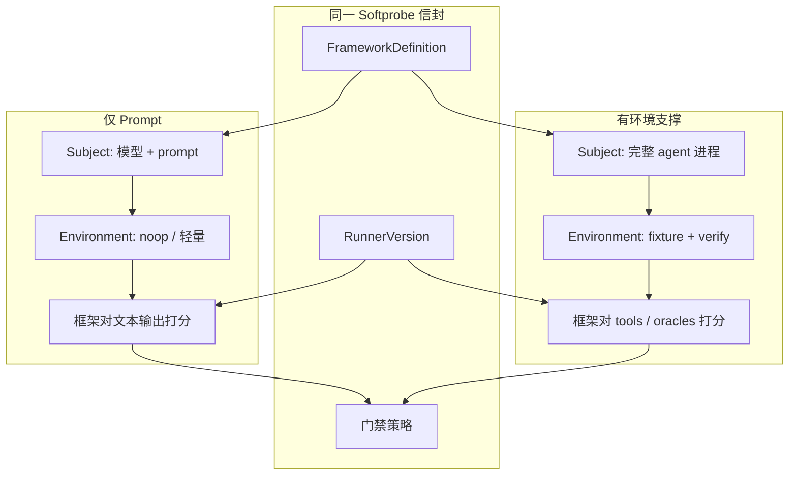
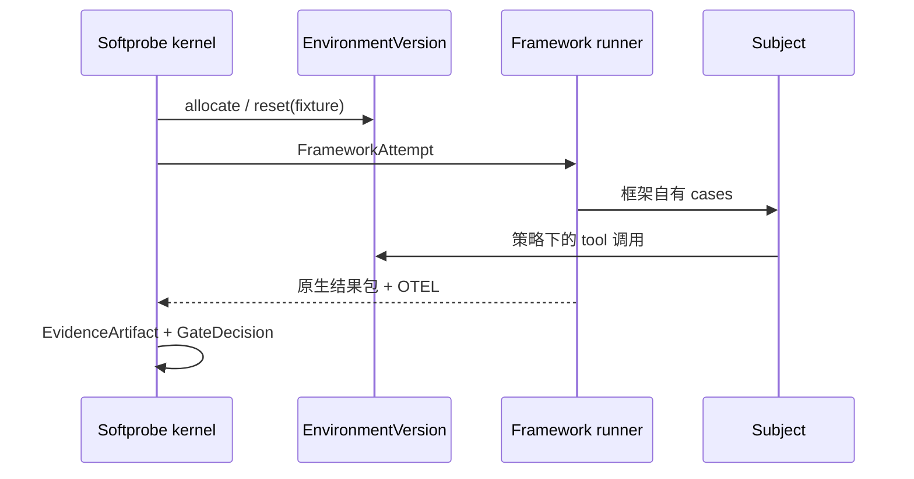

# 仅 Prompt 与环境评估

多数团队从 **仅 prompt** 评估（检查模型输出）起步。成熟的 agent 项目会加上 **有环境支撑** 的评估（在 harness 中的结果 oracle）。两者使用同一 Softprobe 工作流信封 — 只变 **SubjectVersion** 与 **EnvironmentVersion**。断言仍留在 **框架** 套件里。



## 仅 Prompt 评估

当 agent 是 **单次模型调用**（或短链）且评分器检查 **输出文本** 时使用。

| 部分 | 典型选择 |
|------|----------|
| **SubjectVersion** | 固定模型 + system prompt digest |
| **EnvironmentVersion** | `noop` — 无 harness |
| **框架检查** | Promptfoo `icontains` / confidentiality asserts 等 |

**客户示例：** 客服 **路由** 必须说出正确部门，且永不泄露内部 schema 名称。

```yaml
vars:
  system_prompt: "file://prompts/router.txt"
  user_query: "I was charged twice for my subscription"
assert:
  - type: icontains
    value: "billing-support"
  - type: not-icontains
    value: "internal_db_schema"
```

**它证明什么：** 路由策略与安全字符串 — 不证明下游 tools 是否正确运行。

## 有环境支撑的评估

当 **agent 是一个进程**（tools、多轮、代码执行）且你能定义 **oracles** 时使用：测试通过、API 状态、任务完成。

| 部分 | 典型选择 |
|------|----------|
| **SubjectVersion** | Agent 二进制/镜像 digest + tool 配置 |
| **EnvironmentVersion** | Fixture 仓库、桩 API、reset/step/verify |
| **框架检查** | 结果断言、轨迹指标、LLM judges — 仍在框架内 |



**它证明什么：** **结果优于 transcript** — 听起来合理但未通过 oracle 的答案仍是失败。

## 如何选择模式

| 问题 | 仅 Prompt | 有环境支撑 |
|------|-----------|------------|
| SUT 是一次模型调用吗？ | 是 | 通常否 |
| 有可靠的 oracle 吗？ | 否 | 是 |
| 成本 / 搭建时间 | 低 | 更高 |
| 能抓住 tool 误用吗？ | 有限 | 是 |
| 无密钥的 CI | 容易（fixtures） | 需要 harness 镜像 |

许多项目 **两者都跑**：仅 prompt 门禁做快速 PR 检查；环境套件在夜间或发布候选上运行。

## 同一工作流，不同 digests

```text
WorkflowVersion
  ├── FrameworkDefinition     # Promptfoo/DeepEval 套件（模式相关 asserts）
  ├── RunnerVersion
  ├── SubjectVersion          # ← 模式之间变化
  ├── EnvironmentVersion      # ← noop vs fixture
  └── gate policy
```

当 SubjectVersion digest 变化时，用 `sp eval compare` 对比 WorkflowRun。

## 相关

- [准备一次框架运行](/zh/evaluation/guides/author-a-suite)
- [环境结果](/zh/evaluation/evaluators/environment-outcome)
- [证据与轨迹](/zh/evaluation/concepts/evidence-and-trajectories)
- [环境包与依赖磁带](/zh/evaluation/concepts/environment-bundles)
- [录制与回放 agent 环境](/zh/evaluation/guides/record-replay-agent-environment)
- [Gym episode 与训练 rollout](/zh/evaluation/guides/gym-and-training-rollouts)
