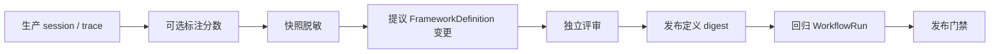

# 生产到评估闭环

把真实失败变成带治理的 **不可变、框架原生回归产物** — 而不是从生产静默复制粘贴进 Softprobe DSL。

## 步骤

1. **观察** — 在线策略或人工选择识别失败的生产 **trace**（或 **session**）
2. **标注**（可选）— 人工将 **分数** 挂到相关 **observation**（**span**）；见 [标注](/zh/evaluation/concepts/annotation)
3. **快照** — 在同意、脱敏、敏感度标签下捕获证据
4. **提议** — 候选 **FrameworkDefinition**（或 runner/env/gate）变更，带 `derived_from` 血缘 — 仍是框架原生文件
5. **评审** — 人工或独立策略批准精确 digests
6. **发布** — 不可变 FrameworkDefinition 加入回归包
7. **激活** — 在授权动作中更新 WorkflowVersion / 门禁引用
8. **门禁** — 下一版 agent 构建必须通过扩展后的工作流

## 授权

| 动作 | 谁 |
|------|-----|
| 提议 | 人类、AI agents（带审计） |
| 批准 / 发布 / 激活门禁 | 配置的人类或策略 — **不是** 提议 agent 的自批准 |
| 回滚 | 服务端 RBAC，不可变审计 |

批准绑定精确内容 digest；任何变更都会使其失效。

## 与 Testing 的关系

[Testing](/zh/testing/) 中的 Java 录制回放用例保持独立。Eval 产物可以把 trace ID **引用**为血缘，而不会把回放 mock 语义并入 eval 工作流。

参见 [评估闭环](/zh/evaluation/concepts/evaluation-loop)。
