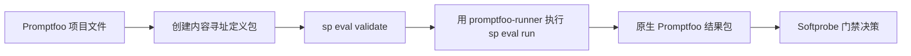
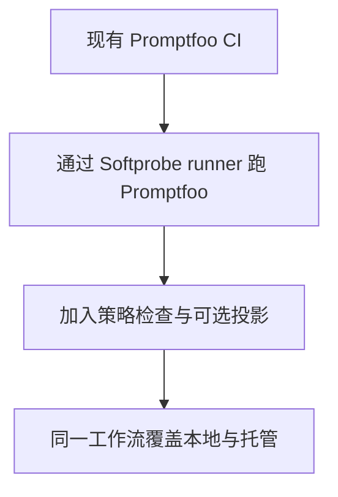

# Promptfoo 集成

Promptfoo 仍受支持，但集成方式现为 **runner 优先**。

## 集成流程



这样既保留 Promptfoo 语义，又使用 Softprobe 生命周期、证据保管与门禁。

## 分步示例

### 1. 将 Promptfoo 定义打包为固定产物

```bash
sp eval pack --framework promptfoo \
  --config promptfooconfig.yaml --tests tests.yaml \
  --out .softprobe/promptfoo-definition.cas.json
```

### 2. 校验 runner 描述符与产物闭合

```bash
sp eval validate \
  --runner promptfoo-runner@2.1.0 \
  --definition .softprobe/promptfoo-definition.cas.json \
  --json
```

### 3. 在内核工作流内执行框架 runner

```bash
sp eval run \
  --runner promptfoo-runner@2.1.0 \
  --definition .softprobe/promptfoo-definition.cas.json \
  --gate support-router-v1 \
  --out-dir .softprobe/runs/latest
```

## 持久化什么

| 产物 | 原因 |
|------|------|
| 定义包 digest | 可复现性 |
| Runner/runtime digest | 兼容性与审计 |
| 原生 Promptfoo 结果包 | 完整语义与诊断 |
| 外层内核状态/事件 | 跨框架生命周期与门禁 |

## 可选投影（非必需）

你可以把常见结果投影为 measurements，供仪表盘/搜索：

```text
native bundle -> optional projection -> measurements
```

投影是附加且有损的。它不替代原生产物。

## 迁移策略



当你希望快速采纳、又不想重写整个 Promptfoo 语料时，走这条路径。

## 常见陷阱

- 把投影当成完整语义对等。
- 假定 Promptfoo 通过/失败就是发布门禁。
- 用环境自带的网络/密钥跑 runner。

## 相关

- [框架 runners](/zh/evaluation/reference/framework-adapters)
- [原生模型与框架 runners](/zh/evaluation/concepts/native-model-and-adapters)
- [快速开始](/zh/evaluation/getting-started)
- [用 Promptfoo 给 episode 打分](/zh/evaluation/guides/score-episode-with-promptfoo)（环境 episode 之后的 Node adapter）
