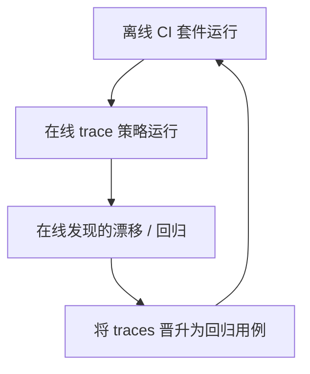

# 在生产 OTEL traces 上跑 Promptfoo

本指南说明如何通过 Softprobe 的在线评估工作流，对 **生产 OTEL traces** 运行 Promptfoo 评估。

## 为何需要本指南

Promptfoo tracing 很适合在评估期间捕获与可视化 traces。在线评估补上缺失的生产工作流：

1. 按策略选择生产 traces，
2. 快照并脱敏证据，
3. 在该证据上执行 Promptfoo runner，
4. 持续对比与门禁。

## 端到端流程


## 1) 为基于 trace 的检查准备 Promptfoo 套件

示例 `tests.yaml` 断言（受益于 trace 上下文）：

```yaml
tests:
  - vars:
      order_id: "123"
    assert:
      - type: trajectory:tool-used
        value: search_orders
      - type: trajectory:tool-sequence
        value:
          steps:
            - search_orders
            - compose_reply
```

将套件打包为固定定义产物：

```bash
sp eval pack --framework promptfoo \
  --config promptfooconfig.yaml \
  --tests tests.yaml \
  --out .softprobe/promptfoo-definition.cas.json
```

## 2) 创建用于选择生产 trace 的在线策略

`policies/promptfoo-online-router-v1.yaml`：

```yaml
policy_id: promptfoo-online-router-v1
runner:
  id: promptfoo-runner@2.1.0
  definition_artifact: .softprobe/promptfoo-definition.cas.json

trace_filter:
  service.name: support-router
  deployment.environment: production
  span.kind: server

sampling:
  strategy: stable_hash
  rate: 0.02

watermark:
  wait_for_late_spans_s: 120

budgets:
  max_runs_per_hour: 200
  max_eval_cost_usd_per_day: 50

redaction:
  attributes:
    - authorization
    - api_key
    - promptfoo.request.body

exclusions:
  - eval.execution=true
```

## 3) 应用并运行策略

```bash
sp eval policy apply --file policies/promptfoo-online-router-v1.yaml
sp eval policy run --policy promptfoo-online-router-v1 --window "last_1h"
```

## 4) 检查输出

```text
Run status: succeeded
Native result artifact: cas://sha256:promptfoo-results-2026-07-21
Projected measurements: 18 (projection_status=lossy)
Gate: support-router-online-v1 = PASS
```

存储的产物包括：
- 原生 Promptfoo 结果包，
- trace 快照元数据与血缘，
- 外层生命周期事件，
- 可选投影测量。

## 5) 对比在线与离线

```bash
sp eval compare \
  --baseline .softprobe/runs/ci-router/manifest.resolved.json \
  --candidate .softprobe/runs/online-router/manifest.resolved.json
```

用它发现 CI fixtures 中未出现的生产漂移。

## 实践中的离线 vs 在线



## 常见陷阱

- **无环路保护：** 忘记 `exclusions: eval.execution=true` 可能对评估器自身的 traces 再评估。
- **无水位线：** 迟到的 spans 会导致不一致的证据快照。
- **无预算：** 在线成本可能迅速飙升。
- **假定投影对等：** 完整语义仍在原生 Promptfoo 产物中。

## 相关

- [在线评估](/zh/evaluation/concepts/online-evaluation)
- [在线 vs 离线评估](/zh/evaluation/concepts/online-vs-offline)
- [生产到评估闭环](/zh/evaluation/guides/production-to-eval-loop)
- [Promptfoo 集成](/zh/evaluation/guides/promptfoo-integration)
