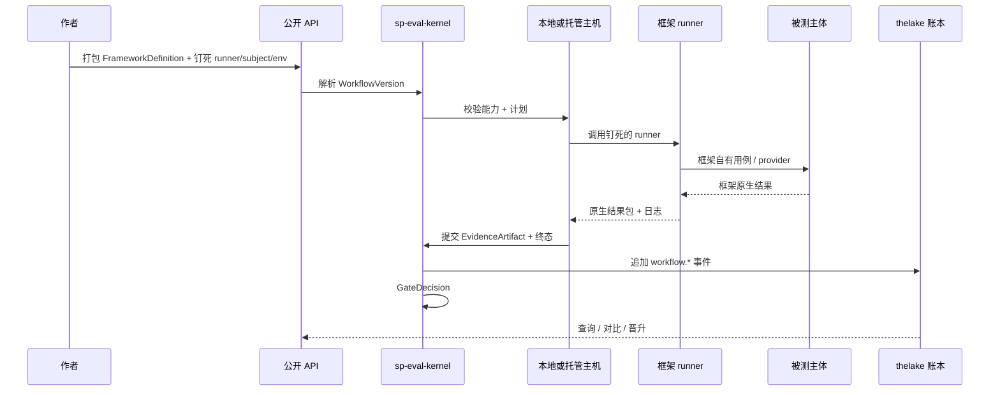
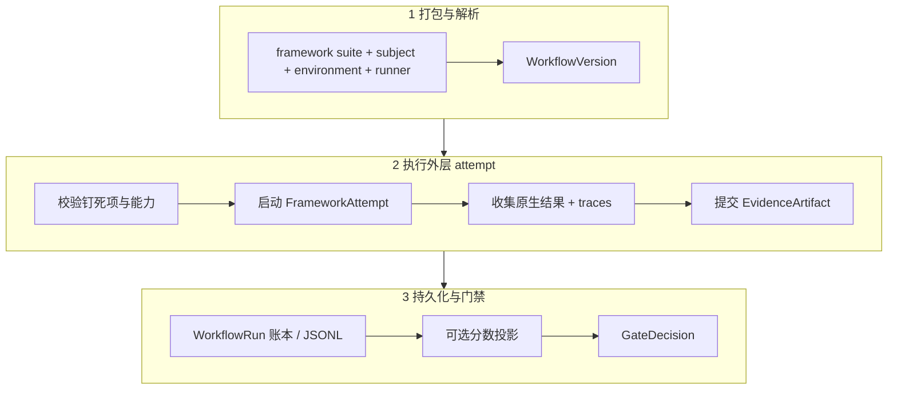
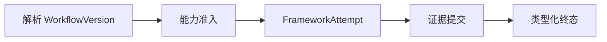
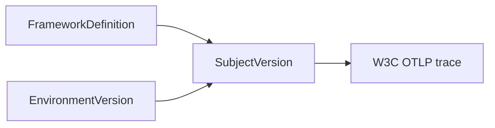
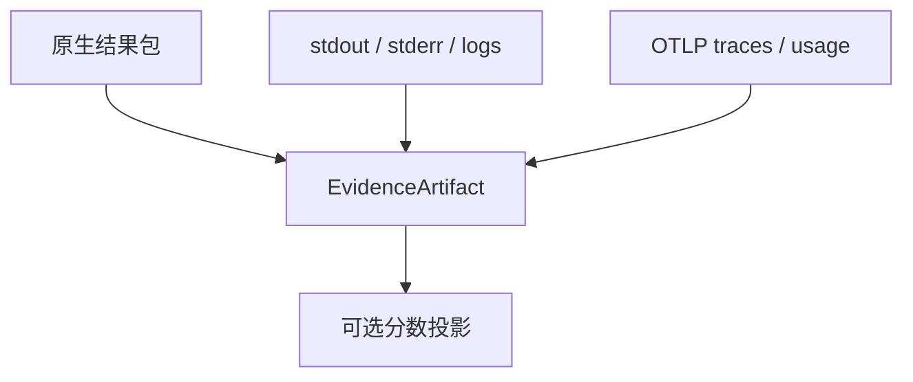
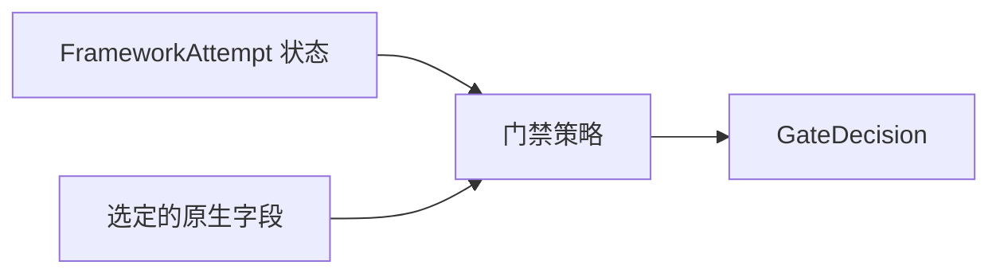
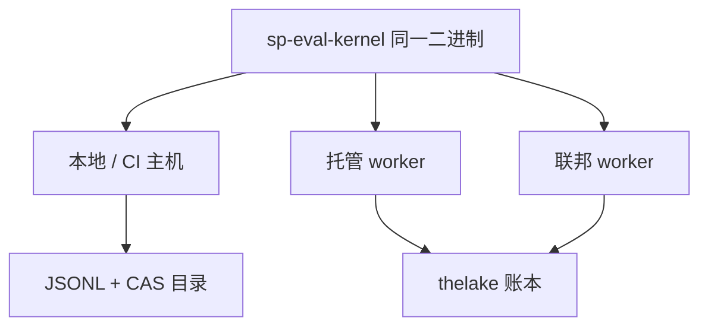
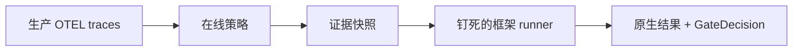

# Agent 评估如何工作

一次评估运行是一次 **框架 runner 工作流**：解析钉死的工作流，在受控环境中执行一个不透明 runner，提交原生证据，可选投影分数，再应用门禁。

## 端到端生命周期



## 流水线概览



## 阶段 1 — 打包与解析

作者保持 **框架原生** 文件。Softprobe 解析不可变版本：

```text
framework suite + subject + environment + runner
        ↓
   FrameworkDefinition + RunnerVersion + SubjectVersion + EnvironmentVersion
        ↓
   WorkflowVersion (+ gate policy)
```

`sp eval validate` 检查封闭产物集、runner 钉死项与能力兼容性，**不**翻译断言，也**不**调用主体。

## 阶段 2 — FrameworkAttempt

内核将 runner 视为 **一个不透明执行节点**。Softprobe 不展开用例、不跑断言、不聚合框架内部 trial。



在 runner 内，Promptfoo / DeepEval（或其他框架）拥有矩阵展开、provider、断言及其报告格式。Softprobe 只记录摘要与外层状态。

围绕该不透明节点的主机规划见 [执行 DAG](/zh/evaluation/architecture/execution-dag)。

## 阶段 3 — 主体与观测

**主体**是框架所行使的对象（模型路由、Agent 进程等），并受 Softprobe 强制的 **EnvironmentVersion** 约束：



每次 FrameworkAttempt 创建或采用一条 W3C trace，并记录 `workflow_run_id`、`framework_attempt_id`、`workflow_version_id` 与 `runner_version_id`。评估执行 trace 使用预留内部环境，默认从在线规则中排除。

## 阶段 4 — 证据与可选投影



- **原生包**对框架语义权威。
- **投影**可发出有损测量供查询 — 绝不是 Softprobe 对断言的重打分。
- 畸形或过大的包映射为类型化失败（`invalid_input`、`missing_evidence` 等），永不变成 score `0`。

## 阶段 5 — 门禁

**门禁**将 WorkflowVersion 中钉死的策略应用于外层状态、来源，以及可选的选定 runner 上报字段。门禁失败不会删除证据。



## 阶段 6 — 持久化

托管执行追加到 **thelake** 评估账本。大体量字节放在对象存储；账本只存摘要（先提交再引用）。本地运行将相同事件流写入 JSONL，并可通过校验后的包导入发布。

## 本地 vs 托管 — 语义相同



| 模式 | 主机 | 存储 |
|------|------|------|
| 本地 / CI | CLI 主机 | JSONL + CAS 产物 |
| 托管 | 排队 worker + 沙箱 | thelake 账本 + 对象存储 |
| 联邦 | 客户 worker | 仅策略过滤后的导出 |

## 仅 Prompt vs 环境支撑

| 切片 | Softprobe 钉死什么 | 框架做什么 |
|------|---------------------|------------|
| **仅 Prompt** | 模型 / prompt 主体 + noop / 轻量环境 | 对文本输出做断言 |
| **环境支撑** | 完整 Agent 主体 + fixture 环境 | 在框架内做工具 / 轨迹 / 结果检查 |

同一 Softprobe 信封；不同 SubjectVersion 与 EnvironmentVersion。参见 [仅 Prompt vs 环境评估](/zh/evaluation/guides/eval-modes)。

## 在线评估

在线 **策略** 选择生产 trace（过滤 + 稳定采样），快照证据，并启动 **同一框架 runner** 工作流 — Softprobe 不会切换到并行的 Softprobe 自有评分器。评估执行 trace 默认排除。



参见 [在线 vs 离线](/zh/evaluation/concepts/online-vs-offline) 与 [生产 OTEL 上的 Promptfoo](/zh/evaluation/guides/promptfoo-online-otel)。

## 下一步

- [心智模型](/zh/evaluation/mental-model)
- [架构概览](/zh/evaluation/architecture/)
- [分数与门禁](/zh/evaluation/concepts/scores-and-gates)
- [生产到评估闭环](/zh/evaluation/guides/production-to-eval-loop)
