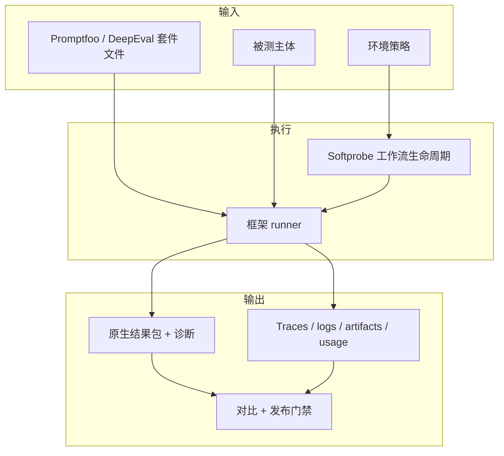

# Softprobe Agent Evaluation

**在受控环境中运行现有评估套件。捕获完整原生证据。用同一套工作流完成对比与门禁。**

Softprobe Agent Evaluation 是面向 AI 评估框架的开放工作流 / 控制平面。

## 系统一览

## Softprobe 做什么

- **打包并钉死**框架原生定义
- **控制执行环境**（网络、挂载、密钥、限额）
- **捕获完整原生输出**（结果、日志、trace、成本 / 用量）
- **规范化外层生命周期**（`requested → validated → running → terminal`）
- **对比运行并驱动门禁**，覆盖本地 CI 与托管执行

## Softprobe 不做什么

- 替换 Promptfoo / DeepEval DSL
- 承诺在新 schema 中实现完整断言类型对等
- 要求用户另写一套评估语言

## 本站产品区域

| 区域 | 何时使用 |
|------|----------|
| **[Testing](/zh/testing/)** | 带 JVM Agent 的 Java 录制回放回归 |
| **[Platform](/zh/platform/)** | Istio / SESSIFY 可观测性 |
| **Agent Evaluation** | 面向框架套件的工作流 + 环境控制 + 证据 + 门禁 |

## 从这里开始

| 角色 | 起始页 |
|------|--------|
| 框架用户（Promptfoo / DeepEval） | [快速开始](/zh/evaluation/getting-started) |
| 迁移负责人 | [Promptfoo 集成](/zh/evaluation/guides/promptfoo-integration) |
| Agent 环境 / 录制回放 | [录制并回放 Agent 环境](/zh/evaluation/guides/record-replay-agent-environment) |
| 平台运维 | [架构](/zh/evaluation/architecture/) |
| CI / AI 编码 Agent | [面向 AI Agent](/zh/evaluation/agents/overview) |

## 快捷链接

- [原生模型与框架 runner](/zh/evaluation/concepts/native-model-and-adapters)
- [框架 runner](/zh/evaluation/reference/framework-adapters)
- [准备一次框架运行](/zh/evaluation/guides/author-a-suite)
- [工作原理](/zh/evaluation/how-it-works)
- [环境包与依赖 tape](/zh/evaluation/concepts/environment-bundles)
- [录制并回放 Agent 环境](/zh/evaluation/guides/record-replay-agent-environment)
- [用 Promptfoo 为 episode 打分](/zh/evaluation/guides/score-episode-with-promptfoo)
- [Gym episode 与训练 rollout](/zh/evaluation/guides/gym-and-training-rollouts)
- [Node 包](/zh/evaluation/reference/node-packages)
