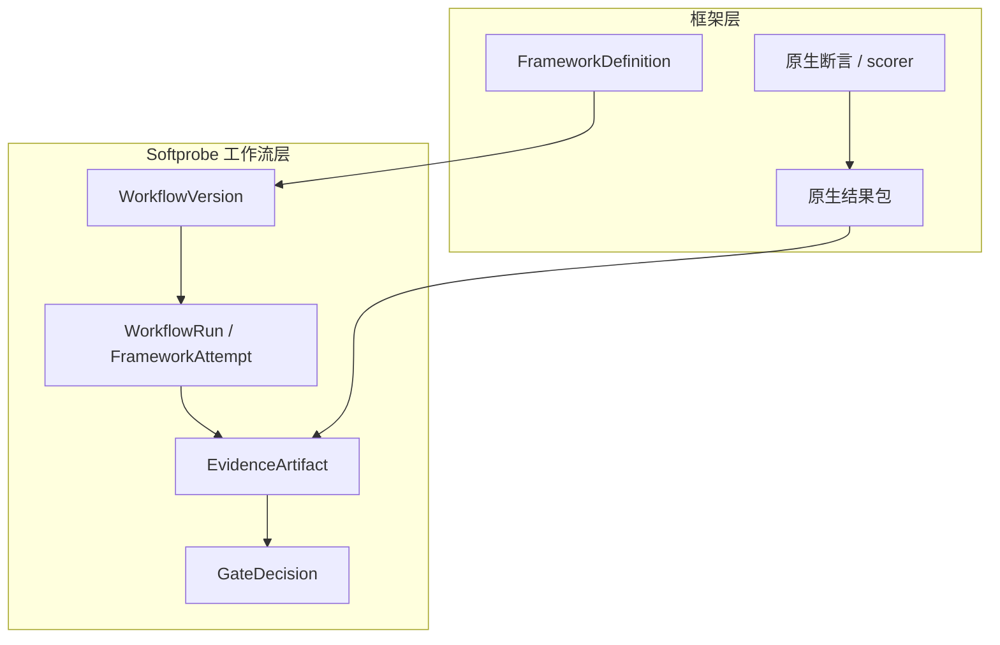

# 心智模型

按两层理解：

1. **框架层**（Promptfoo、DeepEval 等）：原生定义、断言、scorer，以及结果包。
2. **工作流层**（Softprobe）：钉死的 runner + 环境、外层生命周期、证据保管、对比与门禁。

Softprobe **不会**再发明一套评估 DSL。公开 API 是：

```text
framework suite + subject + environment + runner
```

## 分层模型



## 五个名词（不可变输入）

| 名词 | 作用 |
|------|------|
| **FrameworkDefinition** | 封闭、内容寻址的原生套件 + 依赖 |
| **RunnerVersion** | 钉死的框架包 / 镜像 / 命令 / 能力 |
| **SubjectVersion** | 被测系统（Agent、模型路由、镜像等） |
| **EnvironmentVersion** | 隔离：网络、挂载、按引用密钥、限额 |
| **WorkflowVersion** | 上述四者的解析绑定 + 门禁策略 |

运行时记录：**WorkflowRun** → **FrameworkAttempt** → **EvidenceArtifact** → **GateDecision**。

## 流水线（仅外层生命周期）

```text
pack / resolve → validate → run framework runner → commit evidence → gate
```

Softprobe 拥有外层 attempt。矩阵展开、重试与断言语义仍留在框架原生结果包内。

## 真实示例

计费路由 Promptfoo 套件经 `promptfoo-runner@2.1.0` 运行，并满足：

- 网络关闭，
- 工作区只读，
- 白名单密钥引用，
- 结果大小限额。

Softprobe 存储完整原生结果包，可选投影测量供查询，再按外层状态与选定的 runner 上报字段应用发布门禁。

## 何者权威

| 产物 | 权威 |
|------|------|
| 断言细节 / cell 通过失败 | 框架原生结果包 |
| 外层运行状态与来源 | Softprobe 工作流账本 |
| 发布门禁结果 | Softprobe **GateDecision**（策略钉在 WorkflowVersion 中） |
| 可查询的 `scores` 行 | 可选、有损投影 — 永不替代原生包 |

## 类型化结果（不是分数）

一次 **FrameworkAttempt** 以如下之一结束：

`succeeded | invalid_input | missing_evidence | unsupported | timed_out | cancelled | resource_exhausted | runner_error | subject_error`

错误永不变成 score `0`。`succeeded` 且零条投影测量仍然有效。

## 下一步

- [数据模型](/zh/evaluation/concepts/data-model)
- [原生模型与框架 runner](/zh/evaluation/concepts/native-model-and-adapters)
- [Promptfoo 集成](/zh/evaluation/guides/promptfoo-integration)
